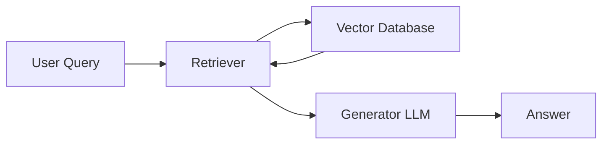
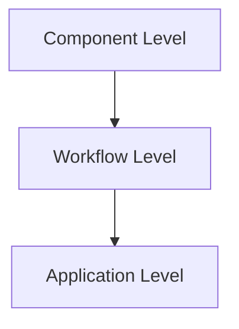
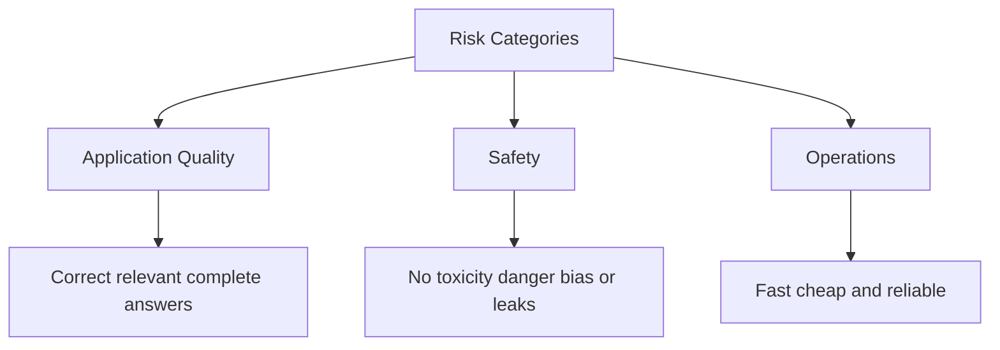

# LLM Evaluations — Why One Application Needs *Multiple* Eval Pipelines

> CampusX LLM Evaluations Playlist — Session 3 Notes
> Builds on: Session 1 (Why LLM Evals? What are LLM Evals? Model vs App Eval, Eval Pipeline overview)

---

## Table of Contents
- [Recap of Previous Session](#recap-of-previous-session)
- [Core Statement](#core-statement)
- [Reason 1: Multiple Failure Points](#reason-1-multiple-failure-points)
  - [RAG Architecture](#rag-architecture)
  - [Walkthrough: The 8-Week ML Course Trap](#walkthrough-the-8-week-ml-course-trap)
  - [3 Levels of Failure Points](#3-levels-of-failure-points)
- [Reason 2: Multiple Risk Categories](#reason-2-multiple-risk-categories)
  - [3 Pillars of Risk](#3-pillars-of-risk)
  - [Risk Categories by Application Type](#risk-categories-by-application-type)
- [Final Conclusion](#final-conclusion)
- [Interview Q&A](#interview-qa)
- [Quick Revision Checklist](#quick-revision-checklist)

---

## Recap of Previous Session
1. **Why do we need LLM Evals** — deploying an LLM app without evaluation causes real production failures (case studies).
2. **What are LLM Evals** — *systematic and reliable ways of evaluating LLMs and LLM-based applications against a clear criteria.*
   - **Model Eval** → evaluates the LLM itself, uses benchmarks. Mostly done by frontier labs.
   - **Application Eval** → evaluates the app you built on top of an LLM. This is where an AI Engineer spends most of their time.
3. **How** — a generic eval pipeline was shown (step-by-step evaluation flow).

---

## Core Statement

> **One LLM-based application usually has SEVERAL eval pipelines — not just one.**

Two big reasons for this:
1. Multiple **failure points** exist in an app.
2. Multiple **risk categories** exist per failure point.

---

## Reason 1: Multiple Failure Points

### RAG Architecture

*Flow: Query goes to Retriever → Retriever fetches top-K relevant docs from Vector DB → Retriever sends query + retrieved docs to Generator → Generator produces the final Answer.*

Two obvious failure points:
| Failure Point | What can go wrong |
|---|---|
| **Retriever** | Fetches irrelevant/wrong documents from vector DB |
| **Generator** | Ignores correct context and hallucinates a wrong answer |

**Consequence:** you need a separate eval pipeline per component:
- **Retriever eval** → checks: *given a query, are the right relevant documents retrieved?*
- **Generator eval** → checks **faithfulness / groundedness**: is the answer generated *only* from the given context, with no invented extra facts?

> Example: Query = "Duration of ML course?" → context says "3 weeks" → answer must say exactly "3 weeks", not add unrelated info like "you can also buy the Python course."

### Walkthrough: The 8-Week ML Course Trap

Scenario: Retriever uses `K = 5` (fetches top 5 relevant docs).

| Doc # | Content |
|---|---|
| D1–D4 | Random/irrelevant text |
| D5 | "Duration of ML course is **8 weeks**" |

- **Retriever verdict:** ✅ Did its job — correct answer was present *somewhere* in top-5 (K just means "find it within K attempts", not "put it first").
- **Generator issue:** System prompt instructed it to prioritize higher-ranked docs (D1–D4 over D5). Generator picked an unrelated fact from D1–D4 (e.g., "Python course = 6 weeks") and answered **"ML course duration is 6 weeks" → WRONG.**
- **But generator also "worked correctly"** — it faithfully followed instructions (prioritize top docs) and did **not hallucinate** out of thin air; it just merged the wrong prioritized facts.

**Key Insight:** Retriever ✅ independently + Generator ✅ independently ≠ Pipeline ✅.
→ Need a **workflow-level eval** on the Retriever+Generator combination to catch this interaction failure.
→ Root cause found: correct doc was ranked last → **fix: add a re-ranker** to push the most relevant doc (D5) to the top.

### 3 Levels of Failure Points

| Level | Description | Examples |
|---|---|---|
| **Component** | Any individual building block can fail | System prompt, retriever, re-ranker, query rewriter, embedding model, vector DB, output parser, tool selector, memory, guardrails |
| **Workflow** | Components individually work, but their *interaction* fails | RAG retriever↔generator flow, agent workflow, multi-turn chatbot flow |
| **Application** | Everything above works, but overall app-level metrics fail | Latency (e.g., 10 sec response = not production-ready), cost, first-token time |

> Even if Retriever ✅, Generator ✅, and Workflow (Retriever+Generator) ✅ — the app can *still* fail at the application level (e.g., too slow, too costly).

---

## Reason 2: Multiple Risk Categories

Not just multiple failure **points** — each failure point also has multiple **aspects (risk categories)** to evaluate.

Example — a RAG chatbot's answer must be:
- Correct / helpful (quality)
- Safe (doesn't leak another user's phone number/email)
- Not too costly/slow (operations)

### 3 Pillars of Risk

| Pillar | Definition |
|---|---|
| **Application Quality** | Whether the app does its actual job well — correct, relevant, complete answers |
| **Safety** | Ensures output isn't harmful — no toxic/dangerous/biased content, no private data leaks, resistant to jailbreaks |
| **Operations** | Can it run fast, cheap, and reliably in production? |

### Risk Categories by Application Type

**General LLM App (e.g., text summarizer)**
- Correctness & Accuracy
- Relevance
- Completeness
- Instruction Following (format/length adherence)

**RAG-specific**
- Context Relevance
- Retriever Recall
- Groundedness & Faithfulness
- Citation Accuracy

**Agent-specific**
- Tool Selection
- Parameter Correctness
- Task Completion
- Error Recovery

**Multi-turn Chatbot-specific**
- Context Retention
- Clarification Behavior

**Safety (applies broadly)**
| Dimension | Checks |
|---|---|
| Toxicity | Is the output toxic? |
| Harmful Content | Self-harm, weapons, illegal activity related content |
| Bias | Different quality of answers based on user profile? |
| Privacy / PII Leak | Credit card info, contact details of others |
| Prompt Injection / Jailbreak Resistance | Can the app be manipulated into doing what it shouldn't? |

**Operations (applies broadly)**
- Latency (incl. under load)
- Cost per request
- Token efficiency
- Error/failure rate

---

## Final Conclusion

Because of:
1. **Multiple failure points** (component → workflow → application), and
2. **Multiple risk categories** (quality, safety, operations) per failure point,

→ **~99.99% of the time**, a real-world LLM application will need **more than one eval pipeline** — e.g., one for latency, one for safety, one for correctness — all running on the *same* application.

---

## Interview Q&A

**Q1. Why can't a single eval pipeline evaluate an entire LLM application?**
A. Because LLM apps have multiple failure points (component, workflow, application level) and each failure point has multiple risk dimensions (quality, safety, operations) — no single pipeline covers all of these.

**Q2. In a RAG system, if the retriever and generator both individually pass their evals, is the app guaranteed to work correctly?**
A. No. The retriever-generator *interaction* (workflow) can still fail — e.g., a correct doc retrieved but ranked low, causing the generator to prioritize an incorrect doc. This requires a separate **workflow-level eval**.

**Q3. What is the fix when retriever eval and generator eval both pass, but the workflow-level eval fails due to poor document ranking?**
A. Add a **re-ranker** to reorder retrieved documents so the most relevant one is prioritized before being passed to the generator.

**Q4. What are the 3 levels at which failure points exist in an LLM app?**
A. Component level, Workflow level, Application level.

**Q5. What are the 3 broad risk category pillars used to organize LLM eval metrics?**
A. Application Quality, Safety, Operations.

**Q6. Give 3 RAG-specific risk categories.**
A. Context relevance, retriever recall, groundedness/faithfulness, citation accuracy (any 3).

**Q7. What does "K" mean in a retriever, and why did the retriever still "pass" its eval despite the wrong final answer?**
A. K = number of top documents fetched from the vector DB. The retriever's job is just to include the correct doc within the top-K — it succeeded since the correct doc was in the top-5, even though it was ranked last (D5).

**Q8. Name 2 operational risk metrics.**
A. Latency (incl. under load), cost per request, token efficiency, error/failure rate (any 2).

---

## Quick Revision Checklist
- [ ] Understand: LLM apps have **multiple eval pipelines**, not one
- [ ] Reason 1: Multiple **failure points** — Component → Workflow → Application
- [ ] Reason 2: Multiple **risk categories** — Quality, Safety, Operations
- [ ] RAG failure points: Retriever (relevance/recall) + Generator (faithfulness/groundedness)
- [ ] Component-level ✅ + Component-level ✅ ≠ Workflow-level ✅ (interaction can still break)
- [ ] Fix for the "8-week ML course" ranking issue → add a **re-ranker**
- [ ] Safety dimensions: toxicity, harmful content, bias, privacy leak, jailbreak resistance
- [ ] Operational dimensions: latency, cost, token efficiency, error rate
- [ ] Different app types (RAG, Agent, Multi-turn Chatbot) have distinct risk categories on top of general ones
