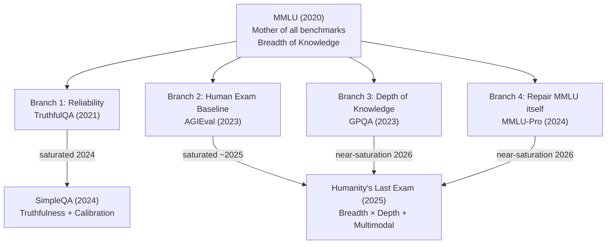

# LLM Evaluations — Knowledge Capability Benchmarks

> Session: CampusX LLM Evals — "Knowledge Capability" deep dive (7 core benchmarks)
> Companion resource: **BenchWiki** (self-built "Wikipedia for LLM benchmarks") — covers 23+ benchmarks with status, history, scoring methodology, known issues.

---

## 1. Why This Session Exists

- LLMs are evaluated via **Benchmarks** (standardized public/private datasets) or **Custom Evals** (your own pipeline).
- There are **8 core LLM capabilities**: Knowledge, Reasoning, Math, Long Context, Coding, (+4 others discussed elsewhere e.g. Safety/Alignment).
- Rather than teaching 10 random famous benchmarks, this session teaches **one capability (Knowledge) end-to-end**, showing the *evolutionary story* of how benchmarks were invented, saturated, and replaced — so the mental model transfers to other capabilities too.

---

## 2. What is "Knowledge Capability"?

- Tests how much **parametric/world knowledge** an LLM retained during pre-training (i.e., knowledge baked into its weights/biases).
- Considered the **most fundamental capability** — the first thing anyone tried to test when LLMs were trained on internet-scale data.
- Other capabilities (reasoning, coding) are more **emergent** (appeared as models scaled up); knowledge was the *original* expectation.

---

## 3. The Evolution Map (Mother Benchmark → 4 Branches)

**Core narrative (say this out loud in interviews):**
1. **MMLU (2020)** — first systematic knowledge benchmark. Tested **breadth** across 57 subjects.
2. It saturated (~92%, contamination + label errors) → research branched in 4 directions:
   - **Reliability** → is the model *truthful*, or just repeating internet misconceptions? → **TruthfulQA**
   - **Human comparison** → reuse real human exams (SAT, Gaokao) instead of inventing new ones → **AGIEval**
   - **Depth** → MMLU was too easy; go PhD-level in fewer subjects → **GPQA**
   - **Repair** → MMLU is good, just flawed; fix format/subject issues → **MMLU-Pro**
3. TruthfulQA later saturated too (its data leaked into **alignment fine-tuning data**, not pretraining) → replaced by **SimpleQA** (open-ended, tests calibration).
4. Eventually AGIEval, GPQA, MMLU-Pro all neared saturation → **Humanity's Last Exam (HLE)** combined breadth + depth + multimodality into one mega-benchmark (2025), designed so that if models crack it, closed-ended QA evaluation is "over" and the field must move to open-ended/agentic evaluation.

---

## 4. The 7 Benchmarks — Comparison Table

| Benchmark | Year | Tests | Format | Size | Status (2026) | Key Innovation |
|---|---|---|---|---|---|---|
| **MMLU** | Sep 2020 | Breadth of knowledge | 4-option MCQ | 14,000 Qs / 57 subjects | Saturated & retired | First systematic knowledge benchmark |
| **TruthfulQA** | Sep 2021 | Reliability / truthfulness | 4-option MCQ (+ generation) | 817 Qs / 38 categories | Saturated (Vestigial) | Showed bigger models can be *less* truthful |
| **AGIEval** | Apr 2023 | Knowledge vs. human baseline | Mixed (18 MCQ + 2 short-answer exams) | 20 real exams, 8,000+ Qs | Saturated (Vestigial) | First bilingual (English + Chinese) benchmark; uses **real human exams** (SAT, LSAT, Gaokao) |
| **GPQA** | Nov 2023 | Depth of knowledge (science) | 4-option MCQ | Diamond subset: 198 Qs (Physics/Chem/Bio) | Near saturation | "Google-proof" — PhD-level, non-experts can't solve even with Google + 30 min |
| **MMLU-Pro** | 2024 | Breadth + reasoning (fixed MMLU flaws) | 10-option MCQ | 12,000 Qs / 14 disciplines | Near saturation | 10 options (harder to eliminate), reasoning-heavy questions, rebalanced subjects |
| **SimpleQA** | 2024 | Truthfulness + Calibration | Open-ended short answer (no options) | 4,326 Qs | **Active** | First to score "not attempted" — measures if a model *knows what it doesn't know* |
| **HLE (Humanity's Last Exam)** | Jan 2025 | Breadth × Depth + Math + Reasoning | 80% short-answer + 20% MCQ, 10% multimodal | 2,500 Qs / 100+ subjects | **Active** (current SOTA benchmark) | Combines MMLU's breadth + GPQA's depth; has a **private held-out test set** to fight contamination; also measures calibration |

---

## 5. Deep-Dive Notes Per Benchmark

### 5.1 MMLU — "Mother of All Benchmarks"
- **What**: 57 subjects × ~14,000 MCQs (4 options), sourced from GRE, USMLE, AP exams, textbooks.
- **Scoring**: Accuracy (overall + per-subject "micro accuracy"). Two extraction methods:
  - Generated answer (model prints A/B/C/D) — e.g., GPT-4 → 84%
  - Log-likelihood of each option token — e.g., GPT-4 → 87%
  - **~2-3% score difference** depending on method used.
- **Run config**: 5-shot prompting, temperature = 0, pass@1, no tools, direct (no CoT).
- **History**: GPT-3 (2020) = 43.9% vs. human experts = 90%. By GPT-4 (2023) = 86%. By 2024, frontier labs clustered at 86–92% → saturated.
- **Why saturated / can't hit 100%**: A later audit (**"MMLU-Redux" paper**, not a benchmark itself) found **~6.5% of questions have wrong/missing answers** — so no model can realistically exceed ~93%.
- **Does NOT measure**: reasoning depth, calibration (does model know what it doesn't know), open-ended generation, multilingual knowledge (English-only, Western-curriculum-biased).
- **Known issues**: label errors (6.5%), heavy contamination (public since 2020), high prompt-format sensitivity (system prompt wording can swing scores).

### 5.2 TruthfulQA — Reliability Branch
- **What**: 817 adversarial questions across 38 categories, targeting **common human misconceptions** (e.g., "cracking knuckles causes arthritis" — false, but widely repeated online).
- **Key finding**: Larger models were often **less truthful** — bigger training data = more misconceptions absorbed too. Capability ≠ Alignment.
- **Scoring — 3 methods**:
  - Generation (model prints answer)
  - **MC1**: log-probability comparison across all options, pick highest
  - **MC2** (default/primary metric): sum normalized probability mass across *all correct* answers (some questions have multiple correct answers)
- **Run config**: "Zero-shot" but sends 6 fixed unrelated example Q&As every time (so behaves like few-shot). No CoT. Temp = 0.
- **Judging**: Originally used GPT-4 as LLM-judge to extract A/B/C/D from free text — a recurring pattern: judge model quality affects score comparability across years.
- **History**: GPT-3 (2021) = 58% vs. human = 94%. Saturated by ~2024 as RLHF/instruction-tuning improved alignment broadly.
- **Why it saturated differently**: Contamination happened at the **alignment/fine-tuning stage**, not pretraining — the dataset became part of RLHF/instruction-tuning data.
- **Does NOT measure**: factual recall (it's MCQ selection, not generation), "honesty under pressure" (whether model would *knowingly* assert something false if incentivized to).
- **Replaced by**: SimpleQA (truthfulness) and MASK (honesty-under-pressure, covered in Safety/Alignment module).

### 5.3 AGIEval — Human Exam Baseline
- **Philosophy**: Instead of inventing new benchmarks, reuse **real human exams** (SAT, LSAT, AQuAT, Gaokao, Chinese civil service exams) — gives a genuine (not estimated) human baseline.
- **Bilingual**: First benchmark mixing English + Chinese equally.
- **Format**: 20 exam sections, 8,000+ questions; 18 MCQ-format exams + 2 short-answer-format exams.
- **History**: GPT-4 (Apr 2023) = 58% vs. avg human = 67%, top human = 91%. By 2024–25, frontier models approached/matched the top-human 91% → saturated, retired.
- **Important caveat (interview-worthy)**: Headlines like *"LLM beats humans on IIT-JEE"* do **not** mean human-level general intelligence — beating an *average test-taker on one exam* ≠ surpassing human intelligence. AGIEval tests exam-style static knowledge, not long-horizon tasks, multi-step reasoning, or tool use.

### 5.4 GPQA — "Google-Proof Q&A" — Depth Branch
- **Why it exists**: MMLU tested breadth with mostly *easy* questions. GPQA flips to **depth**: PhD-level questions in just 3 subjects (Physics, Chemistry, Biology).
- **"Google-proof"**: Even a non-expert with Google access + 30 minutes couldn't solve a single question.
- **3 dataset tiers**: Main (448), Extended (546), **Diamond (198 — hardest, most-cited subset)**. Public GPQA scores usually refer to the Diamond set.
- Every question validated by **2 domain experts**.
- **History**: GPT-4 (2023) = 39% (main). GPT-4o (2024) = 56% (Diamond). OpenAI's o1 (2024) = 78%. OpenAI's own hired PhDs scored 69.7% (paper claimed PhDs scored 81.3% — **discrepancy = marketing red flag**). Grok 4 (2025) = ~87% → nearing saturation.
- **Does NOT measure**: general graduate knowledge (only 3 science domains), open-ended problem solving, correctness of the reasoning trace (a lucky guess scores the same as sound reasoning).
- **Known issues**: very small dataset (198 Qs → lower statistical confidence), disputed "PhD baseline" numbers, contamination, narrow domain coverage.

### 5.5 MMLU-Pro — Repair Branch
- **Philosophy**: MMLU is fundamentally good — improve it rather than replace it.
- **3 key fixes over MMLU**:
  1. **4 → 10 answer options** (harder to eliminate-guess)
  2. Removed trivia/noisy questions → added **reasoning-based** questions
  3. **57 → 14 broader, better-balanced disciplines** (12,000 questions)
- **Evidence of success**: reasoning-capable models scored **~20 points higher** than non-reasoning models — proves the benchmark now needs actual reasoning, not just recall.
- **Related non-benchmark**: **"MMLU-Redux"** — a 2024 paper (not a benchmark) that audited MMLU and found ~6–8% of questions are incorrect, explaining the ~92% score ceiling.
- **History**: Launched 2024; by 2026, nearing saturation (~80-90% scores).
- **Does NOT measure**: open-ended generation, reasoning-trace correctness, calibration.
- **Known issues**: no human baseline reported in the paper, favors reasoning models (unfair advantage by design), source contamination (many questions traceable to public STEM textbooks, e.g., H.C. Verma-style physics problems).

### 5.6 SimpleQA — Truthfulness + Calibration
- **Fills the gap** left when TruthfulQA saturated (data leaked into alignment training).
- **Format**: 4,326 **short, open-ended, fact-seeking questions** — no answer options given, model must generate the answer (much harder than MCQ).
- **Built adversarially**: every question is one that **GPT-4 failed to answer** at the time.
- **3-way judging (LLM-as-judge)**: Correct / Incorrect / **Not Attempted** ("I don't know").
- **3 metrics**:
  - **Correct** (accuracy over all questions)
  - **Correct-given-attempted** (accuracy only on questions the model chose to answer)
  - **F-score** — harmonic mean of the two (balances factuality + calibration)
- **Why it matters**: measures **calibration** — does the model know what it doesn't know? A model saying "I'm not sure" instead of hallucinating is rewarded.
- **History**: GPT-4o (2024) = 38%. Same model that scored 88% on MMLU scored only 40% on SimpleQA — huge gap shows generation is much harder than recognition.
- **Status: Active** — not yet saturated (likely to stay relevant 1-2 more years per the instructor).
- **Does NOT measure**: long-form factuality (only short 1-2 word facts), everyday/practical hallucination behavior (e.g., in a RAG chatbot context).
- **Known issues**: LLM-judge score drift over time (judge model itself improves), **answer staleness** (e.g., "current world record holder" changes over time — dataset built in 2024 may be outdated by 2026), adversarial selection bias against GPT-4 specifically (built from GPT-4's failures).

### 5.7 HLE — Humanity's Last Exam
- **Philosophy**: Combines MMLU's **breadth** + GPQA's **depth** into one benchmark, designed to be the last closed-ended knowledge/reasoning exam needed. If models saturate this, evaluation must shift to **open-ended/agentic tasks**.
- **Scale**: Massive collaborative effort — **1,000 experts across 500 institutions, 50 countries** built 2,500 questions across 100+ subjects (classics to rocket engineering). (Originally 3,000 Qs; 500 removed due to disputed answers.)
- **Format**: 80% short-answer (generated) + 20% MCQ; **10% multimodal** (image-based questions) — first benchmark in this series to include vision.
- **Anti-contamination**: Holds a **private test set** in addition to the 2,500 public questions, so labs can always test on unseen data.
- **Also measures calibration**: models self-report confidence (%) per answer; scored via RMS error between stated confidence and actual correctness.
- **History**: Jan 2025 launch — early models scored single digits. By late 2025: Grok 4 = 24%, GPT-5 = 25%, Gemini = 38%. **Status: Active, current SOTA benchmark** for knowledge + reasoning + math.
- **Does NOT measure**: open-ended/agentic problem solving (still closed-ended), everyday usefulness, full multilingual (English-only).
- **Known issues**: LLM-judge grading errors on short-answer questions, adversarial selection bias (built from questions 2024 frontier models failed) — doesn't represent everyday-user question distribution.

---

## 6. Recurring Cross-Benchmark Patterns (Great Interview Talking Points)

1. **The Saturation Lifecycle**: New benchmark → model scores are low, humans win → labs compete, scores rise → frontier models cluster near human/ceiling baseline → benchmark can no longer discriminate → benchmark retired/replaced.
2. **Contamination** is universal: any public dataset eventually leaks into training data (pretraining *or* alignment/fine-tuning stage — TruthfulQA leaked at the alignment stage specifically).
3. **LLM-as-judge score drift**: Whenever a benchmark uses an LLM to grade free-text answers (TruthfulQA, SimpleQA, HLE), scores from different years are **not directly comparable** because the judge model itself has improved.
4. **Two ways to extract MCQ answers**: (a) let model generate the letter, or (b) compare **log-probabilities** assigned to each option — these can differ by 2-3%.
5. **Calibration vs. Accuracy** are different things: Accuracy = "did it get the right answer?" Calibration = "does it know when it doesn't know?" (MMLU/GPQA/AGIEval/MMLU-Pro don't test calibration; SimpleQA and HLE do.)
6. **Breadth vs. Depth** is a fundamental design axis: MMLU = breadth, GPQA = depth, HLE = both simultaneously.
7. **"Beats humans on exam X" ≠ human-level intelligence** — exam performance tests static knowledge recall, not long-horizon tasks, tool use, or multi-step real-world reasoning.
8. You **cannot fully verify** whether a lab secretly trained on benchmark questions — some researchers embed canary strings in datasets to detect this, but it's not foolproof.

---

## 7. Interview Q&A

**Q1: What is "knowledge capability" in the context of LLM evaluation?**
> The extent to which an LLM has retained/absorbed world knowledge from its pretraining data — i.e., how much useful information is encoded in its parametric weights, independent of reasoning or generation ability.

**Q2: Why did MMLU become "saturated" and what does that mean?**
> Saturation = frontier models cluster near the score ceiling (~90%+), making the benchmark unable to discriminate between models anymore. MMLU saturated partly due to genuine model improvement and partly because ~6.5% of its questions have incorrect/missing gold labels, capping the maximum achievable score around 93%.

**Q3: What's the difference between MMLU and GPQA?**
> MMLU tests **breadth** (57 subjects, relatively easy MCQs). GPQA tests **depth** (only Physics/Chemistry/Biology, PhD-level "Google-proof" questions that non-experts can't solve even with search access).

**Q4: Why is TruthfulQA an interesting/unusual benchmark?**
> It found that **larger models were often less truthful** — because bigger models absorb more internet-wide misconceptions during training. It showed capability and alignment/truthfulness are not the same thing, launching a wave of alignment-focused research (RLHF, DPO, etc.).

**Q5: What is "calibration" in benchmark evaluation, and which benchmarks test it?**
> Calibration = whether a model knows the limits of its own knowledge — i.e., can it say "I don't know" instead of hallucinating a plausible-sounding wrong answer? SimpleQA and HLE explicitly test this (via a "not attempted" category or self-reported confidence scores); MMLU, GPQA, AGIEval, MMLU-Pro do not.

**Q6: Why is SimpleQA harder for models than MMLU despite having "simple" in the name?**
> Because it's **open-ended generation** (no answer options to select from) rather than MCQ — subjective/generative recall is much harder than recognition. E.g., a model scoring 88% on MMLU may score only ~40% on SimpleQA.

**Q7: What is Humanity's Last Exam, and why the dramatic name?**
> HLE combines MMLU's breadth with GPQA's depth across 100+ subjects (2,500 expert-authored questions, 10% multimodal). The name reflects the researchers' thesis: if models saturate a benchmark this hard across both axes, there's nothing meaningful left to measure with closed-ended QA — evaluation must shift to open-ended/agentic tasks.

**Q8: How do labs guard against benchmark contamination?**
> No perfect method exists. Techniques include: holding a **private test set** (HLE), embedding canary strings to detect if a dataset was memorized during training, and periodically refreshing datasets. Public benchmark scores should always be interpreted with contamination risk in mind.

**Q9: If two benchmarks use "LLM-as-judge" scoring, can you directly compare scores from 2 years apart?**
> Not reliably — the judge model's own capability improves over time, so grading strictness/accuracy shifts, making historical score comparisons across judge-model generations unreliable.

**Q10: Why shouldn't "LLM beat humans on IIT-JEE" be interpreted as human-level AI?**
> Beating an average test-taker on a single static exam only proves strong recall/pattern-matching on that exam's question distribution — it says nothing about long-horizon planning, multi-step real-world reasoning, or tool use, which are what "human-level intelligence" would actually require.

---

## 8. Quick Revision Checklist

- [ ] Can recite the **4 branches** that emerged from MMLU's saturation (Reliability, Human-exam, Depth, Repair)
- [ ] Know **year + core stat** for each of the 7 benchmarks (size, #subjects, format)
- [ ] Can explain **MC1 vs MC2 vs Generation** scoring (TruthfulQA)
- [ ] Can explain **log-likelihood vs. generated-answer** MCQ scoring (MMLU)
- [ ] Know which benchmarks test **calibration** (SimpleQA, HLE) vs. which don't (MMLU, GPQA, AGIEval, MMLU-Pro)
- [ ] Can explain why **GPT-4o scores 88% on MMLU but only 40% on SimpleQA**
- [ ] Know GPQA's **3 subsets** (Main/Extended/Diamond) and why "Diamond" is usually cited
- [ ] Can explain the **contamination difference**: pretraining-stage (MMLU, GPQA) vs. alignment-stage (TruthfulQA)
- [ ] Can name what **each benchmark does NOT measure**
- [ ] Understand the **general benchmark lifecycle**: invent → low scores → improve → cluster near ceiling → saturate → retire/replace

---

*Source: CampusX LLM Evaluations series — Knowledge Capability session. Companion self-built resource: BenchWiki (23+ benchmarks documented).*
