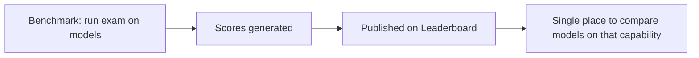
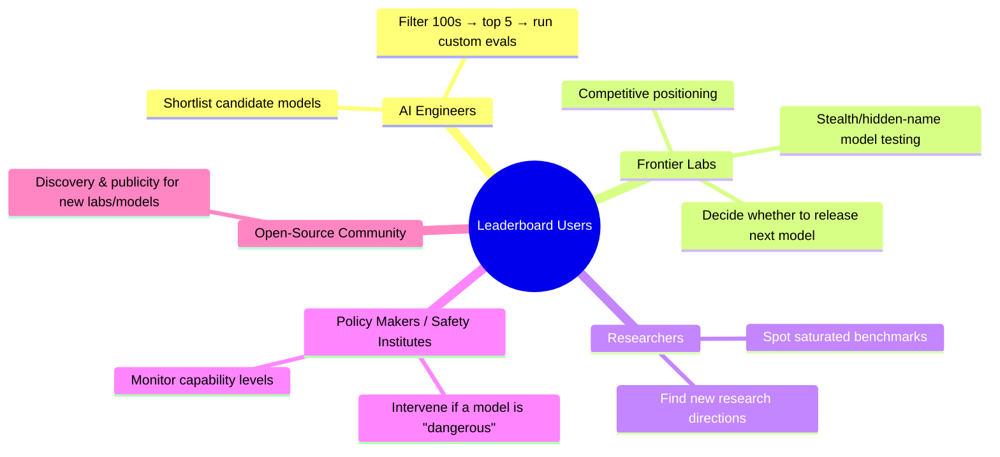
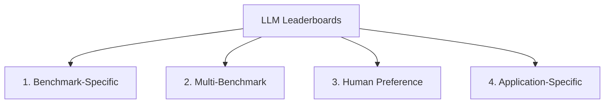
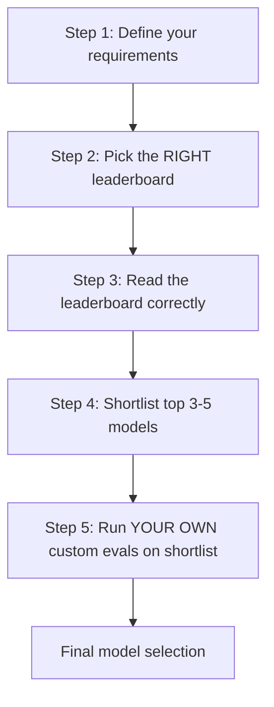

# LLM Leaderboards — Structured Notes

> Source: CampusX LLM Evaluations series — "What are LLM Leaderboards?"
> Part of: Model Evals → **Leaderboards** → Custom Evals → RAG Evals → Agent Evals

---

## 1. What is an LLM Leaderboard?

A **public ranking/comparison table** that shows how different LLMs perform on a common set of evaluations.

- Benchmarks = the **exam** (test a model on a specific aspect)
- Leaderboard = the **result sheet** where scores from that exam are published and compared across models

---

## 2. Why Do Leaderboards Exist? (4 Reasons)

| # | Reason | Explanation |
|---|--------|-------------|
| 1 | **Common reference for comparison** | All models take the "same exam" → easy to see who's #1, #2, etc. |
| 2 | **Trust (third-party validation)** | Labs self-reporting scores (e.g., OpenAI grading itself) is less trustworthy than a neutral third party running the same test on everyone. |
| 3 | **Guides model selection without running evals yourself** | Can't feasibly test 100s of models yourself (cost/time) — leaderboard shortlists top candidates for you. |
| 4 | **Saturation tracking** | If top models cluster around the same score (e.g., 92–94), it signals the benchmark is **saturated** (no longer discriminative). |
| 5 (bonus) | **Discovering new models** | Scrolling past rank 1–3 (Google/OpenAI/Anthropic) to rank 10–20 surfaces newer, cheaper models useful for specific use cases. |

---

## 3. Who Uses Leaderboards? (Stakeholders)

### Key examples from the session
- **Stealth models**: Labs test unreleased models under codenames on leaderboards before revealing the real model (e.g., "Nano Banana" → later revealed as a Google model). If it dominates benchmarks, only then is it released/branded.
- **Release-gating**: A lab won't ship a new model version if it doesn't beat its own previous model on leaderboards (bad optics / bad marketing).
- **Policy intervention example**: Government stepping in on a newly released model deemed risky — used as a real-world illustration of the "safety institutes monitor leaderboards" point.

---

## 4. The 4 Types of Leaderboards

### Type 1 — Benchmark-Specific Leaderboards
- Ranks models using result of **one particular benchmark** only (e.g., MMLU, HumanEval, GSM8K, GPQA).
- **Example**: Humanity's Last Exam (HLE) leaderboard.
- **Limitation**: Very **narrow view** — tells you nothing about overall model quality, only performance on that one axis.
- **Least useful** of the four types.

### Type 2 — Multi-Benchmark Leaderboards ⭐ (Most Useful)
- Combines results from **multiple benchmarks/dimensions** (reasoning, coding, math, instruction-following, data analysis, etc.) into a cumulative/overall score.
- Also often reports **cost per token, latency, output speed, context window size**.
- **Examples**: LiveBench (23 objective tasks across 7 categories), Artificial Analysis (dedicated leaderboards per capability — intelligence, speed, cost, coding agents, speech, image, audio, hardware — plus an overall aggregate).
- **Answers**: *"Which model provides the strongest overall combination of capability, cost, and performance?"*
- Most commonly used by practitioners (including the instructor).

### Type 3 — Human Preference Leaderboards
- Based on **head-to-head human voting**, not benchmark scores.
- Mechanism: User asks the same question to two anonymous models (A vs B) → picks the better response (based on helpfulness, clarity, writing quality, creativity) → aggregated votes → ranking.
- **Example**: LMSYS Chatbot Arena (LM Arena) — "Battle mode."
- **Limitation**: A "better-sounding" answer isn't necessarily the objectively better/more correct one → **human bias** (well-formatted, confident, or entertaining answers get overrated). Mitigated somewhat by scale (many voters worldwide).

### Type 4 — Application-Specific Leaderboards
- Built around a **particular domain/task**, even if they combine multiple benchmarks internally.
- **Example**: Berkeley Function-Calling Leaderboard (ranks models specifically on tool/function-calling ability).
- Other domains: agentic tasks, SQL generation, medical QA, etc.

### Comparison Table

| Type | Basis | Granularity | Usefulness | Example |
|------|-------|-------------|------------|---------|
| Benchmark-Specific | 1 benchmark | Narrow | Low | Humanity's Last Exam |
| Multi-Benchmark | Multiple benchmarks + cost/latency | Broad, overall capability | **Highest** | LiveBench, Artificial Analysis |
| Human Preference | Crowd voting (A/B) | Subjective quality | Medium (marketing-popular) | LMSYS Chatbot Arena |
| Application-Specific | Multiple benchmarks, single domain | Domain-focused | High (for that domain) | Berkeley Function-Calling |

---

## 5. Why You Cannot Blindly Trust Leaderboards (7 Pitfalls)

| # | Pitfall | Explanation |
|---|---------|-------------|
| 1 | **Benchmark performance ≠ real-world performance** | Benchmark data is clean, well-defined. Real world has ambiguous requests, missing info, company-specific data, tool failures, edge cases. (Analogy: doing well on Kaggle ≠ being a good real-world data scientist — Kaggle data is pre-cleaned.) |
| 2 | **Benchmark contamination** | If a model has memorized/seen benchmark questions during training, its score is inflated/not genuine. |
| 3 | **Goodhart's Law / over-optimization for the leaderboard** | Labs fine-tune models specifically to win popular leaderboards (e.g., LM Arena) rather than improve real capability — e.g., training on flattering/soft/well-formatted responses to win human votes. |
| 4 | **Hidden aggregation methodology** | For multi-benchmark leaderboards: which benchmarks are included/excluded, and how scores are normalized/weighted, is often not transparent. |
| 5 | **Small score differences are over-interpreted** | E.g., 84.3 vs 84.1 → ranked 3rd vs 5th, but the actual difference is negligible ("rank bias"). Models within a small margin should be treated as effectively equivalent (like JEE rank 1 vs rank 25). |
| 6 | **Human preference leaderboards carry human bias** | Top rank on LM Arena ≠ objectively best model. Humans favor longer, more confident, better-formatted, more entertaining answers — not necessarily more correct ones. |
| 7 | **Scores can be stale, incomplete, or self-reported** | Leaderboards may not be updated with the latest model versions, may still show discontinued models, or may include company-submitted (self-reported) results with no independent verification. |

### Goodhart's Law (highlighted separately)
> "When a measure becomes a target, it ceases to be a good measure."

- Analogy: If a car company optimizes engineering purely for **mileage** (because that's what Indian buyers look at), the car's overall quality (0–100 acceleration, driving dynamics, etc.) suffers.
- Same with LLMs: optimizing purely to top a leaderboard can degrade real-world usefulness even as the leaderboard score climbs.

---

## 6. Step-by-Step Framework: How an AI Engineer Should Read Leaderboards

### Step 1 — Clarify requirements before looking at any leaderboard
- What type of application am I building?
- What latency do I need?
- What cost can I bear?
- What are my context-length needs?
- Any deployment constraints (public API vs on-premise)?

> Doing this first prevents bias toward the "rank #1" model.

### Step 2 — Go to the leaderboard relevant to your task
| Use case | Relevant leaderboard type |
|----------|---------------------------|
| Chatbot / conversational app | Human preference (e.g., LM Arena) |
| Agentic system | Agent-specific leaderboard |
| RAG system (embeddings) | MTEB (Massive Text Embedding Benchmark) |
| Budget-constrained app | Artificial Analysis / cost-latency-focused leaderboards |

### Step 3 — Read the leaderboard correctly (don't just trust the top number)
Check:
- What exactly is being scored, and how?
- Who ran the evaluation?
- What was the inference budget? Was reasoning/extended thinking enabled?
- How old / how frequently updated is the eval dataset?
- Is there a private held-out test set (to avoid contamination)?
- Has the benchmark saturated?
- Is a confidence interval reported? (If not, close scores may be statistically indistinguishable.)
- For composite scores: what weighting is used across capabilities?
- Read the footnotes / key definitions / FAQ section of the leaderboard.

### Step 4 — Shortlist top 3–5 candidate models
Based on your own criteria from Step 1, not blindly the #1 rank.

### Step 5 — Run your own custom evaluations on the shortlist
This is the **most important step** — the leaderboard's job ends at shortlisting; your own eval set determines the actual best model for *your* application.

---

## 7. Golden Rule 🏆

> **Leaderboards are a FILTERING tool, NOT a DECISION tool.**

- ❌ Don't pick your production model directly off a leaderboard rank.
- ✅ Use leaderboards to narrow 100s of models → top 3–5 candidates.
- ✅ Then run your own custom evaluations on those candidates to make the final decision.

---

## 8. Quick Revision Checklist

- [ ] Define: Leaderboard vs Benchmark (benchmark = exam, leaderboard = published results)
- [ ] List 4 reasons leaderboards exist (common reference, trust/3rd-party, resource-saving model selection, saturation tracking) + discovery bonus
- [ ] Name the 4-5 stakeholder groups and their motive for using leaderboards
- [ ] Recall all 4 leaderboard types with one example each (HLE / LiveBench & Artificial Analysis / LM Arena / Berkeley Function-Calling)
- [ ] Explain why Multi-Benchmark leaderboards are considered most useful
- [ ] List all 7 reasons you can't blindly trust leaderboards
- [ ] Explain Goodhart's Law with an analogy (mileage vs overall car quality)
- [ ] Walk through the 5-step framework for reading leaderboards as an AI engineer
- [ ] State the golden rule: filtering tool, not decision tool

---

## 9. Interview Q&A

**Q1. What is the difference between a benchmark and a leaderboard?**
A benchmark is the actual test/exam that evaluates a specific capability of an LLM. A leaderboard is the published, aggregated ranking of models' results on one or more benchmarks — a way to compare models at a glance.

**Q2. Why do third-party leaderboards carry more trust than a lab's self-reported numbers?**
Because labs have an incentive to make their own model look good (conflict of interest / high stakes). A neutral third party running the same evaluation on all models has no such bias, so its results are more credible.

**Q3. What are the four types of LLM leaderboards? Which is most useful and why?**
Benchmark-specific, Multi-benchmark, Human preference, and Application-specific. Multi-benchmark leaderboards (e.g., LiveBench, Artificial Analysis) are generally the most useful because they give an overall view of a model's capability across multiple dimensions, plus practical info like cost, latency, and context window — rather than a narrow single-axis score.

**Q4. What is benchmark saturation, and why does it matter?**
Saturation happens when many top models cluster around nearly identical scores on a benchmark (e.g., 92–94%), indicating the benchmark is no longer discriminating between models well and may need to be replaced or made harder.

**Q5. What is Goodhart's Law, and how does it apply to LLM leaderboards?**
"When a measure becomes a target, it ceases to be a good measure." When labs optimize models specifically to top a popular leaderboard (e.g., fine-tuning for human-preferred formatting/style on LM Arena), the leaderboard score improves but real-world capability may not — the metric stops reflecting genuine quality.

**Q6. Why can't you blindly trust a leaderboard when selecting a model for production?**
Multiple reasons: benchmark performance doesn't always transfer to messy real-world use cases; benchmarks can be contaminated (models may have memorized test data); models can be over-optimized for a specific leaderboard rather than genuine capability; aggregation/weighting methodology in composite leaderboards is often opaque; small score differences get over-interpreted; human-preference leaderboards carry human bias (favoring longer/more confident answers); and scores can be stale, incomplete, or self-reported.

**Q7. What's the correct workflow for an AI engineer selecting a model using leaderboards?**
1) Clarify application requirements (latency, cost, context, deployment constraints). 2) Go to the leaderboard relevant to the use case (e.g., MTEB for RAG embeddings, LM Arena for chat). 3) Read the leaderboard carefully — methodology, evaluator, dataset recency, confidence intervals, weighting. 4) Shortlist top 3–5 candidate models. 5) Run your own custom evaluations on that shortlist to pick the final model.

**Q8. Are leaderboards a decision-making tool?**
No — leaderboards are a **filtering tool**, used to narrow down hundreds of models to a handful of strong candidates. The actual selection decision should be based on your own custom evaluations run on that shortlist against your specific use case.

**Q9. Give an example of why small differences in leaderboard rank can be misleading.**
Two models scoring 84.3 and 84.1 might land at rank 3 and rank 5 respectively, but a 0.2-point gap is often within noise/statistical insignificance — similar to how a JEE rank 1 vs rank 25 candidate may not differ meaningfully in actual ability. Small rank gaps shouldn't be treated as decisive.

**Q10. What is MTEB and when would you use it?**
MTEB (Massive Text Embedding Benchmark) is a leaderboard specifically ranking embedding models. It's the relevant leaderboard to consult when building a RAG system, since RAG pipelines depend heavily on embedding model quality for retrieval.

---

## 10. What's Next (per session)
- Next session: **Running custom evaluations** on a given LLM (Step 5 of the framework, in practice).
- Future sessions: **Application-level evals** — RAG evals and Agent evals.
