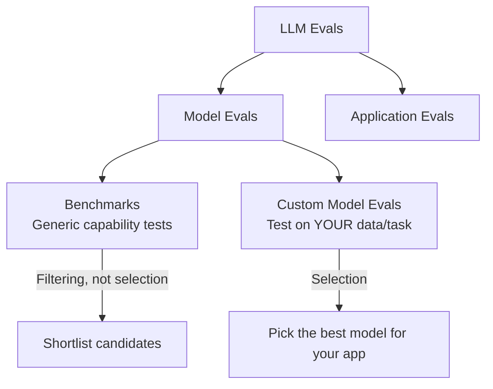
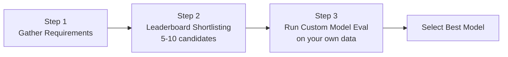
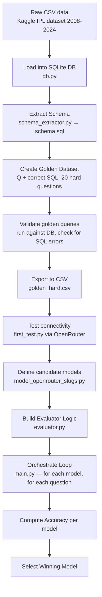
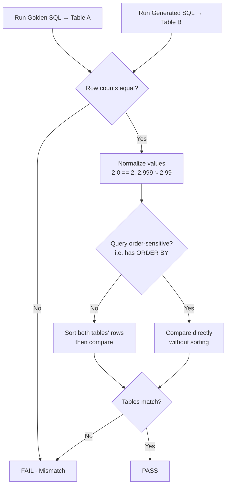
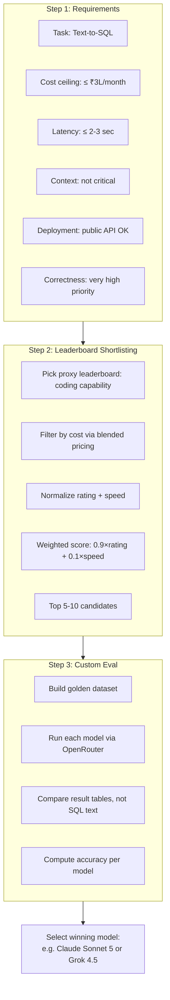

# Custom Model Evals — Text-to-SQL Case Study (ESPN Cricinfo)

> **Series:** CampusX LLM Evaluations
> **Topic:** How to run Custom Model Evals to select the best LLM for a real application
> **Format:** Hands-on / practical session (case study driven)

---

## 1. Quick Recap — Where This Fits



- **Model Evals** → split into **Benchmarks** (generic: knowledge, reasoning, math) and **Custom Model Evals** (run on your own application/data).
- Benchmarks tell you *who the strong general models are*. They don't tell you *which one is best for your specific application*.
- **This session = deep dive into Custom Model Evals**, using a real-world-style case study.

---

## 2. The Case Study: "Ask Cricinfo" (Text-to-SQL)

**Problem statement:**
ESPN Cricinfo runs live commentary. During big matches, viewers ask cricket stat questions (e.g., "Bumrah's wickets vs Pakistan?"). Previously, human analysts manually queried a database to answer — this doesn't scale during high-traffic matches (e.g., 500 questions in 5 minutes).

**Solution:** Build a **Text-to-SQL feature** ("Ask Cricinfo"):
1. User asks a natural language question.
2. LLM is given the **DB schema** + the **question**.
3. LLM generates a **SQL query**.
4. System executes the SQL query on the database.
5. Result is shown to the user.

**Why this isn't RAG:** No external documents are retrieved — only a (fixed) database schema is provided as context every time.

**Role-play framing:** You are an AI engineer at Cricinfo. Task: **select the best LLM** to power this feature.

---

## 3. The 3-Step Framework for Custom Model Selection



| Step | Goal | Output |
|---|---|---|
| 1. Requirements | Understand task, cost ceiling, latency, context, deployment, correctness needs | A requirements doc |
| 2. Leaderboard shortlisting | Use public leaderboards to filter down from hundreds of models | 5–10 candidate models |
| 3. Custom eval | Run the actual task on your own golden dataset for each candidate | Accuracy score per model → pick winner |

> **Key mental model:** Leaderboards are for **filtering**, not **selection**. Final selection always requires a **custom eval on your own data**.

---

## 4. Step 1 — Gathering Requirements

### 4.1 Task Definition
- Task: **Text-to-SQL generation**. Given DB schema + NL question → return only the SQL query (no explanation).

### 4.2 System Prompt Structure (used in this case study)
```
You are a text-to-SQL generator.
Given a database schema and a question, return a single SQL query
that answers it using SQLite syntax. Return ONLY the SQL query.

<schema>
matches table (match info: teams, ground, date, umpire...)
deliveries table (ball-by-ball data: batsman, bowler, runs, wickets...)
</schema>

<question>{user question}</question>
```

### 4.3 Cost Ceiling Calculation

**Given/assumed numbers for this case study:**

| Parameter | Value |
|---|---|
| Input tokens per query (prompt + schema) | ~400 |
| Output tokens per query (SQL only) | ~100 |
| Queries per day (assumed) | 5,000 |
| Days per month | 30 |
| USD→INR conversion | 95 |
| **Monthly budget ceiling** | **₹3 lakh** |

**Cost formula (per query):**
```
cost_per_query = (input_tokens × input_price_per_1M / 1,000,000)
                + (output_tokens × output_price_per_1M / 1,000,000)
```

**Worked example — Claude Fable 5** (input $10/1M, output $50/1M):
```
cost_per_query = (400 × 10/1,000,000) + (100 × 50/1,000,000)
                = 0.004 + 0.005 = $0.009 ≈ $0.0090
Daily cost   = 0.009 × 5,000 = $45 ... 
```
> Note: in-video arithmetic worked out to ≈ **$450/day → $13,500/month → ₹12.82 lakh/month**
> This is **~4x over budget (₹3 lakh)** → Fable is rejected; need a cheaper tier (e.g., Claude Sonnet family).

**Takeaway:** Always sanity-check "hot new flagship model" suggestions against actual budget math — don't pick a model just because it's the newest/most hyped.

### 4.4 Prompt Caching (Cost Optimization)

Useful when a large portion of the prompt (system prompt + schema) is **identical across many queries** — as is the case here (only the user's question changes).

| Cache type | Refresh cycle | Best for |
|---|---|---|
| 5-minute cache write | Refreshes every 5 min of inactivity | High-traffic apps (queries arrive frequently, e.g., every few min) |
| 1-hour cache write | Refreshes every 1 hr of inactivity | Lower-traffic apps (~1000 queries/day) |

**Mechanics:**
- First query: pay a **premium** to write to cache (e.g., 1.25x normal input cost).
- Subsequent queries within the refresh window: pay a **much smaller** cache-hit rate (e.g., ~1/10th of normal input cost).
- If no query arrives before the window expires, the cache is evicted and the next query pays the write premium again.
- Powered internally by **KV-Caching** (caching Key/Value vectors from the attention mechanism).

**Where caching helps vs. doesn't:**
| Scenario | Prompt caching benefit |
|---|---|
| Text-to-SQL with fixed schema (this case) | ✅ High — schema+system prompt reused every call |
| RAG chatbot | ❌ Low — retrieved context changes every query |

> Result in this case study: prompt caching could bring Fable's cost from ~₹1 lakh (rough) down to ~₹65–67k/month.

### 4.5 Other Requirements Checklist

| Requirement | Consideration for this app | Answer |
|---|---|---|
| **Latency** | Users ask live, during matches — expect near-instant answers | Target: **2–3 seconds max** |
| **Context window** | Each question is independent (no multi-turn conversation) | **Not a major factor** — small context needed |
| **Deployment** | Any data privacy/on-prem needs? | **No** — public API (OpenAI/Anthropic/etc.) is fine; more reliable infra than self-hosting |
| **Correctness/Accuracy** | Cricket fans are extremely detail-obsessed; a wrong stat → screenshot → viral embarrassment | **Very high priority** — cannot hallucinate |

**Full requirements summary:**
- Task: Text-to-SQL
- Cost ceiling: ≤ ₹3 lakh/month
- Latency: ≤ 2–3 seconds
- Context window: not a major constraint
- Deployment: public API preferred (reliability > self-hosting)
- Correctness: must be very high (near-zero tolerance for wrong answers)

---

## 5. Step 2 — Leaderboard Shortlisting

### 5.1 Choosing a Leaderboard
- Ideal: a **dedicated Text-to-SQL leaderboard**. Options explored & rejected:
  - **BIRD-SQL** — outdated, includes fine-tuned models (not general-purpose), unclear fine-tuning data.
  - **Spider** — similarly outdated.
  - **LiveSQLBench** — not updated with the newest frontier models; unclear evaluation dataset.
- **Fallback strategy:** Use a **general coding leaderboard** as a **proxy/alias** for SQL-generation capability, since SQL generation is fundamentally a coding task.
- **Chosen source: `llm-stats.com`** — aggregates data from multiple coding benchmarks into one score; well-updated with the latest models; also reports cost, speed, and context window.

### 5.2 Blended Pricing — How to Read Leaderboard Cost Numbers

Many leaderboards report a **single blended price** instead of separate input/output rates, using a fixed ratio (commonly **4:1 input:output**).

**Formula:**
```
blended_price = (4 × input_price + 1 × output_price) / 5
```

**Worked example — Claude Fable 5** (input $10, output $50):
```
blended = (4×10 + 1×50) / 5 = (40+50)/5 = 90/5 = $18
```

> **Lucky coincidence in this case study:** the app's own input:output token ratio (400:100) is **exactly 4:1** — matching the leaderboard's blended ratio. This means the blended price can be used *directly* for cost estimation without separately weighting input/output.

```
Total tokens per query = 400 + 100 = 500
Cost per query = 500 × blended_price / 1,000,000
Monthly cost   = cost_per_query × queries_per_day × 30 × USD_to_INR
```

### 5.3 Filtering & Ranking Strategy

**Step-by-step process used:**
1. Downloaded leaderboard data for **146 models**.
2. Calculated **monthly cost** for each model using the blended-price formula above.
3. **Rejected all models exceeding the ₹3–5 lakh budget** → ~50–60 models remained.
4. **Normalized** two metrics for remaining models to a 0–1 range (min-max normalization):
   - **Coding capability / rating score**
   - **Speed** (characters printed per second)
5. Computed a **weighted composite score**:
   ```
   final_score = 0.9 × normalized_rating + 0.1 × normalized_speed
   ```
6. **Sorted models by final_score descending** → top 10 shortlisted.

**Why weight coding capability (90%) so much higher than speed (10%)?**
- Output is tiny — just a single SQL query (~100 tokens).
- Even a "slow" model prints ~100 tokens quickly; speed barely matters when output is short.
- Speed would matter far more if the output were long-form (e.g., a full essay).
- **Correctness matters far more than raw throughput for this specific task.**

> This weighting is a **judgment call** — could be 80/20, 75/25, etc. Document your reasoning.

### 5.4 Min-Max Normalization (Reminder)
```
normalized_value = (value - min_value) / (max_value - min_value)
```
Scales any metric into the [0, 1] range so metrics on different scales (accuracy % vs. chars/sec) can be combined fairly.

---

## 6. Selecting the 5 Finalist Candidates

From the top-10 shortlist, 5 models were picked for live testing (chosen for diversity/curiosity, not purely top-ranked):

| # | Model | Reason for inclusion |
|---|---|---|
| 1 | GPT-5.6 Tera | Top-ranked candidate (expensive but strongest) |
| 2 | Kimi K3 | Trending/hyped new model (Moonshot AI, 2.7T params, open-weights) |
| 3 | Grok 4.5 | Curiosity — "you never know with Elon Musk" |
| 4 | Claude Sonnet 5 | Only Anthropic-family model in the shortlist |
| 5 | MiniMax M3 | Very cheap Chinese open-weight model, close to top performers |

*(GPT-5.6 Luna was skipped since Tera — from the same family — was expected to outperform it. Gemini 3.6 Flash was also skipped for time.)*

> **Note:** You are not limited to 5 — this was just a live-class time constraint. In practice, evaluate all shortlisted candidates.

---

## 7. Step 3 — Building & Running the Custom Eval

### 7.1 Full Pipeline



### 7.2 Key Files & Their Roles

| File | Purpose |
|---|---|
| `db.py` | Loads Kaggle IPL CSVs (`matches.csv`, `deliveries.csv`), trims to 2020–2024 data, stores into a **SQLite** database |
| `schema_extractor.py` | Reads DB structure, writes table/column/type info → `schema.sql` (needed for the system prompt) |
| `golden_dataset_generator.py` | Contains 20 hand/LLM-crafted (question, SQL, difficulty label) dicts; runs each SQL against the DB to catch syntax errors |
| `make_golden_dataset.py` | Extracts the validated Q&A pairs into a clean `golden_hard.csv` (also stores expected row count + whether query is order-sensitive) |
| `first_test.py` | Sanity test — sends one question through OpenRouter to confirm the pipeline works end-to-end |
| `model_openrouter_slugs.py` | List of (model_name, openrouter_slug) tuples for all candidate models |
| `evaluator.py` | Core comparison logic — determines if a generated SQL query's result matches the golden query's result |
| `main.py` | Orchestrator — loads schema + golden dataset, loops over each candidate model, calls the LLM, executes SQL, evaluates, logs scores |

### 7.3 Why NOT String-Match the SQL Queries?

> A single correct result can be reached via **multiple different SQL query formulations**. Comparing generated SQL text character-by-character against the golden SQL is a **bad strategy**.

**Correct approach:** Run *both* queries against the database and **compare the resulting tables** (result sets), not the SQL text.

### 7.4 Evaluator Logic (Table Comparison)



**Step-by-step evaluator logic:**
1. **Row count check** — if row counts differ, immediately FAIL (different-sized results can't represent the same answer).
2. **Value normalization** — treat `2.0` and `2` as equal; treat near-equal floats (`2.999` vs `2.99`) as equal, to avoid false negatives from formatting differences.
3. **Row-by-row structuring** — convert both result sets into lists of tuples.
4. **Order sensitivity check:**
   - If the golden query does **not** use `ORDER BY` → **sort both tables** before comparing (since row order may legitimately differ across equivalent queries).
   - If the golden query **does** use `ORDER BY` → compare **without sorting** (order itself is part of correctness).
5. **Final comparison** → PASS if tables match, FAIL otherwise.

### 7.5 Golden Dataset Design Principles
- Aim for a **representative distribution** of real user question types:
  - Mix of difficulty: e.g., ~10 easy, ~20 medium, ~20 hard (in a 50-question set).
  - Mix of SQL complexity: joins, subqueries, window functions, etc.
- Typically **human-authored** by a data analyst (or LLM-assisted, but must be validated by running against the real DB).
- **Trade-offs on dataset size:**
  - Larger dataset = better statistical confidence, but:
    - More human/LLM effort & cost to create.
    - More LLM API calls needed for eval (cost scales: `#models × #questions` calls).
  - This case study used a **deliberately small (20-question), very hard** set for a live classroom demo — real production evals may use 50–500+ questions.
  - Golden datasets should be **iteratively expanded** post-deployment: add new real user questions where the model failed.

### 7.6 Using OpenRouter
- **Why:** Different providers (OpenAI, Anthropic, xAI, Moonshot, MiniMax, etc.) have different SDKs/APIs. **OpenRouter** provides one unified API/interface to call any model by its "slug."
- Integrates directly with **LangChain** (`ChatOpenRouter`, analogous to `ChatOpenAI`).
- Offers free credits for light testing; full 5-model × 20-question run cost ~$5 (~₹500) in this case study.

---

## 8. Live Trial Results

| Model | Accuracy | Notable Behavior | Approx. Monthly Cost |
|---|---|---|---|
| **GPT-5.6 Tera** | 80% (16/20) | Failed mostly on the hardest ("brutal") questions | Highest — over budget originally |
| **Kimi K3** | ~50–55% (11/20) | Multiple **SQL syntax errors** (not just wrong answers — malformed SQL); notably **slow** (large reasoning model, reasoning settings untouched) | Cheaper than Tera |
| **Grok 4.5** | ~90% | Fast, very few errors, best accuracy | ~₹2.5 lakh/month |
| **Claude Sonnet 5** | ~85% | Fastest of all tested models in this run | ~₹2.84 lakh/month |
| **MiniMax M3** | ~65% | Also had SQL syntax errors (similar issue pattern to K3) | Very cheap |

### Key Observations
- **A model's leaderboard hype ≠ guaranteed task performance.** Kimi K3 was heavily trending in the news yet performed poorly and slowly on this specific task — a strong lesson in why custom evals matter.
- Chinese open-weight models (K3, MiniMax) in this run showed more **raw SQL syntax errors** than US-based models (possibly generating malformed/garbled SQL).
- **Final decision narrowed to 2 finalists: Grok 4.5 vs. Claude Sonnet 5** (GPT-5.6 Tera eliminated on cost despite being accurate).
  - Cost: comparable between the two.
  - Speed: leaderboard said Grok was faster, but *in this live run*, Sonnet was observed to be faster.
  - Reliability: Anthropic's API/infra was considered more reliable → slight lean toward **Sonnet 5**.
  - Final call is subjective / can be broken via **team voting** when data is close.

> **Caveat acknowledged in-class:** 20 questions is a small sample (~5% swing per question). Ideally:
> - Use a larger golden dataset.
> - Run the eval **multiple times** (e.g., 5 runs) and average, since each API call is independent — gives stronger statistical confidence (at extra cost).

---

## 9. End-to-End Summary Diagram



---

## 10. Interview Q&A

**Q1: What is the difference between a benchmark and a custom model eval?**
A: A benchmark uses generic, standardized datasets to test broad capabilities (reasoning, math, coding) and is best for *filtering* candidate models. A custom model eval runs models against your own task-specific data to determine which model is *actually best for your application* — this is used for final *selection*.

**Q2: Why shouldn't you directly select a model based on leaderboard rank alone?**
A: Leaderboards measure general capability on generic tasks/datasets, which doesn't guarantee performance on your specific domain, prompt structure, or data distribution. A hyped model (e.g., Kimi K3 in this case study) can underperform and even be slower on a narrow, specific task despite topping general leaderboards.

**Q3: Why is comparing generated SQL text directly to the golden SQL text a bad evaluation strategy?**
A: Because multiple different, syntactically distinct SQL queries can produce the identical correct result (e.g., different join orders, subquery vs. CTE). String/character matching would incorrectly mark semantically-correct-but-differently-written queries as wrong. The correct approach is to **execute both queries and compare the resulting result sets (tables)**.

**Q4: How do you compare two SQL result sets robustly?**
A: 1) Check row counts match. 2) Normalize values (e.g., `2.0` == `2`, near-equal floats treated as equal). 3) If the query is not order-sensitive (no `ORDER BY`), sort both result sets before comparing to avoid false negatives from row reordering. 4) If order matters (has `ORDER BY`), compare without sorting, since order is part of correctness.

**Q5: What is prompt caching and when is it most useful?**
A: Prompt caching lets you cache the static/repeated portion of a prompt (e.g., system instructions + fixed schema) on the provider's servers so you don't pay full input-token price on every repeated call — only a small "cache hit" fee, with an initial slightly-higher "cache write" fee. It's most valuable when a large chunk of your prompt is constant across requests (e.g., text-to-SQL with a fixed schema); it offers little benefit in RAG chatbots where retrieved context changes every call.

**Q6: What are the 5-minute vs 1-hour cache write options?**
A: They control the cache's refresh/expiry window. A 5-minute cache suits high-traffic apps where requests arrive frequently enough to keep hitting the cache; a 1-hour cache suits lower-traffic apps where requests are more spread out, avoiding repeated cache-write premiums.

**Q7: How do you calculate the monthly LLM cost for an application?**
A: `cost_per_query = (input_tokens × input_price/1M) + (output_tokens × output_price/1M)`, then `monthly_cost = cost_per_query × queries_per_day × 30 (× currency_conversion_rate if needed)`.

**Q8: What is "blended pricing" on leaderboards and how do you use it correctly?**
A: A single price combining input and output cost using an assumed ratio (commonly 4:1 input:output): `blended = (4×input_price + 1×output_price)/5`. It's only directly usable for your own cost estimate if *your application's* actual input:output token ratio matches the leaderboard's assumed ratio — otherwise you should compute cost using the model's separate input/output rates.

**Q9: Why might latency matter less in some applications despite being a stated requirement?**
A: If the LLM's *output* is very short (e.g., a single SQL query, ~100 tokens), even a comparatively "slow" model (characters/sec) will still respond quickly overall, since there isn't much to generate. Latency/throughput matters far more when output is long-form (e.g., essays, long chat responses).

**Q10: Why might context window size not matter for some applications?**
A: If each user interaction is a single, disjoint, non-conversational request (no multi-turn chat, no large document context), the prompt stays small regardless of the model's max context window — so a model with a small context window is not disqualified.

**Q11: What's the risk of using a fine-tuned/task-specific leaderboard (e.g., older Text-to-SQL leaderboards) vs. a general coding leaderboard as a proxy?**
A: Task-specific leaderboards can become outdated (missing the newest frontier models) or may rank fine-tuned models that aren't available/general-purpose for your use. A general coding leaderboard, used as a capability proxy (since SQL generation is a coding task), can be more current and give you access to frontier general-purpose models.

**Q12: Why normalize metrics before combining them into a composite score?**
A: Different metrics exist on different scales (e.g., accuracy % vs. characters/sec). Min-max normalization rescales each to [0,1] so they can be fairly combined via a weighted sum without one metric dominating purely due to its raw scale.

**Q13: How large should a golden dataset be, and what are the trade-offs?**
A: No strict limit — common range is ~50 to 500+ questions. Trade-offs: (1) creation cost — human/analyst time to write and validate queries; (2) evaluation cost — total LLM calls = `#models × #questions`, so cost scales linearly with dataset size across all candidates. Golden datasets should also be **iteratively grown** by adding real production failure cases over time.

**Q14: How do you validate a golden dataset before using it for evaluation?**
A: Run every golden SQL query against the actual database and confirm it executes without errors (i.e., is syntactically valid and returns a result) — this catches malformed golden queries before they corrupt your evaluation results.

**Q15: What tool solves the "different providers, different SDKs" problem when testing multiple candidate models?**
A: **OpenRouter** — a unified API/platform that lets you call many different providers' models (OpenAI, Anthropic, xAI, Moonshot, MiniMax, etc.) through one consistent interface/slug system, with native LangChain integration.

**Q16: Give an example where a "hyped" frontier model underperformed in this case study, and what lesson does it teach?**
A: Kimi K3 (2.7T-parameter, heavily trending open-weights model) generated multiple raw SQL syntax errors and was notably slow in the custom eval, despite strong general buzz. Lesson: leaderboard fame/hype does not guarantee task-specific performance — always validate with a custom eval on your actual data before selecting a model for production.

**Q17: When choosing between two closely-matched finalist models (similar cost & accuracy), what other factors can break the tie?**
A: Observed real-world speed during your own eval run (not just leaderboard-reported throughput), API/infrastructure reliability of the provider, and team consensus/voting when the data doesn't clearly favor one option.

---

## 11. Revision Checklist

- [ ] Can explain the difference between benchmarks (filtering) and custom evals (selection)
- [ ] Can list and explain the 3-step framework: Requirements → Leaderboard Shortlisting → Custom Eval
- [ ] Can compute per-query and monthly LLM cost from input/output tokens and pricing
- [ ] Understand blended pricing (4:1 ratio) and when it's directly usable
- [ ] Understand prompt caching (5-min vs 1-hour cache, cache write vs cache hit pricing) and when it helps vs. doesn't (RAG)
- [ ] Can explain why context window and latency matter differently depending on app design (single-turn vs. multi-turn, short vs. long output)
- [ ] Can explain why string-matching SQL is wrong; know the table-comparison evaluator logic (row count → normalize → sort-if-unordered → compare)
- [ ] Understand golden dataset design (difficulty spread, query-type spread, validation, iterative growth)
- [ ] Know why general coding leaderboards can be used as SQL-capability proxies
- [ ] Understand min-max normalization and weighted composite scoring for ranking candidate models
- [ ] Understand OpenRouter's role in multi-provider evaluation
- [ ] Can recall the case study's outcome: GPT-5.6 Tera (accurate but costly) → eliminated; Kimi K3 & MiniMax M3 (cheap but error-prone/slow) → eliminated; final 2 = Grok 4.5 vs. Claude Sonnet 5, decided on reliability/observed speed

---

## 12. Glossary

| Term | Definition |
|---|---|
| **Model Eval** | Evaluating raw LLM capability (via benchmarks or custom task-based tests) |
| **Application Eval** | Evaluating the full application/pipeline built around an LLM (not covered in this session — next topic) |
| **Golden Dataset** | A validated set of (question, correct-answer/query) pairs used as ground truth for evaluation |
| **Blended Price** | A single combined input+output price computed using an assumed token ratio (e.g., 4:1) |
| **Prompt Caching** | Provider feature to cache a static portion of the prompt to reduce repeated input-token costs |
| **KV-Cache** | The underlying mechanism (Key/Value vectors in attention) that powers prompt caching |
| **OpenRouter** | Unified API platform to access many different LLM providers via one interface |
| **Normalization (min-max)** | Rescaling a metric to a [0,1] range using `(x - min)/(max - min)` |
| **Order-sensitive query** | A SQL query using `ORDER BY`, where row order is part of correctness |
