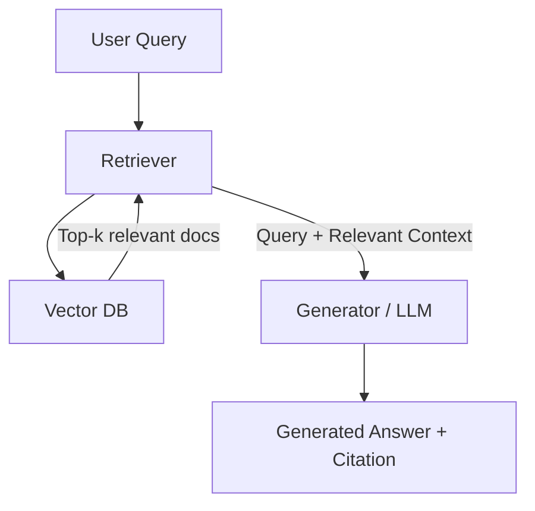
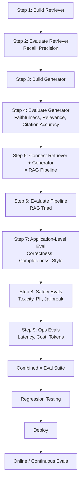
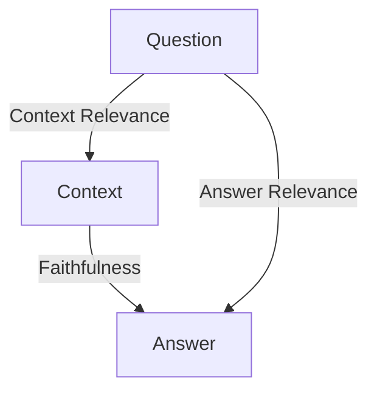
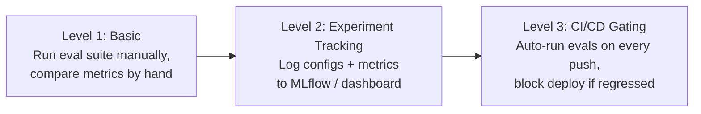
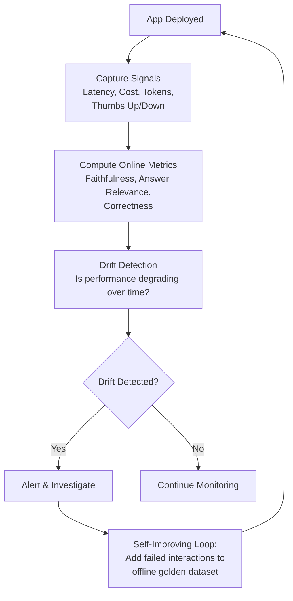

# RAG Application Evaluation Strategy — CampusX Doubt Solver Case Study

> **Session context:** LLM Evaluations course (CampusX). This session marks the transition from **Model Evals** (covered in earlier lectures — benchmarks like MMLU family, custom model evals, Text-to-SQL case study) to **Application Evals**, starting with a RAG chatbot case study. This is the framework-setting lecture — the actual build (retriever, generator, pipeline, application, regression testing) happens across the next 4 sessions.

---

## Table of Contents

1. [Recap: Where This Fits in the Course](#1-recap-where-this-fits-in-the-course)
2. [Model Evals vs Application Evals](#2-model-evals-vs-application-evals)
3. [Why RAG and Agents Specifically](#3-why-rag-and-agents-specifically)
4. [Case Study: CampusX Course Doubt Solver](#4-case-study-campusx-course-doubt-solver)
5. [The 3-Tier RAG Evaluation Framework](#5-the-3-tier-rag-evaluation-framework)
6. [Level 1 — Component-Level Evaluation](#6-level-1--component-level-evaluation)
7. [Level 2 — Pipeline-Level Evaluation (RAG Triad)](#7-level-2--pipeline-level-evaluation-rag-triad)
8. [Level 3 — Application-Level Evaluation](#8-level-3--application-level-evaluation)
9. [Tooling: DeepEval vs Ragas](#9-tooling-deepeval-vs-ragas)
10. [Regression Testing](#10-regression-testing)
11. [Online Evaluation (Post-Deployment)](#11-online-evaluation-post-deployment)
12. [Project Folder Structure](#12-project-folder-structure)
13. [How to Answer This in Interviews](#13-how-to-answer-this-in-interviews)
14. [Interview Q&A](#14-interview-qa)
15. [Quick Revision Checklist](#15-quick-revision-checklist)

---

## 1. Recap: Where This Fits in the Course

The LLM Evals playlist so far has covered two big milestones:

- **Milestone 1 — Fundamentals:** why evals matter, reference-based vs reference-free evals, online vs offline evals, model evals vs application evals.
- **Milestone 2 — Model Evals:** standardized evals (benchmarks like the MMLU family, leaderboards), and custom model evals (e.g., the Text-to-SQL case study) for picking the right base model for your application.

**Milestone 3 (starting now) — Application Evals:** evaluating a full LLM-based application, not just the underlying model. This is the most important part of the playlist.

---

## 2. Model Evals vs Application Evals

| Aspect | Model Evals | Application Evals |
|---|---|---|
| What's evaluated | The raw LLM itself | The end-to-end product built on top of the LLM |
| Purpose | Choosing/comparing base models | Verifying the whole system works for real users |
| Examples covered | MMLU family, custom Text-to-SQL eval | RAG chatbot, agents |
| Covered in this session? | No (already done) | Yes — this is the focus going forward |

---

## 3. Why RAG and Agents Specifically

LLM-based applications can take many forms: simple chatbots, RAG chatbots, agents, multimodal apps, fixed-schema-output apps (e.g., an email classifier routing support/refund/technical tickets). Teaching eval strategy for *every* type isn't feasible, so two are deliberately chosen:

- **RAG** — extremely prevalent; most chatbots built professionally have RAG functionality.
- **Agents** — also very important, covered later in the playlist.

Rationale: harder application types (RAG, agents) subsume the skills needed for simpler ones (plain chatbots, fixed-schema apps), so mastering these two generalizes well. Multimodal apps are treated as a slight tangent (less common in production) and are skipped.

---

## 4. Case Study: CampusX Course Doubt Solver

**Problem statement (intentionally simple):** Build a RAG chatbot that answers student doubts for *this specific* LLM Evals course, using the lecture transcripts as the knowledge base (documents fed into the RAG pipeline).

- Documents = all lecture transcripts of the course.
- Goal = deliberately kept simple so the *focus stays on evaluation*, not on building a fancy RAG system.
- Basic RAG architecture assumed known: **Retriever → Vector DB → Generator**.



---

## 5. The 3-Tier RAG Evaluation Framework

Core idea: **you don't build the entire chatbot first and then evaluate it.** Evaluation happens *alongside* development, level by level — just like software testing (unit tests → integration tests → system tests).

Three levels, evaluated in order:

1. **Component Level** — retriever and generator evaluated independently (in isolation).
2. **Pipeline Level** — retriever + generator connected together; evaluated as a RAG pipeline (RAG Triad).
3. **Application/System Level** — the full application evaluated end-to-end (correctness, completeness, style, safety, ops).



---

## 6. Level 1 — Component-Level Evaluation

Evaluate the retriever and generator **in isolation**, before they're wired together.

### 6.1 Retriever Evaluation

Build order: load documents → chunk → embed into vectors → store in vector DB → given a query, fetch relevant docs.

**Question the eval answers:** given a question, is the retriever fetching the *correct* documents from the vector DB?

| Metric | Definition |
|---|---|
| **Recall** | Of all the truly relevant documents, how many did the retriever manage to fetch? |
| **Precision** | Of all the documents the retriever fetched, how many were actually relevant/useful? |

### 6.2 Generator Evaluation

The generator is essentially "LLM + question + relevant context → answer." At this stage it is **not yet connected to the retriever** — question and context are supplied manually, like a golden dataset.

| Metric | Definition |
|---|---|
| **Faithfulness** | Is the generated answer grounded strictly in the given context, or did the model hallucinate something not present in it? |
| **Answer Relevance** | Is the generated answer actually relevant to the question asked? |
| **Citation Accuracy** | If the answer cites a source (e.g., "this was discussed in lecture X," with a transcript link), is that citation correct? |

Once both retriever and generator pass their isolated evals independently, **Level 1 is complete.**

---

## 7. Level 2 — Pipeline-Level Evaluation (RAG Triad)

**Step 5:** Connect the retriever and generator → this combined system is the **RAG pipeline**.

**Step 6:** Evaluate the pipeline as a whole using the famous **RAG Triad** — three metrics formed from the three entities involved: **Question, Context, Answer.**



| Metric | Pair | Definition |
|---|---|---|
| **Context Relevance** | Question ↔ Context | Is the context fetched by the retriever relevant to the question? |
| **Faithfulness** | Context ↔ Answer | Is the generated answer grounded in the context, or hallucinated? |
| **Answer Relevance** | Question ↔ Answer | Is the generated answer actually relevant to the question? |

> Note: Faithfulness appears at both the generator (component) level and pipeline level — at component level it's tested with a manually-supplied context; at pipeline level it's tested with the context the retriever *actually* fetched.

If all three RAG Triad metrics pass → **Level 2 is complete.**

---

## 8. Level 3 — Application-Level Evaluation

**Step 7:** Test whether the full application (the Doubt Solver) functions correctly as a product.

### 8.1 Quality Metrics

| Metric | Definition |
|---|---|
| **Correctness** | Is the final answer factually correct? |
| **Completeness** | If a question has multiple parts, does the answer address *all* of them? (A partially correct-but-incomplete answer fails this metric even if the answered part is accurate.) |
| **Style / Tone** | Does the explanation style match the target persona — e.g., matching the CampusX instructors' explanation style? |

### 8.2 Safety Evals (Step 8)

| Metric | Definition |
|---|---|
| **Toxicity** | Is the response toxic/harmful in tone? |
| **PII Leakage** | Does the response leak personally identifiable information? |
| **Jailbreak Resistance** | Can the application be jailbroken to bypass its intended behavior? |

### 8.3 Ops Evals (Step 9)

| Metric | Definition |
|---|---|
| **Latency** | How long does the app take to respond per query? |
| **Cost** | How much does each query cost? |
| **Token Usage** | How many tokens are consumed per query? |

**Combined, all three levels (Component + Pipeline + Application) form the "Eval Suite"** — the entire testing suite for the application.

---

## 9. Tooling: DeepEval vs Ragas

Rather than hand-writing all custom eval code (as was done for the earlier custom Model Eval / Text-to-SQL lecture), this playlist uses the **DeepEval** library, which already implements most of the above metrics (Answer Relevancy, Faithfulness, Contextual Precision/Recall, Contextual Relevancy, Toxicity, PII Leakage, etc.). DeepEval's syntax is built on top of **PyTest**, so it will feel natural to anyone familiar with Python software testing.

| Aspect | DeepEval | Ragas |
|---|---|---|
| Scope | Broader — RAG, agents, multi-turn chatbots, non-LLM apps, image-based apps | Primarily RAG-focused |
| Already covered in course? | No | Yes (in the earlier Advanced RAG course) |
| Adoption trend | Expected to become close to an industry-standard benchmark library | Also good, widely used |
| Chosen for this playlist? | **Yes** | No (not because it's bad — just redundant with prior coverage) |

Both libraries can accomplish the same evaluations — the choice of DeepEval here is pragmatic, not a claim that Ragas is inferior.

---

## 10. Regression Testing

**Definition:** Regression testing = running your entire eval suite against your application to objectively determine whether a new version is *not worse* than the previous version.

Three levels of maturity, from basic to advanced:



| Level | What Happens |
|---|---|
| **1. Basic** | Run the eval suite once to get baseline metric numbers (e.g., Retriever Recall = 82%, Precision = 68%). After any change, rerun and manually compare against baseline. |
| **2. Experiment Tracking** | Log each run's configuration (chunk size, overlap, temperature, embedding model settings) alongside its resulting metrics into a tool like **MLflow** (or DeepEval's own **Confident AI**, or **Weights & Biases**). Gives a visual dashboard to compare metric trends across many runs. |
| **3. CI/CD Gating** | Wire a CI tool (e.g., **GitHub Actions**) so that on every code push, the entire eval suite auto-runs. Define a threshold (e.g., "no metric should drop more than 3% from baseline"). If the new version regresses → deployment is paused. If it improves → deployment proceeds and the baseline updates. |

**Key point:** No single standard tool exists yet for LLM eval tracking (unlike classical ML, where MLflow is the de facto standard) — so focus on understanding the *concept*, not memorizing one specific tool.

---

## 11. Online Evaluation (Post-Deployment)

Evaluation does not stop at deployment. Once live, the application is continuously evaluated via **online evals**.



| Activity | Description |
|---|---|
| **Capture signals** | Per-interaction data: latency, cost, tokens consumed, thumbs up/down feedback. |
| **Compute online metrics** | Same metrics tested offline (faithfulness, answer relevance, correctness) now measured on live traffic. |
| **Drift detection** | Monitor whether a metric (e.g., faithfulness) is degrading over time (e.g., a downward trend over the last 8 hours) — triggers alerting. |
| **Self-improving loop** | When the app misbehaves on a real user interaction, that instance is captured and added to the offline golden dataset, enriching future offline evals. |

**Tooling** for this observability/tracing layer: **LangSmith**, **Langfuse**, or **Confident AI** — collectively referred to as **LLM observability / tracing** tools.

---

## 12. Project Folder Structure

```
project/
├── src/                     # Application source code
│   ├── retriever.py
│   ├── generator.py
│   ├── rag_pipeline.py
│   └── api.py               # e.g. FastAPI + Streamlit UI
├── evals/                   # The "Eval Suite"
│   ├── eval_retriever.py
│   ├── eval_generator.py
│   ├── eval_pipeline.py     # RAG Triad
│   ├── eval_application.py  # Correctness, Completeness, Style
│   ├── eval_safety.py       # Toxicity, PII, Jailbreak
│   └── eval_ops.py          # Latency, Cost, Tokens
└── run_evals.py             # Orchestrates all eval files, generates a report
```

`run_evals.py` triggers every eval file in sequence and produces a consolidated report — this is the file invoked for regression testing, and later wired into CI/CD.

---

## 13. How to Answer This in Interviews

**Question: "How do you evaluate your RAG chatbot?"** — asked in ~8 out of 10 GenAI interviews.

**Weak answer (most candidates who've studied evals give this):** "I'd check recall, precision, and answer relevance" — naming 3-4 metrics without structure.

**Strong answer (framework-based):**

1. "I would build an **evaluation suite** that tests the application at **three levels**."
2. **Component level** — evaluate retriever (recall, precision) and generator (faithfulness, relevance, citation accuracy) independently.
3. **Pipeline level** — connect retriever + generator, test the **RAG Triad** (context relevance, faithfulness, answer relevance).
4. **Application level** — test correctness, completeness, style/tone, plus **safety** (toxicity, PII leakage, jailbreak resistance) and **ops** metrics (latency, cost, tokens).
5. Use this eval suite to run **regression testing** — at whichever maturity level suits the org (basic manual comparison → experiment tracking → CI/CD gating).
6. Once the new version beats baseline, **deploy** — then continue with **online evaluations**: capture live signals, compute online metrics, detect drift, and feed failures back into the offline golden dataset (**self-improving loop**).

Structuring the answer this way signals depth and hands-on experience, versus just listing metric names.

---

## 14. Interview Q&A

1. **Q: What's the difference between model evals and application evals?**
   A: Model evals assess the raw LLM in isolation (e.g., via benchmarks like MMLU or custom evals) to pick the right base model. Application evals assess the entire product built on top of the LLM (e.g., a RAG chatbot or agent) — testing the system end-to-end, not just the model.

2. **Q: Why do component-level, pipeline-level, and application-level evaluation instead of just testing the final app?**
   A: It mirrors software engineering best practice — unit test components before integration testing the whole system. Isolating retriever/generator failures early is far cheaper to debug than diagnosing a failure buried inside a full pipeline.

3. **Q: What metrics would you use to evaluate a retriever?**
   A: Recall (fraction of truly relevant docs successfully retrieved) and Precision (fraction of retrieved docs that are actually relevant).

4. **Q: What is the RAG Triad?**
   A: Three metrics evaluating a RAG pipeline as a whole, formed from the Question-Context-Answer triangle: Context Relevance (question↔context), Faithfulness (context↔answer), and Answer Relevance (question↔answer).

5. **Q: What's the difference between Faithfulness and Answer Relevance?**
   A: Faithfulness checks whether the answer is grounded in the retrieved context (i.e., no hallucination). Answer Relevance checks whether the answer actually addresses the question — an answer can be faithful to the context yet still fail to relevantly address what was asked.

6. **Q: What does "Completeness" mean as an application-level metric, and how is it different from Correctness?**
   A: Correctness asks whether the answer's content is factually accurate. Completeness asks whether the answer addresses *every part* of a (possibly multi-part) question. An answer can be correct on the part it addresses yet still be incomplete if it ignores another part of the question.

7. **Q: What safety checks are typically run at the application level?**
   A: Toxicity detection, PII leakage detection, and jailbreak resistance testing.

8. **Q: What are "ops evals" and why do they matter?**
   A: Operational metrics — latency, cost per query, and token usage — that matter for production viability even if the model's answers are perfect.

9. **Q: Why choose DeepEval over Ragas for this kind of evaluation?**
   A: Both are capable RAG eval libraries. DeepEval is broader in scope (covers agents, multi-turn chatbots, non-LLM and image-based apps too), is trending toward becoming an industry-standard, and is built on PyTest syntax, making it familiar to anyone with a software testing background.

10. **Q: What is regression testing in the context of LLM applications?**
    A: Running your full eval suite against a new version of the application and objectively comparing its metrics against a previous baseline, to confirm the new version isn't worse before deploying it.

11. **Q: What are the three maturity levels of regression testing for LLM apps?**
    A: (1) Basic — manually rerun the eval suite and compare numbers; (2) Experiment tracking — log configs and metrics to a dashboard tool like MLflow for visual trend comparison; (3) CI/CD gating — automatically run evals on every code push and block/allow deployment based on whether metrics beat the current baseline.

12. **Q: Does evaluation stop once the application is deployed?**
    A: No — online evaluation continues post-deployment: capturing live signals (latency, cost, user feedback), computing the same quality metrics on live traffic, detecting performance drift over time, and feeding real failure cases back into the offline golden dataset to continuously improve future offline evals (the self-improving loop).

---

## 15. Quick Revision Checklist

- [ ] Can distinguish Model Evals vs Application Evals
- [ ] Can explain why RAG and Agents were chosen as the two application types to focus on
- [ ] Can describe the CampusX Doubt Solver case study set-up (transcripts as documents)
- [ ] Can draw/explain the 3-tier eval framework: Component → Pipeline → Application
- [ ] Know Retriever metrics: Recall, Precision
- [ ] Know Generator metrics: Faithfulness, Answer Relevance, Citation Accuracy
- [ ] Know the RAG Triad and can map each metric to its Question/Context/Answer pair
- [ ] Know Application-level metrics: Correctness, Completeness, Style/Tone
- [ ] Know Safety metrics: Toxicity, PII Leakage, Jailbreak Resistance
- [ ] Know Ops metrics: Latency, Cost, Tokens
- [ ] Understand why DeepEval was chosen over Ragas here (not a quality judgment, just scope + prior coverage)
- [ ] Can explain the 3 levels of regression testing maturity (basic → experiment tracking → CI/CD gating)
- [ ] Can explain online evals: signal capture, online metric computation, drift detection, self-improving loop
- [ ] Can reproduce the standard project folder structure (`src/`, `evals/`, `run_evals.py`)
- [ ] Can deliver the full framework-based answer to "How do you evaluate your RAG chatbot?" fluently
