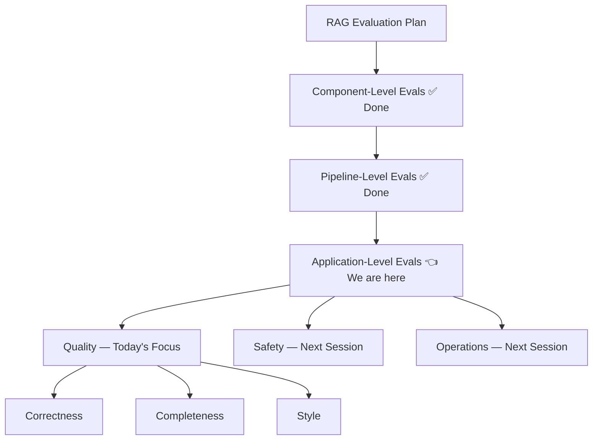
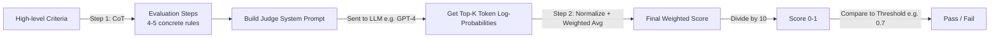
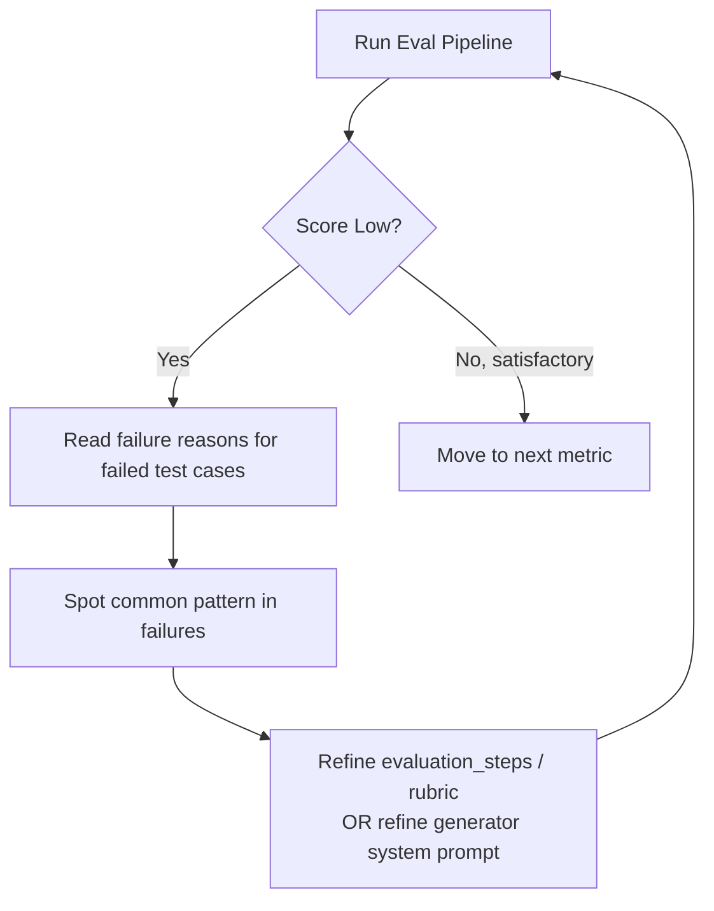

# G-Eval & Application-Level Quality Evaluation

## 📍 Where This Fits



Application quality is measured on **three metrics**:
1. **Correctness** — is the generated answer factually right?
2. **Completeness** — does the answer cover every sub-part of the question?
3. **Style** — does the answer match the brand's teaching/explanation style?

---

## 1. Count-Based Metrics vs Judgment-Based Metrics

### The Pattern in Earlier Metrics (Recall, Precision, Faithfulness, Answer Relevance, Context Relevance)

All five previously-covered RAG metrics share one pattern: they are **count-based**.

**How count-based scoring works (using Faithfulness as example):**
1. Break the generated answer into individual **claims** (via an LLM).
2. For each claim, ask: does it exist in the context? (Yes/No)
3. Count: `favorable claims / total claims` = score.
4. Example: 3 out of 4 claims grounded in context → Faithfulness = 3/4.

This "break into units → count → ratio" approach works great when the answer can be cleanly decomposed and each unit independently verified.

### Where Counting Breaks Down

Some metrics have **no natural counting unit**:
- **Style** — e.g., "Does this answer follow CampusX's teaching style (Why-What-How)?" You can't check each sentence for "Why-What-How" — that pattern exists at the *whole-answer* level, not sentence level.
- **Correctness** — if a generated answer uses an **analogy** to explain something, checking that analogy in isolation against a golden answer makes no sense (an analogy only makes sense within the context of the full explanation). Judged standalone, an LLM judge would flag it as an unrelated/false claim and wrongly penalize it.
- **Completeness**, **Helpfulness**, and most **safety metrics** — also fall in this bucket.

> **Key insight:** When a metric requires holistic **judgment** rather than **decomposable counting**, you need a human or an LLM to read the whole answer and assign a score — not break it into pieces and tally a ratio.

---

## 2. Naive "LLM-as-a-Judge" Approach (and Why It Fails)

### The Basic Setup
1. Build a **golden dataset**: `{question, expected/correct answer}` pairs (e.g., 15 Q&A pairs, human-expert-verified, "universally accepted" correct — not just "what I taught in class").
2. Feed each question to your RAG chatbot → get `actual answer`.
3. Send `{question, expected answer, actual answer}` to an LLM judge with a prompt like:

```
You are evaluating whether an AI's answer is correct.
You will be given a question, an expected answer, and the actual answer.
Compare the actual answer against the expected answer and decide
how factually correct it is. Give a score from 0 to 10 where
10 = fully correct, 0 = completely wrong.
```

4. Repeat for all 15 questions, average the scores.

### The Fatal Flaw: High Variance

Running the **same** evaluation twice on the **same** input can produce wildly different scores (e.g., 60 → 70 → 75 across runs). This is **not reliable**.

**Two root causes:**

| Cause | Explanation |
|---|---|
| **1. Loose criteria** | A single vague sentence ("decide how factually correct it is") gives the LLM too much freedom to "think" differently each call — one run it weighs one aspect, next run a different aspect. |
| **2. Raw token output** | Asking the LLM to directly output a number (0–10) means it just picks whichever digit token had the (marginally) highest probability at that moment — e.g., if "7" was assigned 40% and "8" was assigned 51% probability internally, one run may print 8, the next run (with probabilities flipped slightly) may print 7. You lose all the nuance/uncertainty the model actually had. |

> Not the main causes (ruled out in class): judge model making mistakes (assume SOTA judge), latency/cost (small dataset = negligible).

**Conclusion:** Direct LLM-as-a-judge is NOT used in industry due to unreliable, high-variance results.

---

## 3. G-Eval — The Fix

**Paper:** G-Eval, 2023 — proposes a technique to make LLM-as-a-judge more deterministic and reliable.

### G-Eval's Two Core Innovations



#### Innovation 1 — Criteria → Evaluation Steps via Chain-of-Thought (CoT)
- Instead of giving the judge LLM one vague sentence, G-Eval first asks an LLM (commonly GPT-4, per the paper — best results with GPT-4) to expand the high-level criteria into **4–5 explicit evaluation steps** — effectively a "rule book" / "constitution."
- All subsequent judging calls use this **same fixed rule book**, so the judge has much less room to "interpret differently" each time → reduces one source of variance.

**Example (Correctness criteria → evaluation steps):**
> High-level criteria: *"Compare the actual answer against the expected answer and decide how factually correct it is."*
>
> Expanded evaluation steps (example from class):
> 1. Compare only the factual claims in the actual output against the expected output.
> 2. A claim is wrong only if it contradicts the expected output or is factually false.
> 3. A factually accurate answer scores high even if shorter/covers fewer points — do not deduct for brevity.
> 4. Only wrong statements count against the score.
> 5. Additional correct information must never lower the score.

#### Innovation 2 — Weighted (Log-Probability) Scoring Instead of Raw Token Output
Rather than taking the literal digit the model outputs, G-Eval:
1. Extracts the **top-K token log-probabilities** for the score position (e.g., top 5 candidate tokens).
2. Filters to keep only numeric tokens (discard stray tokens like "the", ":").
3. **Normalizes** the remaining probabilities so they sum to 1.
4. Computes a **weighted average** of the token values using these normalized probabilities.

**Worked example:**

| Token | Raw Prob | Normalized (÷0.95) |
|---|---|---|
| 8 | 0.70 | 0.737 |
| 7 | 0.20 | 0.211 |
| 9 | 0.05 | 0.053 |

Weighted score = `(8 × 0.737) + (7 × 0.211) + (9 × 0.053)` ≈ **7.84**

- Naive approach would've just output **8** (highest raw probability token).
- Weighted approach gives **7.84** — captures the model's underlying uncertainty between 7, 8, and 9.
- Because this is an *averaged* quantity, repeat runs stay close (7.84 → 7.4 → 7.9), never wildly jumping (e.g., never 6 → 8).
5. Divide final weighted score by 10 → normalized to [0, 1].
6. Compare against a **threshold** (commonly 0.7) → Pass/Fail.

> **Bottom line:** G-Eval is still "LLM-as-a-judge" — nothing exotic. Its entire value is: (1) CoT-expanded rule book instead of a vague one-liner, and (2) log-probability–weighted scoring instead of raw token output. Together these make evaluation **far more deterministic and reliable** across repeated runs.

---

## 4. Criteria vs. Direct Evaluation Steps

G-Eval supports two modes of input:

| Mode | How it works | When to use |
|---|---|---|
| **Provide `criteria`** | G-Eval internally uses CoT to auto-generate evaluation steps from your high-level criteria | **Early stage** — when you're just starting to design the eval pipeline and don't yet know model failure patterns. Trust the LLM to generate steps. |
| **Provide `evaluation_steps` directly** | You supply the exact steps yourself; the CoT-generation step is skipped entirely | **Later stage** — once you've run evals a few times and understand *why* things fail. Providing steps yourself removes even more variance, since evaluation steps stay 100% fixed across every call (vs. potentially varying slightly if regenerated by CoT each time). |

Also add an explicit **scoring rubric** (e.g., "0–4 = clear factual error, 5–8 = mostly correct minor inaccuracies, 9–10 = fully correct") — this removes scoring-band discretion from the judge LLM too, making things even more deterministic.

---

## 5. Correctness vs. Faithfulness (Important Distinction)

| | Faithfulness | Correctness |
|---|---|---|
| **Definition** | Is the answer grounded in the **retrieved context**? | Is the answer factually right in the **real world / Google-level** sense? |
| **Checks against** | The context chunks | A golden/expert-verified answer |

**Four possible combinations:**

| Faithful? | Correct? | Scenario |
|---|---|---|
| ✅ | ✅ | Ideal — grounded in context AND factually right |
| ✅ | ❌ | Context itself had wrong info (e.g., instructor taught something incorrect); generator faithfully reproduced it |
| ❌ | ✅ | Generator ignored context, used its own training knowledge, but happened to be right |
| ❌ | ❌ | Generator hallucinated something that's also factually wrong |

> A production RAG answer should ideally be **both faithful and correct**.

---

## 6. Full Implementation Walkthrough (DeepEval Library)

### Step-by-Step Process

1. **Build a golden dataset** — `{question, ideal_answer}` pairs, created by a subject-matter human expert (e.g., 15 Q&A pairs), saved as `correctness_golds.json`.
2. **Build the eval pipeline file** (e.g., `eval_application.py`):
   - Import golden dataset.
   - Loop over each Q&A pair, send question to RAG pipeline → get `actual_output`.
   - Build a `LLMTestCase` with `{input, actual_output, expected_output}`.
3. **Define a `GEval` metric object:**

```python
from deepeval.metrics import GEval
from deepeval.metrics.g_eval import Rubric
from deepeval.test_case import LLMTestCaseParams

correctness_metric = GEval(
    name="Correctness",
    evaluation_steps=[
        "Compare only the factual claims in the actual output against the expected output.",
        "A claim is wrong only if it contradicts the expected output or is factually false.",
        "A factually accurate answer must score at least 9 even if shorter, less detailed, "
        "and covers fewer points than the expected output — do not deduct for brevity.",
        "Do not penalize the actual output for omitting information — only wrong statements count here.",
        "Reward statements that match the expected output in meaning, regardless of wording."
    ],
    rubric=[
        Rubric(score_range=(0, 4), expected_outcome="Contains a clear factual error."),
        Rubric(score_range=(5, 8), expected_outcome="Mostly correct, minor inaccuracies."),
        Rubric(score_range=(9, 10), expected_outcome="All claims are factually correct."),
    ],
    evaluation_params=[
        LLMTestCaseParams.INPUT,
        LLMTestCaseParams.ACTUAL_OUTPUT,
        LLMTestCaseParams.EXPECTED_OUTPUT,
    ],
    model="gpt-4o-mini",
    threshold=0.7,
    strict_mode=False,   # False → uses weighted log-prob scoring (recommended)
)
```

> `strict_mode=True` skips the weighted-average calculation and just takes the raw output token directly — **avoid this**, it reintroduces the variance problem.

4. Run: `python3 -m evals.eval_application`

### Iterative Improvement Loop (what the instructor actually did)



**Correctness — Round 1:** Score = 66% (8/15 passed). Failure reason: generated answers didn't fully match the golden answer's completeness (golden answers were written very thoroughly by a human expert; RAG answers were more concise but still factually correct).

**Fix applied:** Refined evaluation steps to explicitly say brevity/omission should NOT be penalized — only wrong statements count. → **Score improved to 84%** (14/15 passed), and re-running showed **very stable** scores (84 → 83, same single test case failing both times) — confirming G-Eval's determinism.

**Completeness — Round 1:** Score = 68% (only 5/15 passed). Same GEval pattern, new metric:

```python
completeness_metric = GEval(
    name="Completeness",
    evaluation_steps=[...],  # steps checking whether all sub-parts of golden answer are covered
    rubric=[...],
    evaluation_params=[LLMTestCaseParams.INPUT, LLMTestCaseParams.ACTUAL_OUTPUT, LLMTestCaseParams.EXPECTED_OUTPUT],
    model="gpt-4o-mini",
    threshold=0.7,
)
```

**Fix applied:** The generator's system prompt was restricting it to give overly concise answers ("answer quietly from context without over-explaining"). Refined the generator prompt to add:
> *"Thoroughly identify every distinct part of the question and cover each one. Include all the relevant points the context provides for answering it. If the question has multiple parts or the concept has multiple components, address all of them rather than stopping at the first."*

→ **Score improved to 75%** (14/15 passed) — a prompt-engineering fix on the *generator* side, not just the evaluator.

**Style — Round 1:** No golden answer needed at all — just a clearly-written **rubric** describing what "CampusX style" looks like. GEval metric:

```python
style_metric = GEval(
    name="Style",
    evaluation_steps=[
        "Reward an intuitive, explanatory tone; plain language before formulas/jargon; "
        "technical terms briefly unpacked when used.",
        "Reward a direct, conversational register addressing the student as a "
        "CampusX lecture would, rather than a dry, formal, textbook tone.",
        "Reward the use of a concrete example/analogy and 'why it matters' framing where it helps."
    ],
    rubric=[
        Rubric(score_range=(0, 4), expected_outcome="Dry, stiff, jargon-heavy, robotic; does not read like a teaching explanation."),
        Rubric(score_range=(5, 8), expected_outcome="Reasonably clear but somewhat flat, formal, or textbook-like."),
        Rubric(score_range=(9, 10), expected_outcome="Clearly in a CampusX teaching voice — intuitive, conversational, explains before formalizing."),
    ],
    evaluation_params=[LLMTestCaseParams.INPUT, LLMTestCaseParams.ACTUAL_OUTPUT],
    model="gpt-4o-mini",
    threshold=0.7,
)
```

**Round 1 score:** 54% — generator wasn't prompted about style at all.

**Fix 1:** Rewrote generator prompt to explicitly describe the desired conversational teaching style (flowing prose, not bullet lists unless enumeration is genuinely needed; explain intuition before jargon).

**Fix 2 (over-correction fix):** Noticed the rubric's "reward analogies/examples" line was being interpreted too literally — judge was penalizing *every* answer lacking an analogy, even when analogies weren't appropriate. Added a counter-balancing line:
> *"An analogy or concrete example is a bonus when the concept is abstract, but a clear, direct, well-explained answer is fully acceptable [without one]."*

→ **Final style score: ~74%** (9/15 passed, 6 failed) — meaningful improvement from prompt engineering on both the generator and the rubric itself.

> **Takeaway on prompt engineering:** It's often dismissed as unimportant, but this session is direct proof that carefully tweaking system prompts (both generator and evaluator/rubric) produces measurable, repeatable score improvements.

---

## 7. Comparison Table: All Metrics Covered So Far

| Metric | Type | Needs Golden Answer? | Computed Via |
|---|---|---|---|
| Recall | Count-based | N/A (context-based) | Ratio of relevant chunks retrieved |
| Precision | Count-based | N/A (context-based) | Ratio of retrieved chunks that are relevant |
| Faithfulness | Count-based | No (uses context) | Claims grounded in context / total claims |
| Answer Relevance | Count-based | No | Ratio via claim breakdown |
| Context Relevance | Count-based | No | Ratio via claim breakdown |
| **Correctness** | **Judgment-based (G-Eval)** | **Yes** | Weighted log-prob score vs. golden answer |
| **Completeness** | **Judgment-based (G-Eval)** | **Yes** | Weighted log-prob score — coverage of all sub-parts |
| **Style** | **Judgment-based (G-Eval)** | **No** (rubric-only) | Weighted log-prob score vs. style rubric |

Other metrics G-Eval can be used for (per DeepEval docs, mentioned in class): Coherence, Tonality, Helpfulness, and Safety-related metrics (covered next session).

---

## 8. Interview Q&A

**Q1. What is the fundamental difference between count-based metrics (like Faithfulness) and judgment-based metrics (like Correctness/Style)?**
> Count-based metrics decompose an answer into discrete units (claims/statements) and compute a ratio of how many satisfy a condition. Judgment-based metrics can't be decomposed this way (e.g., style or an analogy only make sense at the whole-answer level) — they require an LLM (or human) to read the entire answer and assign a holistic score.

**Q2. Why is naive "LLM-as-a-judge" (just asking for a 0–10 score) considered unreliable?**
> Two reasons: (1) A vague, high-level criteria gives the LLM too much freedom to interpret differently each call, causing inconsistent reasoning across runs. (2) Directly sampling the output token means you get whichever digit had (even marginally) the highest probability at that moment — small probability shifts between runs cause the printed score to jump (e.g., 7 vs 8), producing high variance in the final averaged score.

**Q3. What are the two core innovations of G-Eval?**
> (1) Using Chain-of-Thought to expand a high-level criteria into explicit, fixed evaluation steps (a "rule book"), reducing interpretive variance. (2) Extracting top-K token log-probabilities for the score, normalizing them, and computing a weighted average — instead of taking the raw output token — which smooths out small run-to-run fluctuations into a stable decimal score.

**Q4. Walk through how G-Eval computes a final score from token probabilities.**
> Extract the top-K candidate tokens for the score position with their probabilities (e.g., top 5). Discard non-numeric tokens. Normalize the remaining numeric token probabilities so they sum to 1. Multiply each token's value by its normalized probability and sum → weighted average. Divide by 10 to bring it into [0,1]. Compare against a threshold (e.g., 0.7) to decide pass/fail.

**Q5. When should you supply `criteria` vs. directly supplying `evaluation_steps` in a GEval metric?**
> Supply `criteria` early on, when you don't yet understand your model's failure modes — let the LLM auto-generate evaluation steps via CoT. Once you've run evaluations a few times and understand what's failing and why, supply `evaluation_steps` directly — this removes even the small variance introduced by re-generating steps on every call, making the pipeline maximally deterministic.

**Q6. Why is providing a scoring rubric important in G-Eval?**
> Without a rubric, the LLM judge decides on its own how to map evaluation outcomes to score bands, adding another axis of variability/subjectivity. An explicit rubric (e.g., "0–4 = clear factual error, 5–8 = mostly correct, 9–10 = fully correct") removes this discretion from the model, making scoring more deterministic and repeatable.

**Q7. What is the difference between Faithfulness and Correctness, and can an answer be one without the other?**
> Faithfulness checks if the answer is grounded in the retrieved context; Correctness checks if the answer is factually right in the real world. Yes — all four combinations are possible: faithful+correct (ideal), faithful+incorrect (context itself was wrong), unfaithful+correct (model used external/training knowledge but got lucky), and unfaithful+incorrect (hallucination that's also wrong).

**Q8. Why can't correctness be measured by breaking the answer into claims and checking each one against a golden answer independently (like Faithfulness does)?**
> Because some parts of an answer, like analogies, only make sense within the context of the whole explanation. Checked in isolation against a golden answer, an analogy would look unrelated/false and get wrongly penalized — so correctness must be judged holistically, not claim-by-claim.

**Q9. How would you measure "Style" (e.g., adherence to a brand's teaching voice) without a golden answer?**
> You don't need a golden answer for Style — you write a clear rubric describing what the target style looks like (tone, structure, use of examples, etc.) and let a G-Eval judge score the generated answer directly against that rubric.

**Q10. If a G-Eval score is unexpectedly low, what's the recommended debugging workflow?**
> Read the LLM judge's stated reasons for the failed test cases, look for a common pattern across failures, then fix the root cause — which could be either (a) the generator's system prompt (e.g., it's too restrictive on length or style) or (b) the evaluation steps/rubric being too strict or missing nuance (e.g., over-penalizing missing analogies). Re-run and confirm improvement.

**Q11. Why does G-Eval typically use GPT-4 (or GPT-4o-mini) as the judge model?**
> The G-Eval paper reports best results using GPT-4-class models for both the CoT step-generation and the final scoring step; strong instruction-following and reasoning quality directly affects reliability of both the rule book and the score.

**Q12. What does `strict_mode=False` do in DeepEval's `GEval`, and why is it preferred?**
> `strict_mode=False` enables the weighted log-probability scoring mechanism (G-Eval's core innovation). `strict_mode=True` instead takes the LLM's raw output token directly, which reintroduces the high-variance problem G-Eval was designed to solve — so `False` is the recommended/default choice for reliable scoring.

**Q13. Give a concrete example of over-correction in rubric design, as seen in the class demo.**
> The Style rubric said to "reward the use of a concrete example/analogy." The judge LLM started penalizing every answer lacking an analogy, even where one wasn't appropriate. The fix was adding a counter-balancing rule: an analogy is a "bonus" for abstract concepts, but a clear, direct, well-explained answer without one is still fully acceptable.

**Q14. What's the role of a "golden dataset" in application-level evaluation, and who typically creates it?**
> It's a set of `{question, ideal/expert-verified answer}` pairs used as ground truth for Correctness and Completeness metrics. It's typically created by a human subject-matter expert, and "correct" means universally/factually accepted — not merely "what was taught in a specific course."

**Q15. Does improving Style or Completeness risk hurting other metrics like Faithfulness?**
> Yes — the instructor noted that pushing Style (e.g., encouraging longer, more example-heavy answers) too aggressively could start to hurt Faithfulness or make answers stray from context, so metrics need to be balanced together rather than each maximized in isolation.

---

## 9. Revision Checklist

- [ ] Can explain why Recall/Precision/Faithfulness/Answer Relevance/Context Relevance are "count-based" metrics
- [ ] Can explain why Style/Correctness/Completeness require judgment, not counting
- [ ] Can list the 2 root causes of high variance in naive LLM-as-a-judge scoring
- [ ] Can explain both G-Eval innovations: (1) CoT criteria→steps, (2) log-prob weighted scoring
- [ ] Can walk through the weighted-average token-probability calculation with numbers
- [ ] Know the difference between supplying `criteria` vs. `evaluation_steps` directly, and when to use each
- [ ] Can explain why a scoring rubric further reduces variance
- [ ] Can distinguish Faithfulness vs. Correctness and list all 4 combinations
- [ ] Understand why claim-level breakdown fails for Correctness (analogy example)
- [ ] Can describe the golden dataset format and who builds it
- [ ] Familiar with DeepEval's `GEval` class parameters: `name`, `evaluation_steps`/`criteria`, `rubric`, `evaluation_params`, `model`, `threshold`, `strict_mode`
- [ ] Can describe the iterative "run → read failure reasons → fix generator prompt or eval rubric → re-run" improvement loop
- [ ] Know that Style needs no golden answer, only a rubric
- [ ] Aware that over-tuning one metric (e.g., Style) can hurt others (e.g., Faithfulness)

---

## 🔜 What's Next

Per the course plan, Application-Level Quality (Correctness, Completeness, Style) is now **complete**. The next session covers:
- **Safety metrics** for the application (2–3 metrics)
- **Operations metrics** for the application
- **Regression testing**

Both will continue to use the **G-Eval framework** established in this session.
