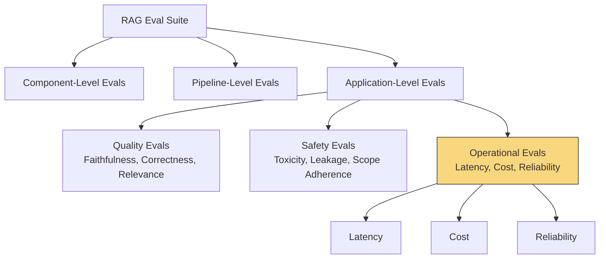
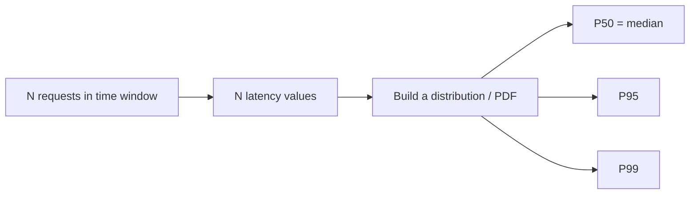
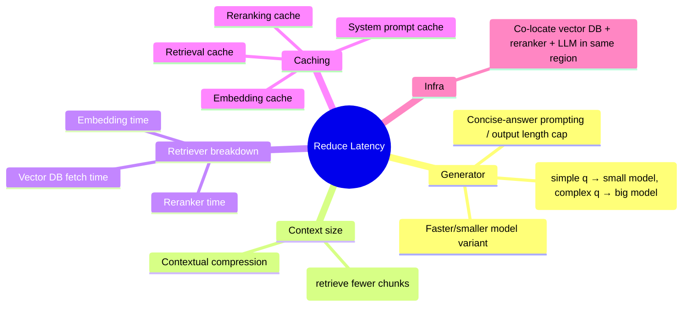
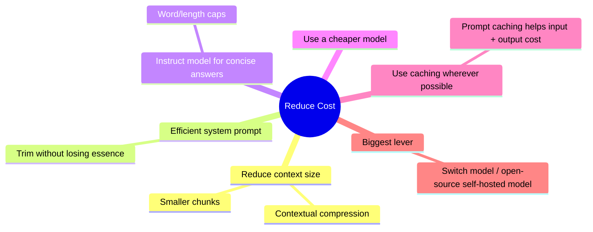

# Operational Evals for RAG Applications

> Source: CampusX LLM Evaluations series — Session on Operational Evals (Latency, Cost, Reliability)
> Part of the 3-tier RAG Eval Suite: **Component-level → Pipeline-level → Application-level (Quality, Safety, Operations)**

---

## 1. Where This Fits in the Eval Suite



Status: Component-level ✅, Pipeline-level ✅, Application Quality ✅, Application Safety ✅, **Operational ✅ (this note)**, Regression Testing ⏭ (next), Online Evals ⏭ (after that).

---

## 2. Quality Evals vs. Operational Evals

| Aspect | Quality Evals | Operational Evals |
|---|---|---|
| Question answered | Is the output *correct*? | Can the system run *reliably, quickly, cheaply* in production? |
| Needs LLM-as-judge? | Usually yes | **No** |
| Needs golden dataset? | Usually yes | **No** |
| Nature | Judgment-driven | Software & telemetry-driven |
| Examples | Faithfulness, Correctness, Answer Relevance | Latency, Cost, Reliability, Throughput |

> **Key idea:** Even if a RAG system gives great answers, it's operationally broken if it can't run reliably, quickly, and economically in production.

### The Three (+1) Operational Metrics
1. **Latency** — how long users wait for an answer
2. **Cost** — money spent per query
3. **Reliability** — how consistently the pipeline runs without errors
4. **Throughput** (mentioned but out of scope here — needs load testing)

---

## 3. Why Operational Evals Must Be Run Offline Too

Intuitively, operational evals sound "post-deployment only" (they measure real-world runtime behavior). But they **must** be part of the offline eval suite too.

**Reasoning — the differential argument:**
- Absolute operational numbers on a laptop (e.g., 2.3s latency) won't match production numbers exactly.
- But the **differential/direction** of change is trustworthy — e.g., swapping in a reranker + bigger LLM + top-10 chunks (instead of top-5) causes:

| Metric | Before | After | Change |
|---|---|---|---|
| Correctness | 91% | 95% | ↑ good |
| Faithfulness | 94% | 96% | ↑ good |
| Answer Relevance | 93% | 95% | ↑ good |
| Avg Latency | 2.3s | 4.1s | ↑ **bad** |
| P95 Latency | 4.8s | 6.2s | ↑ **bad** |
| Avg Cost/query | ₹0.72 | ₹1.08 | ↑ **bad** |
| Timeout Rate | 2% | 1% | ↓ good |
| Success Rate | 99.8% | 99.9% | ↑ good |

Without offline operational evals, this quality-vs-cost/latency tradeoff would be **completely invisible** until users complain in production.

> **Rule of thumb:** Absolute values of operational evals are not very dependable offline, but the *differential* (direction of change between two experiment setups) is highly informative — and this is only visible if you keep setup constant across experiments.

**Summary line from the instructor:**
> "Do not wait until production to discover that your RAG pipeline is too slow and too expensive."

---

## 4. Metric 1 — Latency

### 4.1 Definition
> The amount of time a system takes to respond to a request (from question submitted → full reply shown).

### 4.2 Why Not Just Use Mean Latency? (Distributions > Averages)

Latency is measured over a time window (last 1hr / 24hr / week / month) across many requests, forming a **distribution**, not a single number.



| Percentile | Meaning |
|---|---|
| P50 (median) | 50% of requests completed within this time |
| P95 | 95% of requests completed within this time |
| P99 | 99% of requests completed within this time |

**Why P95/P99 matter more than mean:** Mean hides the "tail" — the unlucky users who waited much longer. Tail latency = worst-case user experience.

### 4.3 Key Considerations When Measuring Latency

| # | Consideration | Why it matters |
|---|---|---|
| 1 | Prefer distributions over averages | Mean hides tail/worst-case UX (see P50/P95/P99 above) |
| 2 | Break down end-to-end latency by component | E.g. Retriever vs Generator — shows where time is actually going |
| 3 | Measure TTFT (Time to First Token) separately | Streaming UX metric — how fast the *first* token appears |
| 4 | Watch for cold starts | Skip first 1–2 "warm-up" requests before measuring (model loading, DB connection init, network handshake, container cold start etc.) |
| 5 | Report token count / context size alongside latency | Bigger output/context → naturally higher latency; without this context, numbers are misleading |
| 6 | Distinguish latency from throughput | Latency = time per single request; Throughput = requests handled per unit time (system-level, needs concurrency) |
| 7 | Repeat runs (external APIs are noisy) | Send each question multiple times (e.g. 5x) and average, since LLM provider APIs can have transient slowness |
| 8 | Track failures/timeouts separately from latency | A "great" P95 can be misleading if timeout rate silently rose — always report timeout rate alongside latency |
| 9 | Define latency budgets / SLOs | System-level AND component-level thresholds (e.g., "P95 E2E latency must be < 3s", "retriever must be < 1s") |
| 10 | Use representative & segmented workloads | Mix of simple/medium/complex questions — not just easy ones |

### 4.4 Latency vs. Throughput (Restaurant Analogy)

| | Latency | Throughput |
|---|---|---|
| Definition | Time for a single request | Number of concurrent requests system can handle per unit time |
| Analogy | How long one customer waits for their food | How many customers the kitchen can serve in an hour |
| Behavior | Stays OK below a concurrency threshold, spikes above it | Defines that threshold |

> Once concurrent load crosses the system's throughput capacity, a queue forms and later requests see much higher latency — always report latency **together with** the concurrency level it was measured at.

### 4.5 Component-Level Breakdown Example (from live script run)

| Metric | Mean | Median | P95 | P99 | Min | Max |
|---|---|---|---|---|---|---|
| End-to-End Latency | 3.6s | 3.8s | 5.3s | 5.3s | 1.3s | 5.3s |
| — Retrieval only | ~0.7s (756–762ms) | — | 983ms | ~1.0s | — | — |
| — Generation only | 2.9s | — | — | — | — | — |
| TTFT | 1.6s | ~1.6s | 2.0s | 2.1s | 1.3s | — |

- Generator took ~4× longer than retriever (LLM API call dominates).
- SLO check example: target P95 E2E ≤ 3000ms and TTFT P95 ≤ 1200ms → **both failed** (actual: 5.3s and 2081ms) → triggers a team discussion on optimization.

### 4.6 Latency Optimization Levers



**Practical script setup pattern (`eval_latency.py`):**
- N sample questions × repeated calls each (e.g. 5 questions × 5 repeats = 25 calls)
- 2 warm-up runs discarded
- SLO thresholds hardcoded (e.g. P95 E2E ≤ 3000ms, TTFT ≤ 1200ms)
- Requires a **streaming-enabled generator function** to measure TTFT (added specifically for this)

---

## 5. Metric 2 — Cost

### 5.1 Definition
> The monetary expense incurred to process a user query — driven primarily by LLM token consumption.

### 5.2 Where Cost Comes From in a RAG Pipeline

| Source | Notes |
|---|---|
| **LLM API calls** | Dominant cost driver — priced per token (input/output), usually per 1M tokens. Output tokens typically cost ~4× more than input tokens. |
| Vector DB | If using a paid/commercial service (e.g. Pinecone) |
| Reranker API | If using a paid reranker (e.g. Cohere) |
| Embedding model | Usually cheap, but non-zero if using a paid API |
| Infrastructure/hosting | Server costs once deployed |

> This session's cost analysis assumes vector DB, reranker, and embedding model are free/local — so it focuses entirely on **LLM token cost**, the dominant real-world factor.

### 5.3 How to Calculate

```
Input Cost  = input_tokens  × input_rate  (per 1M tokens)
Output Cost = output_tokens × output_rate (per 1M tokens)
Total Cost  = Input Cost + Output Cost
```

### 5.4 Key Considerations

| # | Consideration | Why |
|---|---|---|
| 1 | Report **cost per query**, not just aggregate cost | Aggregate (hourly/daily/monthly) is useful for budgeting but per-query is the actionable metric |
| 2 | Break down input vs. output cost separately | Shows where optimization opportunity lies |
| 3 | Measure cost as a distribution (not single total) | Long-tail expensive queries need investigation |
| 4 | Segment cost by query type (simple/medium/complex) | Same rationale as latency segmentation |
| 5 | Set a cost budget | Business-driven, translated to a per-query ceiling (e.g. "≤ ₹0.50/complex query") |

### 5.5 Example Output (`eval_cost.py` run, GPT-4o-mini)

- 4 questions × 3 repeats = 12 samples
- Avg input tokens: ~1700 (of which ~1109 auto-cached by OpenAI, since repeated identical questions/system prompt trigger aggressive prompt caching — real production caching will be less aggressive since questions vary)
- Avg output tokens: ~209
- **Avg cost/query: ~$0.02 (~₹2)**, very tight min–max range → cost is far more **stable** than latency (rates are fixed; no network/API variance the way latency has)
- Spending more on input tokens than output tokens (opposite of typical apps like coding agents, where output dominates)
- Projected: ~₹57/day, ~₹1700/month at 2000 queries/day
- Budget check: within SLO → passing

### 5.6 Cost Reduction Strategies



> Unlike latency (many system-level levers), cost optimization mostly revolves around the LLM — model choice is the single biggest lever; most other tweaks yield only small (~±5%) differentials.

### 5.7 Cost vs. Latency — Offline Reliability

| | Latency | Cost |
|---|---|---|
| Varies a lot between offline (laptop) and online (deployed)? | Yes — network hops, server placement etc. add latency | No — token rates are fixed regardless of where you run it |
| Reliable to measure offline? | Less reliable in absolute terms | **More reliable** — cost per query is largely setup-independent |

---

## 6. Metric 3 — Reliability

### 6.1 Definition
> The ability of a RAG system to successfully serve requests without errors, timeouts, crashes, or broken pipeline stages.

Example: 10 users ask questions → 8 get answered, 2 see "try again later" → system is **80% reliable**.

### 6.2 Core Metrics

| Metric | Formula / Meaning |
|---|---|
| Success Rate | % of requests successfully served |
| Error Rate | `1 − Success Rate` |
| Timeout Rate | % of requests exceeding the allowed time period |
| Retry Rate | % of requests that required at least one retry |

### 6.3 Key Considerations

| # | Consideration | Why |
|---|---|---|
| 1 | Measure overall success/failure rate | Baseline metric |
| 2 | **Categorize failures**, don't use one generic error rate | Break 20% failure into: LLM API failure, retriever failure, reranker failure, timeout, rate limit, parsing/formatting errors, internal exceptions. Requires extra try/except instrumentation around each pipeline stage. |
| 3 | Measure reliability under load, separately | A pipeline can be highly reliable single-user offline but start failing as concurrency rises |
| 4 | Use enough samples | 25–50 samples is too few to catch rare failures — need hundreds/thousands for a trustworthy signal |
| 5 | Use representative requests | Simple, long-context, complex, long-answer, edge-case queries — failure rates can differ sharply by query type |

### 6.4 Example Output (`eval_reliability.py` run)

- 4 questions × 5 repeats = 20 calls, max retries = 2
- Result: **Success Rate 100%, Error Rate 0%, Retry Rate ~0%**
- Caveat: this is an "ideal" laptop setup hitting a highly reliable API (OpenAI) — real numbers become meaningful only post-deployment at scale, under concurrency, or with less reliable providers (e.g. self-hosted/Ollama models showing more rate-limit/error spikes).

---

## 7. Consolidated Comparison — Latency vs. Cost vs. Reliability

| Dimension | Latency | Cost | Reliability |
|---|---|---|---|
| Question answered | How long does it take? | How much does it cost? | Does it work without failing? |
| Key sub-metrics | Mean, P50, P95, P99, TTFT | Cost/query, input vs output split | Success rate, error rate, timeout rate, retry rate |
| Offline reliability of absolute values | Low (setup-dependent) | High (rate-based, stable) | Low (needs scale/concurrency to surface issues) |
| Main lever to fix | Model size, context size, caching, infra placement | Model choice, context size, caching | Retry logic, error handling, redundancy, rate-limit management |
| Requires LLM-as-judge? | No | No | No |
| Requires golden dataset? | No | No | No |

---

## 8. Important Nuances / Gotchas

- **No LLM-as-judge, no golden dataset needed** for any operational eval — these are pure software/telemetry measurements, so the scripts are **free to run** (no LLM judging cost), even though internally they do call an LLM to get the actual RAG answers.
- **Cold start bias**: always discard first 1–2 runs.
- **API noise**: always repeat the same question multiple times and average — don't trust a single sample.
- **Don't conflate a "better" number with reality**: e.g., lower timeout count can make latency numbers look artificially better if failed (timed-out) requests are simply excluded — always report timeout/error rate *alongside* latency.
- **Budgeting**: latency budgets often need separate dev vs. prod consideration (since prod latency will likely exceed laptop numbers due to network/server placement) — but cost budgeting is typically the same in dev and prod since token rates don't change.
- Throughput is a 4th operational metric but requires load/stress testing tools — out of scope for this offline eval suite.

---

## 9. Interview Q&A

**Q1. What is the difference between quality evals and operational evals?**
> Quality evals (faithfulness, correctness, relevance) judge the *content* of the output, usually needing an LLM-as-judge and/or golden dataset. Operational evals (latency, cost, reliability) judge whether the system can run reliably, quickly, and economically in production — they're software/telemetry-driven and need neither an LLM judge nor a golden dataset.

**Q2. Why should operational evals be part of the offline eval suite if they're meant to measure production behavior?**
> Because the *differential* between two experiment setups (e.g. before/after a model swap) is reliable and highly informative even offline, even though the *absolute* values won't exactly match production. Catching a latency/cost regression before deployment avoids finding out "the hard way" in production.

**Q3. Why prefer P95/P99 latency over mean latency?**
> Mean can mask a long tail of poor experiences. P95/P99 show what the worst-affected users are experiencing, which matters more for UX and SLOs than the "typical" case.

**Q4. What is TTFT and why measure it separately from end-to-end latency?**
> Time to First Token — the delay before the first streamed token appears. It directly reflects perceived responsiveness in streaming UIs and can be optimized somewhat independently of total generation time.

**Q5. How do you avoid cold-start bias when benchmarking latency?**
> Run a few warm-up requests first (e.g., 2) and exclude them from the measured sample, since the first calls pay extra cost for model loading, connection init, cache warming, etc.

**Q6. Why do output tokens usually cost more than input tokens, and how does that change optimization priorities?**
> Output tokens are typically priced ~4× input tokens because generation is more compute-intensive. This means capping/controlling output length (concise prompting, word limits) is often a high-leverage cost lever — though which side dominates cost depends on the application (e.g., coding agents skew output-heavy; QA chatbots can skew input-heavy due to large context).

**Q7. Why is cost more reliable to measure offline than latency?**
> Token pricing is fixed regardless of where the code runs, so cost/query on a laptop closely matches production cost/query. Latency, by contrast, depends heavily on network hops, server placement, and concurrency — all of which differ between a local dev machine and a distributed production deployment.

**Q8. Why should error rate be broken down into categories instead of reported as one number?**
> A single "20% error rate" hides *why* things are failing (LLM API failure vs. retriever failure vs. rate limiting vs. internal exceptions). Categorized failures point directly at what to fix; this requires instrumenting the pipeline with try/except blocks at each stage.

**Q9. Why can a system show 100% reliability offline but fail in production?**
> Offline tests are typically single-user, low-volume, and hit a reliable API. Production involves concurrency at scale, which surfaces rate limits, queuing, and infra-level failures that don't appear under light, sequential local testing.

**Q10. What's the difference between latency and throughput?**
> Latency = time to serve one request. Throughput = how many requests the system can serve per unit time (a concurrency/capacity metric). Below the throughput ceiling, latency stays stable; once concurrent demand exceeds it, a queue forms and latency spikes — so they should always be discussed together.

**Q11. Name three ways to reduce LLM-driven RAG cost.**
> (Any 3) Use a cheaper/smaller model, reduce context size (smaller chunks / contextual compression), enforce concise output via prompting or length caps, leverage prompt caching, or route simple queries to smaller models via a model router.

**Q12. What's a latency/cost/reliability SLO, and why define one?**
> A Service Level Objective — a concrete threshold (e.g., "P95 E2E latency < 3s", "cost/query < ₹0.50", "success rate > 99.5%") derived from business/UX/industry needs. It gives an objective pass/fail bar to evaluate every pipeline change against, rather than relying on vague judgment.

---

## 10. Revision Checklist

- [ ] Can explain why operational evals are distinct from quality evals (no LLM judge, no golden dataset)
- [ ] Can list the 3 core operational metrics: Latency, Cost, Reliability (+ Throughput as 4th, out of scope here)
- [ ] Can explain the "differential over absolute value" argument for running operational evals offline
- [ ] Can define P50 / P95 / P99 and explain why they beat mean latency
- [ ] Can explain TTFT and its UX significance (streaming)
- [ ] Can list all latency considerations: distributions > averages, component breakdown, TTFT, cold starts, token/context size reporting, latency vs throughput, repeat runs for API noise, track failures separately, define SLOs, representative workloads
- [ ] Can explain cost formula (input tokens × input rate + output tokens × output rate) and why output tokens usually cost more
- [ ] Can explain why cost is more stable/reliable offline than latency
- [ ] Can define reliability metrics: success rate, error rate, timeout rate, retry rate
- [ ] Can explain why failures should be categorized, not lumped into one error rate
- [ ] Can explain why reliability numbers look "too good" in small-scale offline tests
- [ ] Can sketch the latency optimization mindmap (generator, context, retriever breakdown, caching, infra)
- [ ] Can sketch the cost optimization list (context size, prompt efficiency, output caps, cheaper model, caching)
- [ ] Know what comes next: Regression Testing (reusing this eval suite to detect regressions on any pipeline change), then Online Evals, then Agent Evals

---

## 11. What's Next (per session)

1. **Regression Testing** — use this entire eval suite (component + pipeline + application quality/safety/operations) to check whether any given pipeline change is an improvement, a regression, or neutral — this gates deploy decisions.
2. **Online Evals** — observability tools (LangSmith, Confident AI, etc.) that auto-log these metrics in production.
3. **Agent Evals** — next major topic area, expected to move faster since fundamentals are now established.
