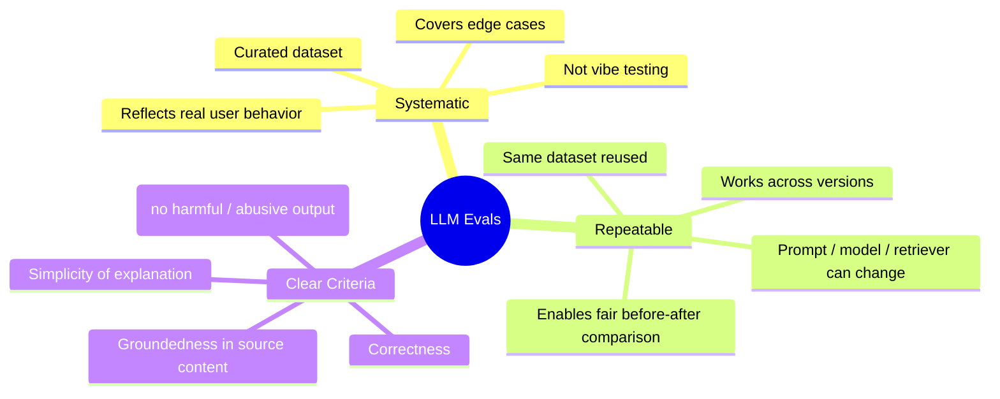
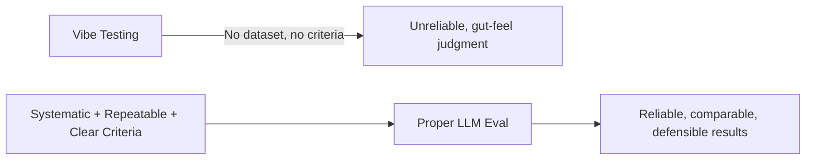
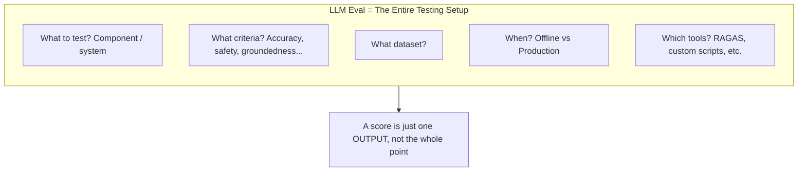
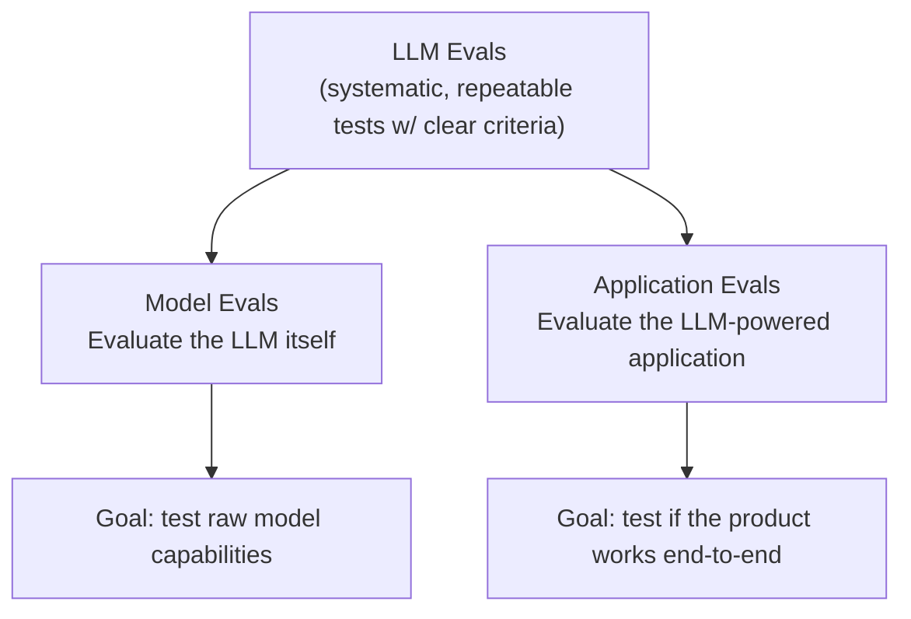
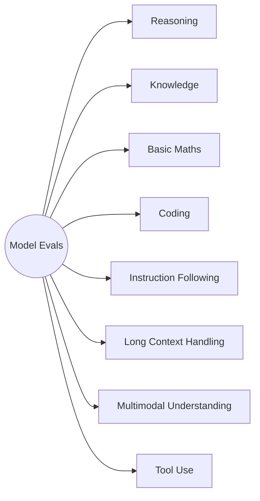
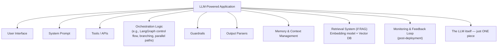
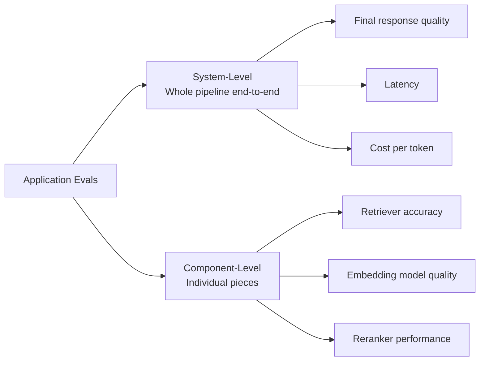
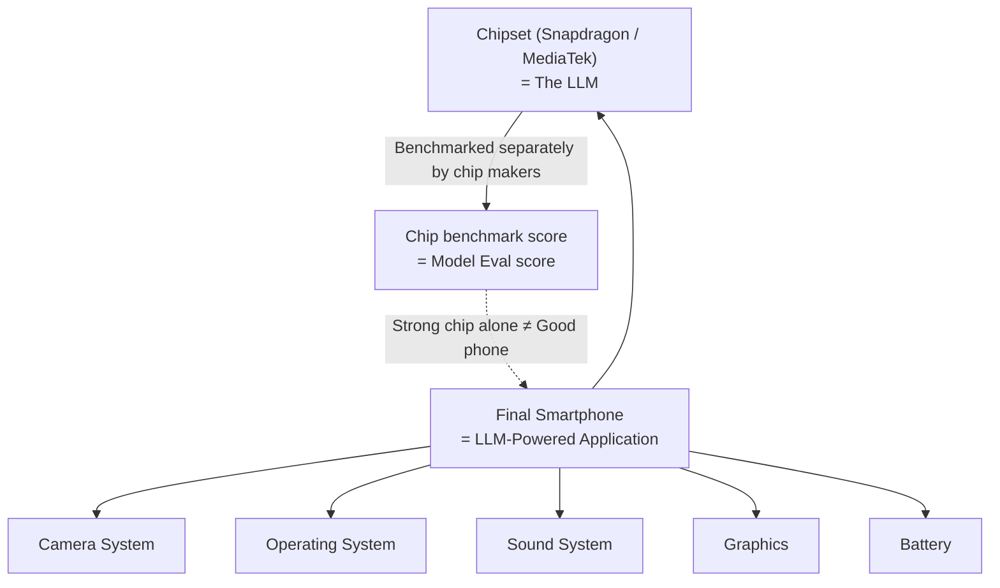
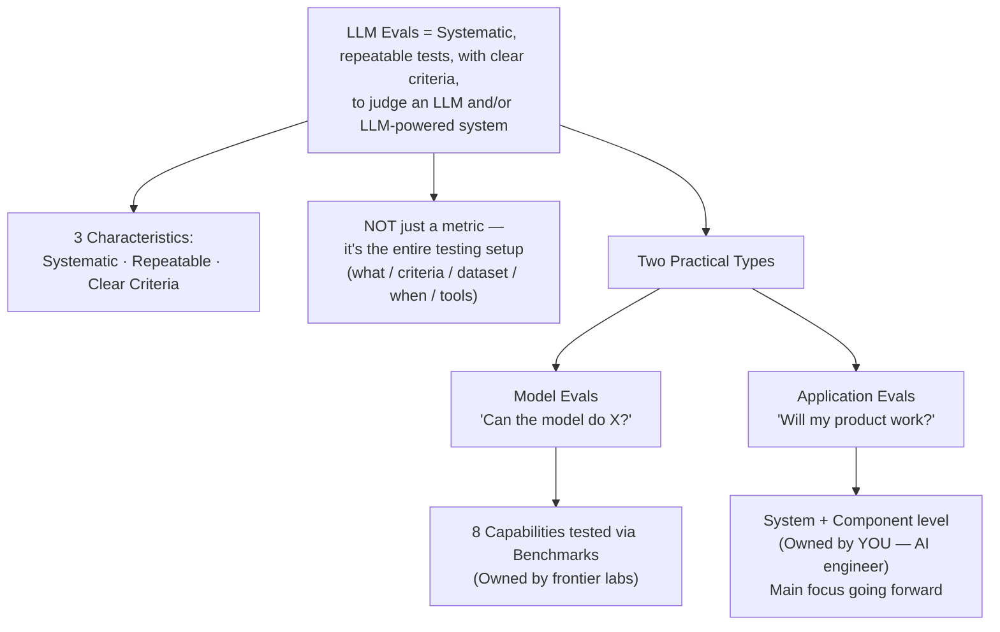

# LLM Evaluations — Model Evals vs Application Evals

> Source: CampusX — "Introduction to LLM Evaluations | Model Evals vs Application Evals"
> Topic area: AI Engineering / LLM Evals fundamentals

---

## Table of Contents

1. [What are LLM Evals? (Definition)](#1-what-are-llm-evals-definition)
2. [The Three Core Characteristics](#2-the-three-core-characteristics)
3. [Common Misconception: Eval ≠ Metric](#3-common-misconception-eval--metric)
4. [What Questions Do LLM Evals Answer?](#4-what-questions-do-llm-evals-answer)
5. [The Big Split: Model Evals vs Application Evals](#5-the-big-split-model-evals-vs-application-evals)
6. [Model Evals — Deep Dive](#6-model-evals--deep-dive)
7. [Application Evals — Deep Dive](#7-application-evals--deep-dive)
8. [The Smartphone Analogy](#8-the-smartphone-analogy)
9. [Model Evals vs Application Evals — Comparison Table](#9-model-evals-vs-application-evals--comparison-table)
10. [Summary Diagram](#10-summary-diagram)
11. [Interview Q&A](#11-interview-qa)

---

## 1. What are LLM Evals? (Definition)

> **LLM Evals are systematic, repeatable tests used to judge an LLM and/or an LLM-powered system against clear criteria.**

This single definition is the foundation of the entire topic, and it already hints at the major split discussed later: evals apply to **the LLM itself** *and* to **LLM-powered systems** (applications built on top of an LLM).

---

## 2. The Three Core Characteristics

Every proper LLM eval setup has three non-negotiable properties:

### 2.1 Systematic
Not "vibe testing" — i.e., not just typing 5 random questions, eyeballing the answers, and deciding "looks fine." Instead:
- Build a **proper dataset**.
- Deliberately include **edge cases**.
- Ideally sample **real user conversations** (e.g., pull 100 real chats from production) so the test set reflects actual usage patterns, not assumptions.

### 2.2 Repeatable
- The **same dataset** should be reusable even after you change the prompt, swap the model, change the retriever, or alter the chunking strategy.
- This is what lets you make an **apples-to-apples comparison**: "Did Version 2 actually improve on Version 1?" — answerable only because both versions were run against the *same* fixed test set.

### 2.3 Clear Criteria
Without criteria, you're just vibe-testing with extra steps. Criteria define *what "good" means* for your use case. Example criteria for a course chatbot:
- Is the answer **correct**?
- Is the explanation **simple**?
- Does the explanation come **strictly from the course content** (no outside hallucinated info)?
- Is the response **safe** (no harmful language, profanity, or threatening tone)?

---

## 3. Common Misconception: Eval ≠ Metric

A very common mental trap (especially for people coming from classic ML/DL background):

> "Evaluation = a metric" → e.g., in classic ML: Accuracy, Precision, Recall.

This carries over incorrectly into LLM land as: *"LLM Eval = a set of metrics/scores."*

**This is wrong.** An LLM Eval is **not just a metric** — it is the **entire testing setup**:

| Question the setup must answer | Example |
|---|---|
| What are we testing? | The retriever in a RAG chatbot |
| What criteria are we using? | Retriever accuracy |
| What dataset are we testing on? | Curated Q&A pairs with ground-truth context |
| When are we testing? | Offline (pre-deployment) or in production |
| What tools are we using? | e.g., RAGAS for a RAG application |

---

## 4. What Questions Do LLM Evals Answer?

The **goal** of an eval isn't to spit out a single number — it's to answer practical engineering questions:

- Can this model be used for a particular task/application?
- Is this system good enough to ship to production?
- Did prompt version 2 actually improve on prompt version 1?
- Is the RAG answer grounded in the retrieved context?
- Is the agent completing the task correctly?
- Is the chatbot safe for real users?
- Is latency under control?

---

## 5. The Big Split: Model Evals vs Application Evals

> ⚠️ **Disclaimer (from the source material):** "Model Evals" and "Application Evals" are **not official industry terms** — they're a teaching simplification. In the real world, both are usually just called "LLM Evals," and people infer from context which one is meant.

| | Model Evals | Application Evals |
|---|---|---|
| Evaluates | The LLM itself | The full LLM-powered system/product |
| Owned by | Frontier labs (OpenAI, Anthropic, etc.) | AI Engineers building products |
| Key question | "Can the model do X?" | "Will my product work correctly?" |
| Your day-to-day relevance | Low — mostly literacy, not hands-on work | **High** — this is your core job |

---

## 6. Model Evals — Deep Dive

> **Definition:** Model Evals evaluate the model itself — testing and benchmarking the capabilities of a model.

When a new LLM is released, labs test and document its capabilities against standardized **benchmarks** and **leaderboards**, then publicize results ("Our new model tops Benchmark X with Y% accuracy").

### 6.1 The 8 Core Capabilities Tested

1. **Reasoning** — Can the model think step-by-step to solve a problem?
2. **Knowledge** — Does the model have broad world/general knowledge up to its training cutoff?
3. **Basic Maths** — Can it solve mathematical problems?
4. **Coding** — Can it write/understand code?
5. **Instruction Following** — Can it follow multiple instructions correctly (e.g., 10 instructions given together)?
6. **Long Context Handling** — Can it pull correct answers out of very large context windows?
7. **Multimodal Understanding** — Can it understand/generate across text, images, audio, etc.?
8. **Tool Use** — Can it correctly use external tools/functions?

### 6.2 Capability → Benchmark Mapping

| Capability | Example Benchmark |
|---|---|
| Reasoning + Knowledge | **MMLU** (Massive Multitask Language Understanding) — questions across science, history, law, medicine, etc. |
| Basic Maths | **GSM8K** — grade-school math word problems |
| Coding | **SWE-bench**, **HumanEval** |
| Instruction Following | **IFEval** |
| Long Context Handling | **Needle in a Haystack** |
| Multimodal Understanding | **MMMU** |

### 6.3 Why This Matters to You (Even If You Won't Run These)

- As an **AI engineer**, you will **rarely run model evals yourself** — that's the responsibility of frontier labs releasing new models.
- But you **must develop "benchmark literacy"**:
  - Know what model evaluation is.
  - Know what benchmarks exist and what they measure.
  - Know how to **read** benchmark results.
- **Why it matters practically:** when picking a model for *your* application (OpenAI vs Anthropic vs an open-source model), this literacy lets you make an informed decision based on which model tops which benchmark — i.e., **model evals feed your model-selection decision.**

---

## 7. Application Evals — Deep Dive

> **Definition:** Application Evals assess the behavior and performance of an LLM-powered application — either at the level of the entire system, or at the level of a specific component within it.

This is **the main focus of practical AI engineering work** and the primary topic for the rest of this course/series.

### 7.1 Why Application Evals Exist: The LLM Is Just One Component

Beginners often assume: *"The LLM is the brain → the brain is everything."* This is false once you build real-world systems. A real LLM application also includes:

Each of these pieces can fail independently of the LLM's raw capability — which is exactly why application-level evaluation is critical.

### 7.2 Component-Level vs System-Level Evaluation

Application Evals operate at **two levels**:

**Example — RAG chatbot:**
- *System level:* Is the final response good? What's the latency? What's the cost per token?
- *Component level:* Is the retriever working correctly? Is the embedding model performing well? Is the reranker doing its job?

### 7.3 The Key Reframe: Not "Can the Model?" but "Will the Product Work?"

> Model Evals ask: *"Can the model do this?"*
> Application Evals ask: *"Will my product work correctly?"*

Example questions Application Evals answer for a course chatbot:
- Was the student's question answered correctly?
- Was the course material used properly?
- Was the answer faithful (no fabrication)?
- Was the answer easy enough for a beginner?
- Did hallucination occur?
- Was the response fast?
- Is the chatbot safe?

---

## 8. The Smartphone Analogy

A great mental model for why Application Evals matter even when the underlying model is strong:

- Chip manufacturers benchmark **just the chip** (analogous to **Model Evals**) and publish scores.
- But a strong chip **does not guarantee** a good smartphone — the camera, OS, battery, sound, and graphics all matter too.
- Similarly: **frontier labs hand you a well-evaluated LLM** (the "chip"), but evaluating the **entire system you build around it** — the "phone" — is **your responsibility** as an AI engineer. That full-system responsibility is **Application Evals**.

---

## 9. Model Evals vs Application Evals — Comparison Table

| Aspect | Model Evals | Application Evals |
|---|---|---|
| **What's evaluated** | The raw LLM | The full LLM-powered system or a component in it |
| **Core question** | Can the model do X? | Does the product work correctly end-to-end? |
| **Owned/run by** | Frontier labs (OpenAI, Anthropic, Google, etc.) | AI engineers / application developers (you) |
| **Evaluation tool** | Benchmarks (MMLU, GSM8K, SWE-bench, HumanEval, IFEval, Needle-in-Haystack, MMMU) | Custom datasets, frameworks like RAGAS, criteria-based scoring |
| **Capabilities tested** | Reasoning, Knowledge, Maths, Coding, Instruction Following, Long Context, Multimodal, Tool Use | Correctness, groundedness, safety, latency, cost, task completion |
| **Practical relevance to AI engineers** | Mostly literacy — read & interpret results to choose the right model | **Core day-to-day responsibility** |
| **Course focus** | One dedicated lecture (for literacy) | **Primary focus of the entire course** |

> 📌 **Industry note:** When you see a YouTube video or article simply titled "LLM Evaluation" (no further qualifier), assume — ~99% of the time — it's talking about **Application Evals**, not Model Evals.

---

## 10. Summary Diagram

---

## 11. Interview Q&A

**Q1. What is the formal definition of LLM Evals?**
A: Systematic, repeatable tests used to judge an LLM and/or an LLM-powered system against clear criteria.

**Q2. What are the three defining characteristics of a good LLM eval, and why does each matter?**
A:
- *Systematic* — uses a curated dataset with edge cases instead of ad-hoc "vibe testing."
- *Repeatable* — the same dataset can be rerun across different prompt/model/retriever versions, enabling fair version-to-version comparison.
- *Clear criteria* — explicit standards (correctness, safety, groundedness, etc.) replace subjective gut-feel judgments.

**Q3. Why is it incorrect to think of "LLM Eval" as just a metric (like accuracy/precision/recall in classical ML)?**
A: Because an LLM Eval refers to the **entire testing setup** — what component/system is being tested, the criteria used, the dataset, the timing (offline vs production), and the tools involved (e.g., RAGAS). A metric/score is just one output of that setup, not the setup itself.

**Q4. What's the difference between Model Evals and Application Evals?**
A: Model Evals test the **raw LLM's capabilities** (can it reason, code, follow instructions, etc.) and are typically run by frontier labs using standardized benchmarks. Application Evals test whether an **entire LLM-powered product** (or a specific component of it) works correctly in practice — this is the AI engineer's core responsibility.

**Q5. Name the 8 capabilities commonly tested in Model Evals along with one benchmark for each.**
A: Reasoning & Knowledge → MMLU; Basic Maths → GSM8K; Coding → SWE-bench/HumanEval; Instruction Following → IFEval; Long Context Handling → Needle in a Haystack; Multimodal Understanding → MMMU. (Tool Use is also tested, though no single benchmark was named in this lecture.)

**Q6. Why would an AI engineer rarely run Model Evals themselves, yet still need to understand them?**
A: Benchmarking new foundation models is the job of frontier labs releasing those models — not the application developer. However, AI engineers need "benchmark literacy" to make informed model-selection decisions (e.g., choosing between OpenAI, Anthropic, or open-source models) when starting a new project.

**Q7. Explain the smartphone analogy for Model vs Application Evals.**
A: A smartphone's chipset (e.g., Snapdragon) is benchmarked independently by its manufacturer — like a Model Eval. But a powerful chip alone doesn't guarantee a great phone; the camera, OS, battery, and graphics also need to work well together — like an Application Eval, which evaluates everything an engineer builds *around* the LLM.

**Q8. At what two levels can Application Evals be performed? Give an example for each, using a RAG chatbot.**
A:
- *System level* — evaluating the end-to-end pipeline: final response quality, latency, cost per token.
- *Component level* — evaluating individual pieces: retriever accuracy, embedding model quality, reranker performance.

**Q9. If a YouTube tutorial is simply titled "LLM Evaluation" with no further qualifier, which type should you assume it's covering?**
A: Application Evals — about 99% of the time, generic "LLM Evaluation" content refers to evaluating LLM-powered applications, not raw model benchmarking.

**Q10. What core question does an Application Eval ask, as opposed to a Model Eval?**
A: Model Evals ask "**Can** the model do this task?" Application Evals ask "**Will** my product/system actually work correctly?"

---

*End of notes.*
