# Why LLM Evaluations Matter — Vibe Testing, Case Studies & Roadmap

> Source: CampusX — "Why LLM Evals Matter" (intro lecture to the LLM Evaluations playlist)
> Topic area: AI Engineering / LLM Evals fundamentals

---

## Table of Contents

1. [Context: What Is an AI Engineer?](#1-context-what-is-an-ai-engineer)
2. [The Missing Piece: Evaluation](#2-the-missing-piece-evaluation)
3. [The Danger of "Vibe Testing"](#3-the-danger-of-vibe-testing)
4. [Case Study 1: Air Canada Chatbot](#4-case-study-1-air-canada-chatbot)
5. [Case Study 2: Chevrolet Dealership Chatbot](#5-case-study-2-chevrolet-dealership-chatbot)
6. [Case Study 3: The Lawyer & ChatGPT](#6-case-study-3-the-lawyer--chatgpt)
7. [Why Evaluating LLMs Is Genuinely Hard](#7-why-evaluating-llms-is-genuinely-hard)
8. [Playlist Roadmap](#8-playlist-roadmap)
9. [Summary Diagram](#9-summary-diagram)
10. [Interview Q&A](#10-interview-qa)

---

## 1. Context: What Is an AI Engineer?

> **An AI Engineer is someone who builds applications on top of foundation models (LLMs).**

The learning journey so far (per the channel's progression) has covered:

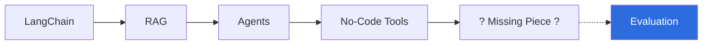

All of these are about **building** LLM-powered systems. But building is only half the job — you also need a reliable way to know whether what you built actually **works**, and works **safely**, before it reaches real users.

---

## 2. The Missing Piece: Evaluation

This is the central motivation for the entire playlist:

> Before shipping any LLM application to production, you must be able to **evaluate** it — systematically, not by gut feel.

This is framed as a **career-critical skill** — not optional polish, but a core competency expected of a production-grade AI Engineer.

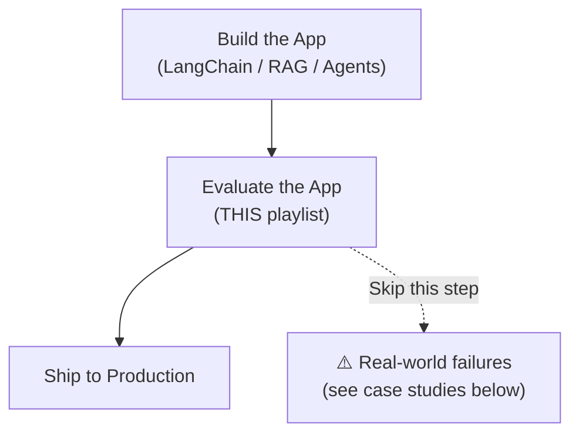

---

## 3. The Danger of "Vibe Testing"

**Vibe testing** = judging an LLM application by typing in a handful of questions, eyeballing the responses, feeling like "yeah, this seems fine," and shipping it — with no structured dataset, no defined criteria, and no repeatability.

Why it's dangerous:
- It only checks the **happy path** — the few questions you happened to think of.
- It misses **edge cases**, **adversarial inputs**, and **rare-but-costly failure modes**.
- It gives **false confidence**: "it worked when I tried it" is not the same as "it's safe and reliable for thousands of real users."
- Failures discovered this way tend to surface **after deployment**, in front of real customers, media, or courts — which is exactly what the three case studies below illustrate.

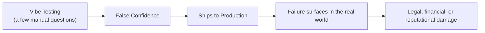

---

## 4. Case Study 1: Air Canada Chatbot

**What happened:**
Air Canada's customer-support chatbot was asked about the airline's bereavement-fare refund policy. The chatbot **hallucinated** — it gave the customer incorrect information, telling them they could apply for a retroactive discount after booking, which did not match the airline's actual written policy.

**The consequence:**
The customer relied on the chatbot's (wrong) answer, was later denied the refund based on the *real* policy, and took Air Canada to a small-claims tribunal. Air Canada argued the chatbot was a separate "legal entity" responsible for its own words — a defense the tribunal rejected. **Air Canada lost the case** and was held responsible for information its own chatbot provided.

**Why it matters for evals:**
This is a textbook **groundedness/factuality failure** — the bot generated a plausible-sounding but false policy statement. A proper eval pipeline checking "is this answer grounded in our actual policy documents?" would have caught this before launch.

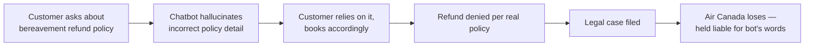

---

## 5. Case Study 2: Chevrolet Dealership Chatbot

**What happened:**
A car dealership had deployed an LLM-powered chatbot (built on a general-purpose model) for customer service on its website. A user **jailbroke** the chatbot through clever prompting — manipulating it into agreeing to sell a vehicle for **$1**, and even getting it to state the offer was a "legally binding" agreement.

**The consequence:**
Screenshots of the exchange went viral, turning into a **public-relations embarrassment** for the dealership. It exposed how easily an unguarded LLM deployment can be manipulated by adversarial users into making absurd or damaging statements on a brand's behalf.

**Why it matters for evals:**
This is a **safety / guardrail failure** — there was no adversarial testing (red-teaming) for prompt injection or jailbreak attempts before deployment. Evals must include **adversarial test cases**, not just well-behaved ones.

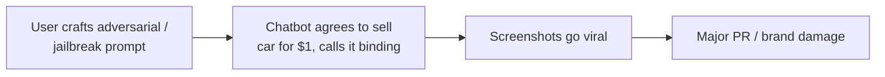

---

## 6. Case Study 3: The Lawyer & ChatGPT

**What happened:**
A lawyer used ChatGPT to help research and draft a legal brief. ChatGPT **fabricated case citations** — generating fake court cases and rulings that sounded authoritative but did not actually exist. The lawyer did not verify these citations and submitted the brief to a real court.

**The consequence:**
The fabricated citations were discovered by the court, and the lawyer was **sanctioned/fined** for submitting fictitious legal precedent.

**Why it matters for evals:**
This is a classic **hallucination in a high-stakes domain** — the model confidently generated false, specific, "factual-sounding" content (citations, case names, rulings) with no grounding in real source material, and no human verification step caught it before it caused real-world harm.

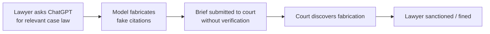

---

### Common Thread Across All Three Cases

| Case | Failure Type | Root Cause | Eval Category That Would Catch It |
|---|---|---|---|
| Air Canada | Hallucinated policy | No groundedness check | Factuality / Groundedness eval |
| Chevrolet | Jailbreak / manipulation | No adversarial testing | Safety / Red-teaming eval |
| Lawyer & ChatGPT | Fabricated citations | No fact-verification step | Factuality / Hallucination eval |

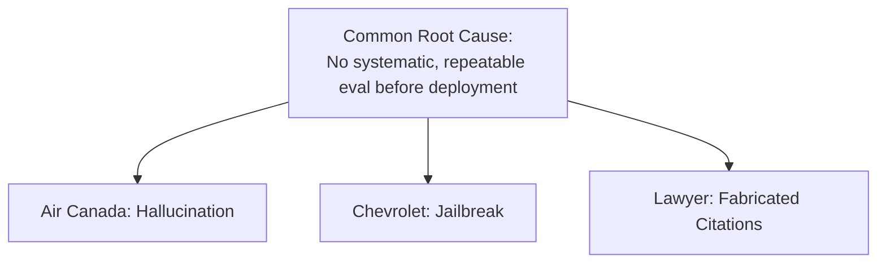

---

## 7. Why Evaluating LLMs Is Genuinely Hard

Two structural reasons make LLM evaluation fundamentally harder than traditional software testing:

### 7.1 Deterministic vs Probabilistic Behavior

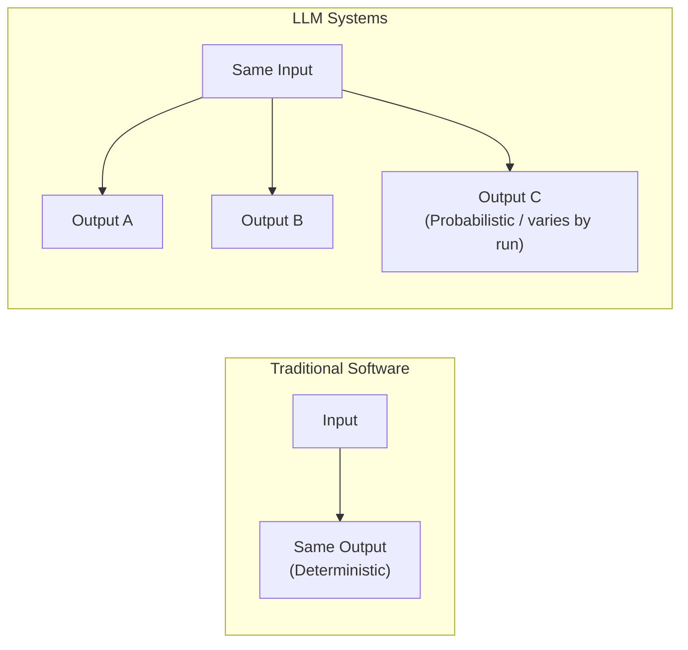

- Traditional software: given the same input, you get the **same output**, every time. Testing is a matter of asserting exact expected values.
- LLMs: given the **same input**, you can get **different outputs** across runs (due to sampling, temperature, model updates, etc.). This means you can't simply assert "output == expected_string" — evaluation must tolerate and measure **variation**, often using judgment-based or similarity-based scoring rather than exact matching.

### 7.2 Multi-Dimensional Evaluation

Correctness alone is **not sufficient**. A response can be factually correct and still be a bad response. You need to evaluate across multiple axes simultaneously:

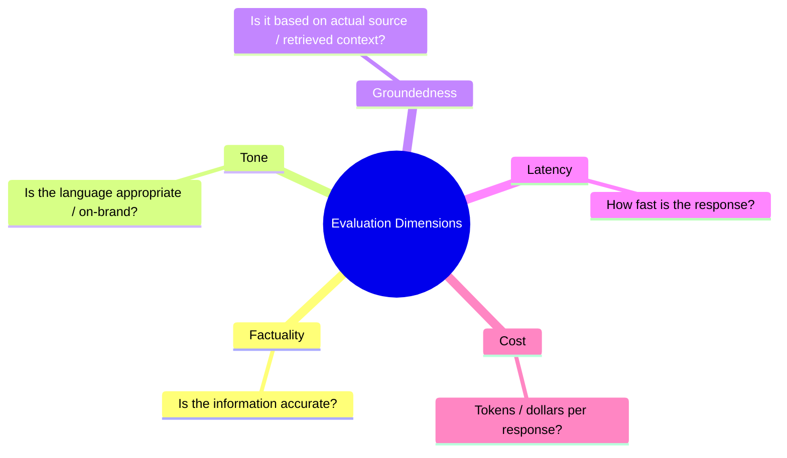

| Dimension | Question It Answers |
|---|---|
| **Factuality** | Is the information actually true? |
| **Tone** | Is the language/style appropriate for the audience and brand? |
| **Groundedness** | Is the answer backed by real source documents/context, not invented? |
| **Latency** | How quickly does the user get a response? |
| **Cost** | What's the compute/token cost per response? |

> A response can score perfectly on factuality and groundedness but still fail the product if latency is too high or cost per query is unsustainable at scale.

---

## 8. Playlist Roadmap

The full playlist will progressively cover:

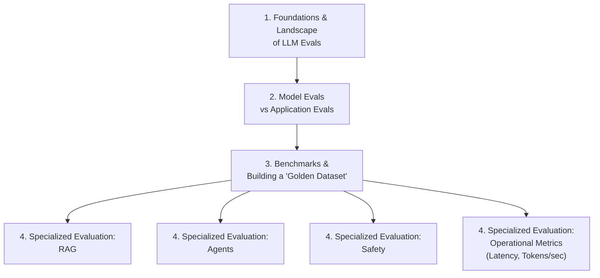

| Stage | Topic |
|---|---|
| 1 | Foundations & overall landscape of LLM Evals |
| 2 | Model Evaluation vs Application Evaluation |
| 3 | Benchmarks and constructing a **Golden Dataset** |
| 4 | Specialized evals for: **RAG**, **Agents**, **Safety**, and **Operational metrics** (e.g., latency, tokens-per-second) |

---

## 9. Summary Diagram

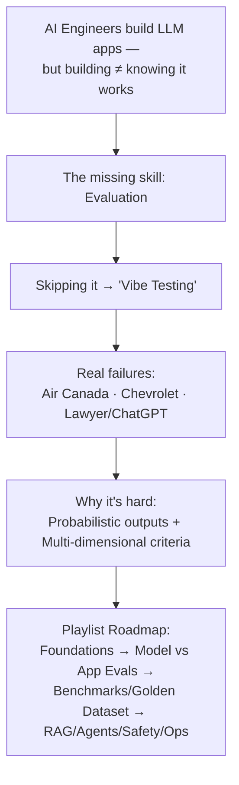

---

## 10. Interview Q&A

**Q1. What is "vibe testing," and why is it considered dangerous for LLM applications?**
A: Vibe testing is informally judging an LLM application by trying a handful of questions and relying on gut feel ("seems fine") rather than a structured, repeatable evaluation process. It's dangerous because it only covers the cases you happen to think of, misses edge cases and adversarial inputs, and creates false confidence that surfaces as real failures only after deployment.

**Q2. Summarize the Air Canada chatbot incident and the lesson it teaches about evaluation.**
A: Air Canada's chatbot hallucinated incorrect details about a bereavement refund policy; the customer relied on it, was denied the refund under the real policy, and won a tribunal case against the airline, which was held liable for its bot's statements. Lesson: groundedness/factuality checks against real source documents are essential before deployment.

**Q3. What failure mode did the Chevrolet dealership chatbot case expose?**
A: A user jailbroke the chatbot into "agreeing" to sell a car for $1 and calling it a binding offer, causing a viral PR crisis. This exposed the absence of adversarial/red-team testing — evals must include deliberately hostile or manipulative prompts, not just well-behaved ones.

**Q4. What went wrong in the lawyer/ChatGPT case, and what category of eval failure does it represent?**
A: ChatGPT fabricated fake case citations that a lawyer submitted to court without verification, leading to sanctions. This is a hallucination/factuality failure in a high-stakes domain, compounded by a missing human/automated fact-verification step.

**Q5. Why is evaluating LLM systems harder than evaluating traditional deterministic software?**
A: Traditional software is deterministic — same input always yields the same output, so testing can assert exact expected values. LLMs are probabilistic — the same input can yield different outputs across runs, so evaluation must measure and tolerate variation rather than relying on simple exact-match assertions.

**Q6. Name the five evaluation dimensions discussed beyond plain correctness, and explain why correctness alone is insufficient.**
A: Factuality, Tone, Groundedness, Latency, and Cost. Correctness alone is insufficient because a response can be factually accurate yet still fail in production due to inappropriate tone, lack of grounding in real context, excessive latency, or unsustainable cost at scale.

**Q7. What is a "Golden Dataset" in the context of LLM evaluation, and where does it fit in the playlist roadmap?**
A: A Golden Dataset is a curated, high-quality, ground-truth-labeled dataset used as a stable benchmark for repeatable evaluation. It's covered as Stage 3 of the roadmap, right after the Model vs Application Evals distinction and before specialized evals for RAG, Agents, Safety, and operational metrics.

**Q8. List the four specialized evaluation areas planned later in the playlist.**
A: RAG evaluation, Agent evaluation, Safety evaluation, and Operational metrics evaluation (e.g., latency, tokens-per-second/cost).

---

*End of notes.*
