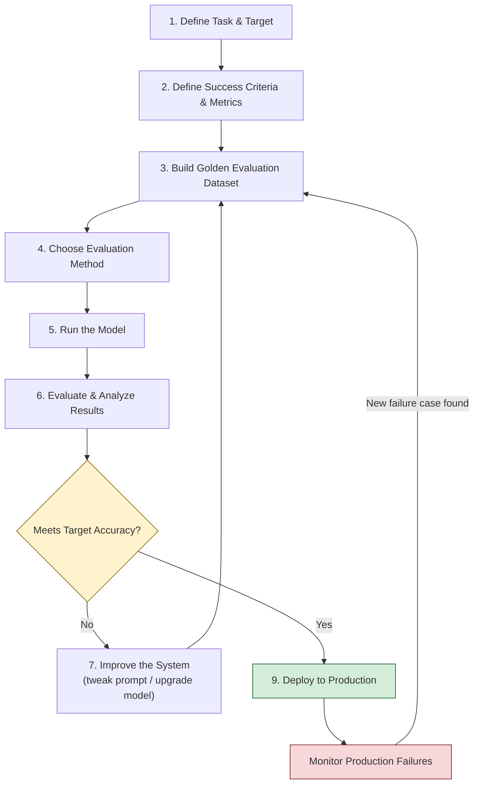
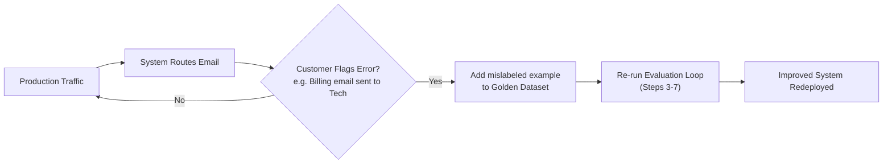
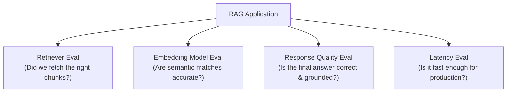

# LLM Application Evaluation — The 9-Step Workflow

> Application Evals measure how well an *entire LLM-powered system* (prompt + model + retrieval + business logic) performs on a real-world task — illustrated here through a Zomato email-routing case study and generalized into a repeatable 9-step evaluation workflow.

---

## Table of Contents

1. [Recap: Model Evals vs Application Evals](#1-recap-model-evals-vs-application-evals)
2. [Case Study: Zomato Email Classification](#2-case-study-zomato-email-classification)
3. [The 9-Step Evaluation Workflow](#3-the-9-step-evaluation-workflow)
4. [Workflow Diagram](#4-workflow-diagram)
5. [Step-by-Step Deep Dive](#5-step-by-step-deep-dive)
6. [Production Feedback Loop](#6-production-feedback-loop)
7. [Multi-faceted Evaluation (RAG Example)](#7-multi-faceted-evaluation-rag-example)
8. [Evaluation Methods Comparison](#8-evaluation-methods-comparison)
9. [Sample Golden Dataset & Scoring Script](#9-sample-golden-dataset--scoring-script)
10. [Interview Q&A](#10-interview-qa)
11. [Quick Revision Checklist](#11-quick-revision-checklist)

---

## 1. Recap: Model Evals vs Application Evals

| Aspect | Model Evals | Application Evals |
|---|---|---|
| What's tested | The raw LLM itself (e.g., GPT-4, Llama) | The full product/system built on top of an LLM |
| Examples | MMLU, HellaSwag, HumanEval | Email router accuracy, RAG chatbot quality, support-ticket triage |
| Who runs them | Model providers / researchers | Application/product teams |
| Goal | Compare foundation models | Verify a specific business use case works reliably |

This lecture focuses **only on Application Evals** — evaluating a system built for a specific real-world task.

---

## 2. Case Study: Zomato Email Classification

**Use case:** Zomato receives customer support emails and wants to auto-route them to the correct team instead of manual triage.

**Task:** Classify each incoming email into one of three categories:

- `Billing` — payment, refund, invoice issues
- `Technical` — app crashes, login issues, bugs
- `General` — general queries, feedback, miscellaneous

**Why this matters:** A misrouted email (e.g., a billing complaint sent to the technical team) delays resolution and hurts customer experience — making *accuracy* a direct business metric, not just a model metric.

---

## 3. The 9-Step Evaluation Workflow

| # | Step | Core Question |
|---|---|---|
| 1 | Define Task and Target | What exactly should the system do? |
| 2 | Define Success Criteria and Metrics | How do we numerically judge "good"? |
| 3 | Build a Golden Evaluation Dataset | What's our ground truth? |
| 4 | Choose an Evaluation Method | Who/what grades the output? |
| 5 | Run the Model | Generate predictions on the dataset |
| 6 | Evaluate and Analyze Results | Compare predictions vs ground truth |
| 7 | Improve the System | Fix prompt / swap model / add context |
| 8 | Iterative Evaluation Loop | Repeat 3–7 until target met |
| 9 | Deployment and Production Monitoring | Ship it, watch it, keep improving |

---

## 4. Workflow Diagram



> Steps 3–7 form the **iterative loop** (Step 8) — the system never "passes" on the first try in real projects; you cycle through dataset curation, evaluation, and improvement until the metric clears the business bar.

---

## 5. Step-by-Step Deep Dive

### Step 1 — Define Task and Target (3:47–4:29)
Be explicit and unambiguous about the job the system performs.
> *Example:* "Classify each customer email into exactly one of: Billing, Technical, General."

### Step 2 — Define Success Criteria and Metrics (4:29–5:50)
Pick a metric that maps to business value.
- **Classification tasks →** Accuracy, Precision, Recall, F1
- **Generation tasks →** Faithfulness, Relevance, Coherence (often LLM-graded)
- For Zomato: **Accuracy = (correctly routed emails) / (total emails)**

### Step 3 — Build a Golden Evaluation Dataset (5:50–7:20)
- Collect **50–500** real, representative examples.
- Each example is manually labeled with the correct category — this becomes your **ground truth**.
- Quality and diversity matter more than raw size; edge cases should be deliberately included.

### Step 4 — Choose an Evaluation Method (7:20–9:16)

| Method | How it works | Best for |
|---|---|---|
| **Automated (Python script)** | Exact match / rule-based comparison against ground truth | Classification, structured/extraction tasks |
| **Human evaluation** | A person manually reviews and scores outputs | Subjective quality, tone, nuanced correctness |
| **LLM-as-judge** | A second LLM grades the output against a rubric or ground truth | Open-ended generation, summarization, RAG answers |

For Zomato's 3-class classification, an **automated Python script** comparing predicted label vs ground-truth label is sufficient and cheapest.

### Step 5 — Run the Model (9:16–10:32)
Feed every email in the golden dataset through the actual system (prompt + LLM) and capture its predicted category for each.

### Step 6 — Evaluate and Analyze Results (10:32–11:44)
Compare predictions to ground truth, compute the accuracy score, and **drill into the errors** — which category gets confused with which (a confusion-matrix mindset).

### Step 7 — Improve the System (11:44–12:36)
If accuracy is below target, try (in increasing order of cost):
1. Refine the system prompt (clearer instructions, few-shot examples)
2. Add more context (e.g., sample emails per category)
3. Upgrade/switch the underlying LLM
4. Add a pre/post-processing rule layer

### Step 8 — Iterative Evaluation Loop (12:36–13:39)
Repeat **Steps 3 → 7** — re-test, re-measure, re-improve — until accuracy meets the agreed business requirement (e.g., ≥ 95%).

### Step 9 — Deployment and Production Monitoring (13:39–14:49)
- Ship the system to production.
- Continuously monitor real-world failures.
- **Every production error becomes a new golden dataset entry** — this prevents the same mistake from recurring (regression protection).

---

## 6. Production Feedback Loop



**Key takeaway (14:49–17:00):** Evaluation doesn't stop at deployment. Production is itself a continuous data source — flagged errors are the highest-value additions to your golden dataset because they represent *real* failure modes, not hypothetical ones.

---

## 7. Multi-faceted Evaluation (RAG Example)

A single application is rarely evaluated with just one metric. A **RAG (Retrieval-Augmented Generation)** system, for instance, needs *separate* evaluations for each moving part:



| Component | What's Evaluated | Typical Metric |
|---|---|---|
| Retriever | Are the right documents/chunks retrieved? | Recall@k, Precision@k |
| Embedding Model | Quality of semantic similarity matching | Cosine similarity benchmarks |
| Response Quality | Is the generated answer correct, grounded, relevant? | Faithfulness, Relevance (often LLM-judged) |
| Latency | Is the end-to-end response time acceptable? | p50/p95 response time (ms) |

> **Takeaway:** One application = one evaluation is a myth for complex systems. Decompose the pipeline and evaluate each stage independently — a great generator can still produce bad answers if the retriever feeds it irrelevant context.

---

## 8. Evaluation Methods Comparison

| Criteria | Automated | Human | LLM-as-Judge |
|---|---|---|---|
| Speed | Fastest | Slowest | Fast |
| Cost | Very low | High (labor) | Moderate (API calls) |
| Scalability | High | Low | High |
| Subjectivity handling | Poor | Excellent | Good |
| Best fit | Classification, exact-match tasks | Tone, brand voice, nuanced judgment | Summarization, RAG answers, open-ended generation |
| Risk | Misses nuance | Slow, inconsistent across reviewers | Judge model itself can be biased/wrong |

---

## 9. Sample Golden Dataset & Scoring Script

**golden_dataset.csv** (illustrative format)

```csv
email_id,email_text,true_label
1,"My payment was deducted twice for the same order","Billing"
2,"The app crashes every time I try to track my order","Technical"
3,"Do you have a loyalty program for frequent customers?","General"
4,"I was charged but my order never got confirmed","Billing"
5,"Login OTP is not arriving on my phone","Technical"
```

**evaluate.py** — minimal automated accuracy scorer

```python
import csv

def load_golden_dataset(path):
    with open(path, newline="", encoding="utf-8") as f:
        return list(csv.DictReader(f))

def run_model(email_text):
    """
    Placeholder for the actual LLM call.
    Replace with: response = llm.classify(email_text)
    """
    # Example only — real implementation calls your LLM classifier
    return predict_category(email_text)

def evaluate(dataset):
    correct = 0
    confusions = []

    for row in dataset:
        predicted = run_model(row["email_text"])
        actual = row["true_label"]

        if predicted == actual:
            correct += 1
        else:
            confusions.append((row["email_id"], actual, predicted))

    accuracy = correct / len(dataset) * 100
    return accuracy, confusions

if __name__ == "__main__":
    dataset = load_golden_dataset("golden_dataset.csv")
    accuracy, confusions = evaluate(dataset)

    print(f"Accuracy: {accuracy:.2f}%")
    print("Misclassifications:")
    for eid, actual, predicted in confusions:
        print(f"  Email {eid}: expected={actual}, got={predicted}")
```

> In production, every entry printed under `Misclassifications` is a candidate to be added back into `golden_dataset.csv` — closing the loop described in Step 9.

---

## 10. Interview Q&A

**Q1. What is the difference between Model Evals and Application Evals?**
> Model Evals test the raw capabilities of a foundation model in isolation (e.g., benchmarks like MMLU). Application Evals test a complete system — prompt, model, retrieval, business logic — against a specific real-world task and business metric.

**Q2. Why do we need a "Golden Dataset," and what size is recommended?**
> A Golden Dataset is a manually labeled, ground-truth set of real examples used to measure system performance objectively. The lecture recommends 50–500 examples — large enough to be statistically meaningful, small enough to curate and label by hand with high quality.

**Q3. How do you choose between Automated, Human, and LLM-based evaluation?**
> Choose Automated for tasks with a clear, checkable ground truth (classification, extraction). Choose Human evaluation when judgment is subjective (tone, brand voice). Choose LLM-as-judge for open-ended generation tasks (summarization, RAG answers) where exact-match scoring doesn't work but full human review doesn't scale.

**Q4. What happens when a production error is discovered after deployment?**
> The flagged failure case is added directly to the Golden Evaluation Dataset. This ensures the same mistake is tested for in every future iteration of the evaluation loop — preventing regressions.

**Q5. Why might a single application need multiple separate evaluations?**
> Complex pipelines (like RAG) have multiple independent components — retriever, embedding model, generator, and latency/infra — each of which can fail independently. Evaluating only the final output can mask which specific component is responsible for a failure, so each stage needs its own metric and test set.

**Q6. In the Zomato example, why is Accuracy chosen as the metric instead of something like BLEU or ROUGE?**
> Accuracy directly answers the business question — "was the email routed to the correct team?" — which is a discrete classification outcome. BLEU/ROUGE measure text-generation similarity and aren't relevant here since there's no free-form text being generated, only a category label being predicted.

**Q7. What's the role of Step 8 (Iterative Evaluation Loop) in the overall workflow?**
> It formalizes that evaluation isn't a one-time gate — Steps 3 through 7 (dataset → method → run → evaluate → improve) are repeated until the system's measured performance meets the predefined business requirement, before it's allowed to move to deployment.

---

## 11. Quick Revision Checklist

- [ ] Can explain Model Evals vs Application Evals in one sentence each
- [ ] Can state all 9 steps of the Application Eval workflow in order
- [ ] Know why Accuracy was chosen for the Zomato classification task
- [ ] Can explain golden dataset size guidance (50–500 examples)
- [ ] Can differentiate Automated vs Human vs LLM-as-judge evaluation methods, with examples
- [ ] Understand the iterative loop: Steps 3–7 repeat until target metric is met
- [ ] Know that production failures get fed back into the golden dataset (regression prevention)
- [ ] Can name all 4 components of a multi-faceted RAG evaluation (retriever, embedding model, response quality, latency)
- [ ] Can sketch the workflow diagram from memory
- [ ] Can write a minimal Python accuracy-scoring loop against a labeled dataset

---

*Notes based on the CampusX LLM Evaluations playlist — Application Evaluation lecture.*
