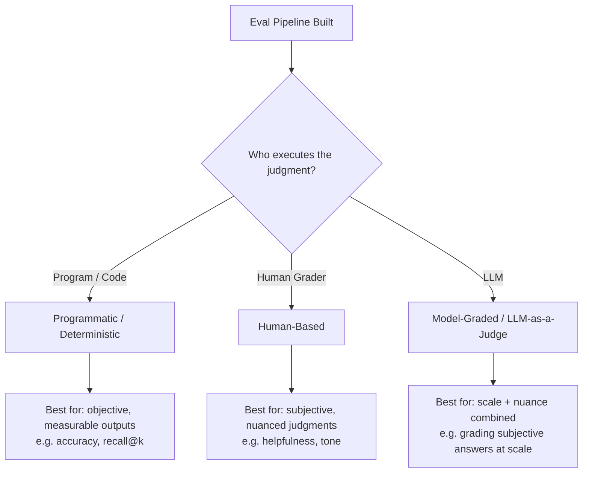
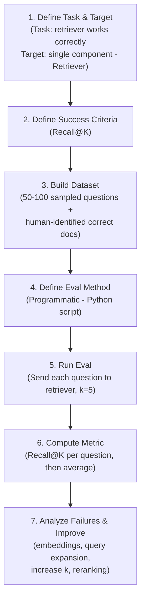
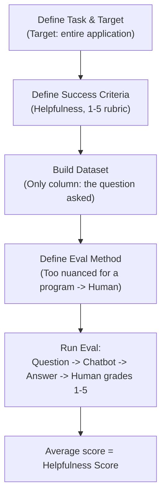
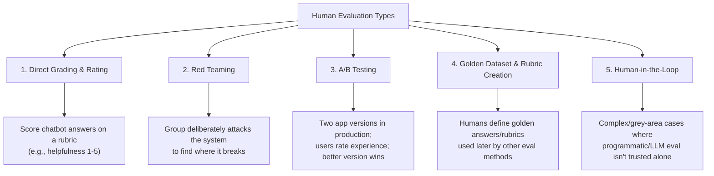
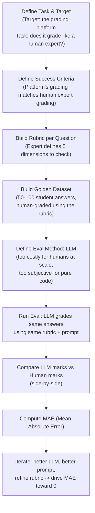
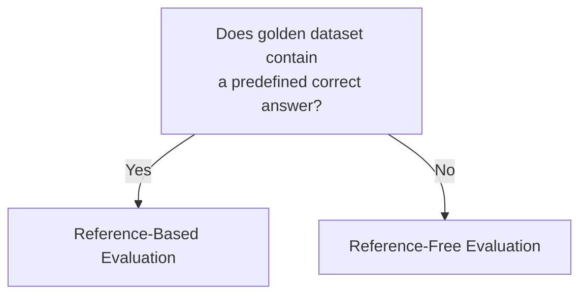

# LLM Eval Methods (Programmatic vs Human vs Model-Graded)

> CampusX LLM Evaluations Playlist — Session 4 Revision Notes
> Builds on: Model Evals vs Application Evals, Why LLM Evals Matter, Multiple Eval Pipelines

## Table of Contents
- [1. What is an LLM Eval Method?](#1-what-is-an-llm-eval-method)
- [2. The 3 Core Eval Methods — Overview](#2-the-3-core-eval-methods--overview)
- [3. Method 1: Programmatic / Deterministic Eval](#3-method-1-programmatic--deterministic-eval)
- [4. Method 2: Human-Based Eval](#4-method-2-human-based-eval)
- [5. The 5 Types of Human Evals](#5-the-5-types-of-human-evals)
- [6. Method 3: Model-Graded Eval (LLM-as-a-Judge)](#6-method-3-model-graded-eval-llm-as-a-judge)
- [7. Case Study: UPSC Mains Answer Grading Platform](#7-case-study-upsc-mains-answer-grading-platform)
- [8. Reference-Based vs Reference-Free Evaluation](#8-reference-based-vs-reference-free-evaluation)
- [9. Offline vs Online Evals (Preview)](#9-offline-vs-online-evals-preview)
- [10. Comparison Table: All 3 Methods](#10-comparison-table-all-3-methods)
- [11. Interview Q&A](#11-interview-qa)
- [12. Quick Revision Checklist](#12-quick-revision-checklist)

---

## 1. What is an LLM Eval Method?

> **Definition:** An LLM Eval Method is the mechanism you use to decide whether an LLM's output is good or not — the actual procedure that takes an output and produces a judgment about it.

We build evaluation pipelines so we can determine whether a component, workflow, or application is working correctly. But **who/what actually carries out the evaluation?** That's the "method."

Every eval pipeline you build will be executed by exactly **one of three methods**:

1. **Programmatic / Deterministic** — a program executes the eval
2. **Human** — a human executes the eval
3. **Model-Graded / LLM-as-a-Judge** — an LLM executes the eval

---

## 2. The 3 Core Eval Methods — Overview



**Key idea:** Creating the golden dataset is a *separate activity* from executing the eval. Golden datasets are almost always created by a human (a subject matter expert), regardless of which method is later used to run the eval at scale.

---

## 3. Method 1: Programmatic / Deterministic Eval

### Example: Evaluating a Retriever (Component-Level Eval)

**Setup:** CampusX builds a RAG chatbot. The `retriever` component fetches the most relevant documents from a vector DB for a given query.

**Flow followed for any eval pipeline:**



### Recall@K Metric

> **Definition:** Out of all the correct/relevant items that exist, how many did the system retrieve in its top K results?

**Worked Example:**
- Question: *"What are the prerequisites for the ML course and how long is it?"*
- Correct (golden) documents: `1001`, `1003`
- Retriever returns top `k=5`: `1001, 102, 104, 105, 106`
- Correct docs retrieved: only `1001` → **Recall = 1/2 = 50%**

```
Recall@K = (Number of relevant docs retrieved in top K) / (Total relevant docs that exist)
```

- Range: **0% to 100%** (100% is ideal)
- Final metric = average Recall@K across the entire dataset (e.g., 50 questions → overall Recall@K = 67%)
- Other related metrics: **Precision**, **Rank**

### How to Improve a Retriever
| Lever | What it does |
|---|---|
| Better embedding model | Improves semantic meaning capture |
| Query expansion | LLM expands/rewrites the query before sending to retriever |
| Increase K | Fetch more documents (e.g., k=5 → k=10) |
| Reranking | Reorders retrieved docs so the right one moves into top K |

---

## 4. Method 2: Human-Based Eval

### Example: Evaluating Chatbot "Helpfulness" (Application-Level Eval)

Here the **target is the entire application**, not one component. Task: evaluate helpfulness of chatbot answers (not safety/ops — just application quality).

> **Helpfulness = the answer was accurate + correctly toned + complete in itself.**

Since there's no single "correct metric" for helpfulness (it varies business to business), a **rubric** is defined instead:

| Score | Meaning |
|---|---|
| 5 | Accurate, complete, correct tone |
| 3 | Partially helpful |
| 1 | Not helpful at all |

### Flow



### Why Multiple Human Graders?

If two graders (Grader A, Grader B) score the same answer very differently (e.g., 2 vs 4), this signals **ambiguity in the rubric itself**, not just grader disagreement. Multiple graders are often used specifically to **refine the rubric** — high agreement means the rubric/instructions are clear; high disagreement means the criteria are ambiguous.

### Human Eval: Advantage vs Disadvantage

| Advantage | Disadvantage |
|---|---|
| High reliability — human judgment is trusted, easily catches nuance a program/LLM might miss | **Cost** — hiring humans doesn't scale to lakhs/millions of users |

---

## 5. The 5 Types of Human Evals

Humans don't just do direct 1-5 grading. In the LLM world, humans perform evaluation in **5 distinct ways**:



| Type | Description |
|---|---|
| Direct Grading & Rating | Human scores each output against a rubric |
| Red Teaming | Team intentionally attacks an LLM system to find failure points before launch |
| A/B Testing | Real users in production rate/compare two app versions; better one is fully deployed |
| Golden Dataset/Rubric Creation | Humans define correct answers or scoring dimensions used by other methods |
| Human-in-the-Loop | Judgment passed to a human for edge cases too complex for automated eval |

---

## 6. Method 3: Model-Graded Eval (LLM-as-a-Judge)

Sits **between Programmatic and Human**: combines the scalability of a program with the nuanced judgment of a human. This is the **most widely used method** in real-world LLM eval pipelines, when implemented correctly.

> **LLM-as-a-Judge:** Using an LLM to act as a judge to evaluate another system's output.

---

## 7. Case Study: UPSC Mains Answer Grading Platform

**Setup:** A platform conducts UPSC Mains mock exams (subjective, essay-type answers) at scale (e.g., 10,000+ students). Hiring human subject-matter experts to grade every paper isn't cost-effective. A vendor offers an LLM-based system that grades against a defined rubric at a fraction of the cost. The platform being evaluated is this LLM-based grading system.

### Step-by-Step



### Rubric Design Example

For the question *"Ethical governance is impossible without administrative accountability. Discuss (15 marks)"*, an expert defines dimensions such as:
- Does it discuss ethical governance & accountability?
- Does it explain the link between them?
- Does it give mechanisms?
- Does it cite examples?
- Does it have a balanced conclusion?

Each dimension covered = marks allocated for that dimension.

### Golden Dataset Structure

| Answer ID | Question ID | Student's Answer | Human Marks (out of 15) |
|---|---|---|---|
| A1 | Q1 | ...full text... | 13 |
| A2 | Q1 | ...full text... | 4 |

### Judge Prompt Structure

The LLM judge prompt is built from four parts pulled directly from the dataset/rubric:

```
1. Role:        "You are a grader evaluating a UPSC Mains answer against a rubric."
2. Context:     Question text + total marks for the question + exact rubric (dimensions)
3. Input:       The student's actual written answer
4. Instructions:
   - For each dimension, decide if the answer genuinely addresses it, then allocate marks
   - Do NOT reward verbosity, keyword stuffing, or unsubstantiated confident claims
   - DO reward structure, relevant examples, and balanced argumentation
   - Output: which dimensions were addressed, total marks awarded, and a
     1-sentence justification/reasoning for the score
```

### Mean Absolute Error (MAE)

Used to quantify how close LLM grading is to human grading.

```
MAE = ( |h1 - l1| + |h2 - l2| + ... + |hn - ln| ) / n
```
Where `h` = human marks, `l` = LLM marks, `n` = number of graded answers.

- **MAE = 0** → LLM grades exactly like a human (ideal)
- **MAE = 2.3** → on average, LLM deviates by ±2.3 marks from human grading
- **Goal:** drive MAE toward zero by:
  - Using a better/stronger LLM
  - Improving the system prompt
  - Refining the rubric

---

## 8. Reference-Based vs Reference-Free Evaluation

| | Reference-Based | Reference-Free |
|---|---|---|
| **Definition** | A known correct answer/reference exists for each test case; output is graded by comparing against it | No predefined correct answer exists; output quality is judged directly against a criteria/rubric (scale/standard, not a per-item correct answer) |
| **Test:** "Is the correct answer available in the golden dataset?" | Yes | No |
| **Example from this session** | Retriever eval (golden doc IDs known); UPSC eval (human marks per answer known — the "correct" grading is defined) | Chatbot helpfulness eval (only questions in dataset, no predefined "correct" answer — human judgment + rubric decide the score) |



> Note: This is orthogonal to the 3 eval methods (Programmatic/Human/Model-Graded) — it's a separate axis describing *what kind of ground truth* the eval relies on.

---

## 9. Offline vs Online Evals (Preview)

- Everything covered in this session (retriever, helpfulness, UPSC grading) is **Offline Evaluation** — done before/outside production traffic.
- **Online Evaluation** = evaluation that continues *after* the system is live in production, using real user interactions.
- This is flagged as the next topic to study in depth.

---

## 10. Comparison Table: All 3 Methods

| Aspect | Programmatic | Human | Model-Graded (LLM-as-Judge) |
|---|---|---|---|
| Executor | A program/script | A human grader | An LLM |
| Best for | Objective, measurable outputs (accuracy, recall@k) | Subjective/nuanced judgments (helpfulness, tone) | Subjective judgments **at scale** |
| Cost | Low | High (doesn't scale) | Low-moderate (fraction of human cost) |
| Reliability/Nuance | Low nuance, high consistency | High nuance, high trust | Moderate-high nuance, needs calibration |
| Example (this session) | Retriever Recall@K | Chatbot helpfulness (1-5 rubric) | UPSC Mains answer grading |
| Golden dataset creator | Human (always) | Human (always) | Human (always) |
| Typical metric | Recall@K, Precision | Average rubric score | MAE vs human scores |

---

## 11. Interview Q&A

**Q1. What is an LLM Eval Method?**
The mechanism/procedure used to decide whether an LLM's output is good — i.e., who or what actually executes the judgment (a program, a human, or a model).

**Q2. What are the three core LLM eval methods?**
Programmatic/Deterministic, Human-based, and Model-graded (LLM-as-a-Judge).

**Q3. What is Recall@K and how is it calculated?**
It measures, out of all correct/relevant items that exist, how many were retrieved in the system's top K results. Formula: relevant items retrieved in top K ÷ total relevant items that exist.

**Q4. Why would you use a human for evaluation instead of a program?**
When the target being measured (e.g., "helpfulness") is subjective/ambiguous and can't be captured by a deterministic metric — human judgment can capture nuance a program cannot.

**Q5. What's the biggest disadvantage of human-based evaluation?**
Cost — it doesn't scale economically to large user volumes.

**Q6. Name the 5 types of human evaluation.**
Direct grading/rating, red teaming, A/B testing, golden dataset/rubric creation, and human-in-the-loop.

**Q7. Why is LLM-as-a-Judge considered the most useful eval method?**
It combines the scalability of programmatic evaluation with the nuanced judgment closer to a human, making it viable for large-scale subjective evaluation tasks (like grading essay answers).

**Q8. What is Mean Absolute Error (MAE) used for in LLM-as-a-Judge evals?**
To quantify how closely the LLM judge's scores match human grader scores, by averaging the absolute difference between human and LLM marks across all graded items. Goal is to drive it toward zero.

**Q9. What's the difference between reference-based and reference-free evaluation?**
Reference-based evaluation compares output against a known, predefined correct answer for each test case. Reference-free evaluation has no predefined correct answer — output is judged directly against a criteria/rubric (a scale/standard rather than an exact answer).

**Q10. If two human graders frequently disagree on scores for the same output, what does that indicate?**
Ambiguity in the rubric/scoring criteria — not necessarily a flaw in either grader.

**Q11. What can you tune to reduce MAE in a model-graded eval pipeline?**
Use a stronger/better LLM, refine the system prompt, and/or improve the rubric.

**Q12. Is creating the golden dataset itself a separate activity from choosing an eval method?**
Yes — golden datasets are almost always created by a human, regardless of whether the eval is later run programmatically, by humans, or by an LLM judge.

---

## 12. Quick Revision Checklist

- [ ] Can define what an "LLM Eval Method" is (the execution mechanism)
- [ ] Can name all 3 eval methods: Programmatic, Human, Model-Graded
- [ ] Can walk through the standard eval pipeline flow: Task/Target → Success Criteria → Dataset → Eval Method → Run → Metric → Iterate
- [ ] Can calculate Recall@K from a worked example
- [ ] Know how to improve a retriever (embeddings, query expansion, K, reranking)
- [ ] Understand why a rubric (not a single metric) is used for subjective evals like "helpfulness"
- [ ] Know why multiple human graders help refine a rubric (agreement = clear rubric, disagreement = ambiguous rubric)
- [ ] Can list and briefly explain all 5 types of human evals
- [ ] Understand the UPSC case study end-to-end: rubric → golden dataset → LLM judge prompt structure → MAE
- [ ] Can compute/explain Mean Absolute Error (MAE) and what a lower value means
- [ ] Can distinguish Reference-Based vs Reference-Free evaluation with the "is correct answer known?" test
- [ ] Know that Offline vs Online eval is a separate, upcoming topic
- [ ] Can compare all 3 methods on cost, nuance, and scalability
