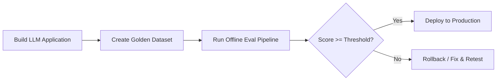
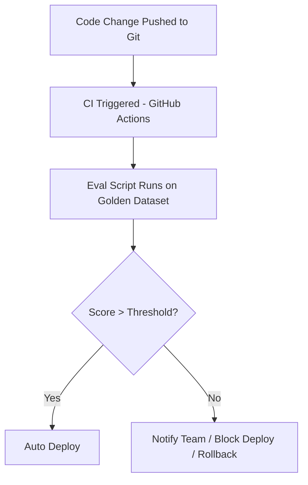
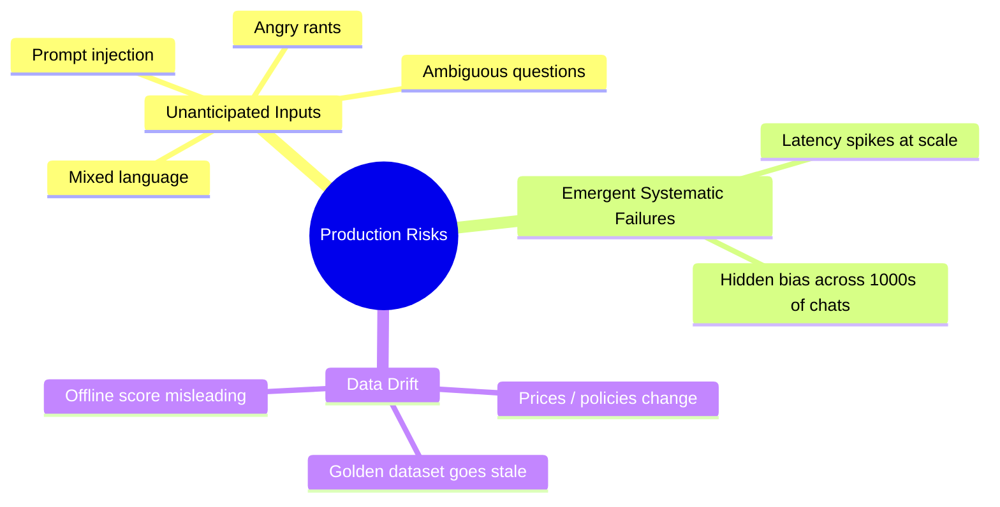
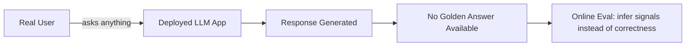
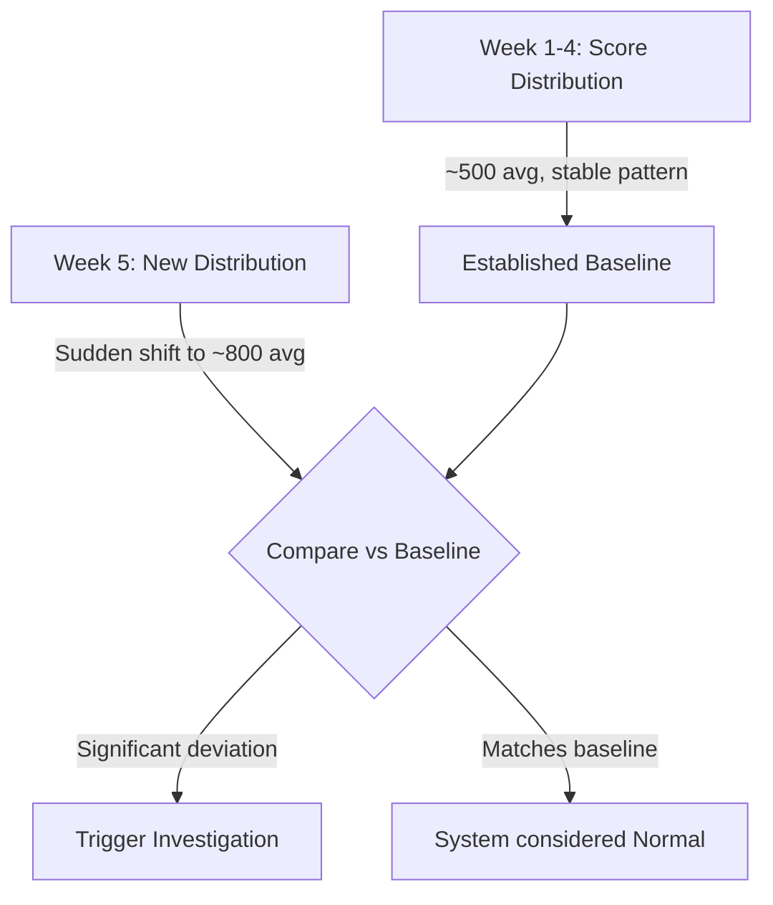
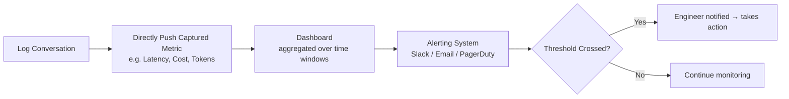
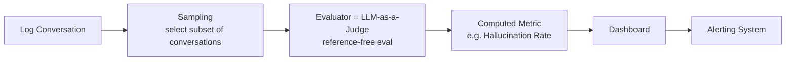
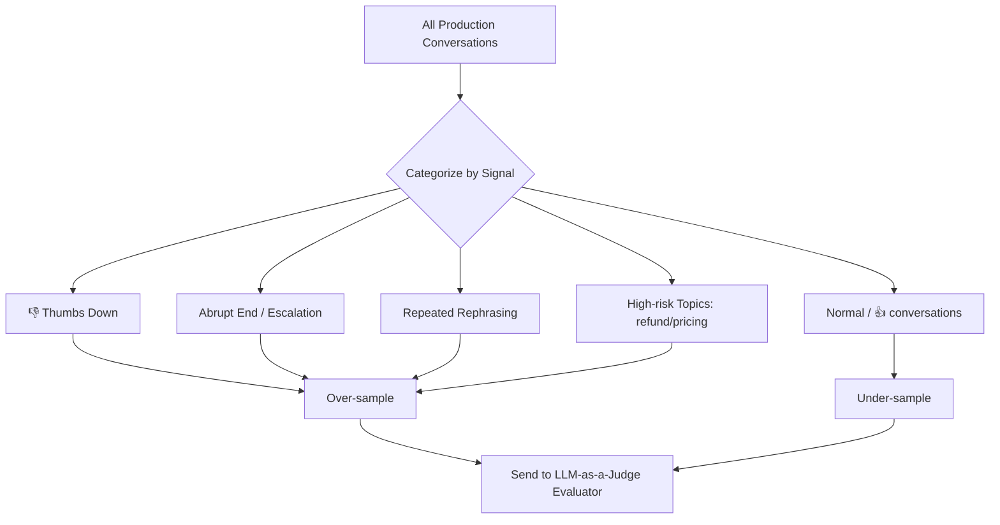
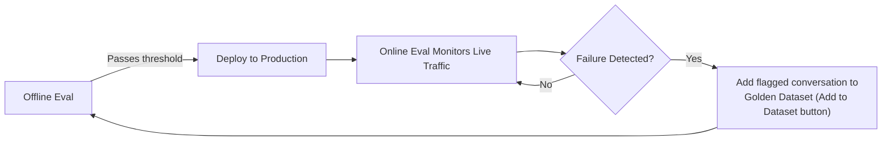
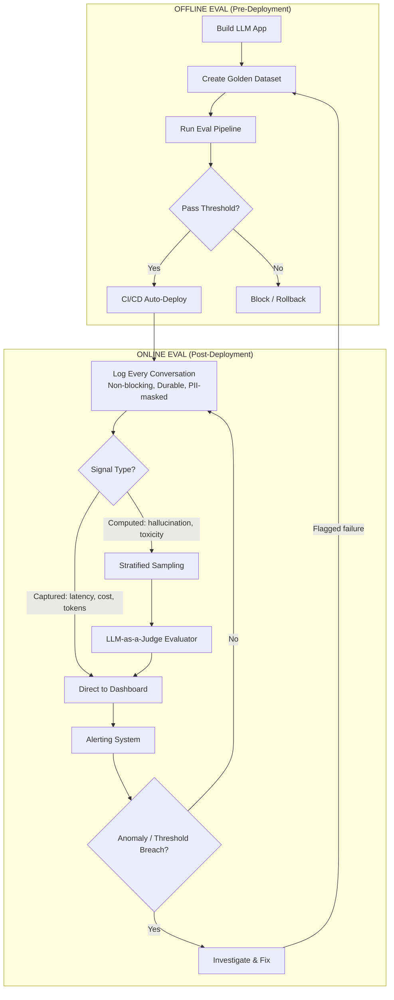

# Offline Evals vs Online Evals — LLM Evaluation Pipelines

> **Course**: CampusX — LLM Evaluations Playlist (Session 3 & 4)
> **Summary**: This session builds on the previously covered "why evals matter" and "eval pipeline" fundamentals to introduce the critical distinction between **Offline Evaluation** (pre-deployment testing against a fixed golden dataset) and **Online Evaluation** (post-deployment monitoring of live production traffic without a golden dataset). It covers the 3 core benefits of offline evals, the 3 major production risks that offline evals *cannot* catch, the full anatomy of an online eval pipeline (logging → sampling → evaluation → dashboarding → alerting), and the self-improving feedback loop that connects online failures back into the offline dataset.

---

## Table of Contents

- [1. Recap: What We've Covered So Far](#1-recap-what-weve-covered-so-far)
- [2. What is Offline Evaluation?](#2-what-is-offline-evaluation)
- [3. Three Core Benefits of Offline Evals](#3-three-core-benefits-of-offline-evals)
- [4. Three Major Production Risks (Post-Deployment)](#4-three-major-production-risks-post-deployment)
- [5. What is Online Evaluation?](#5-what-is-online-evaluation)
- [6. Offline vs Online: Comparison Matrix](#6-offline-vs-online-comparison-matrix)
- [7. Core Concept: Correctness vs Normalcy](#7-core-concept-correctness-vs-normalcy)
- [8. The UPSC Grader Example (Baseline Distribution)](#8-the-upsc-grader-example-baseline-distribution)
- [9. Anatomy of an Online Eval Pipeline](#9-anatomy-of-an-online-eval-pipeline)
  - [9.1 Step 1 — Logging](#91-step-1--logging)
  - [9.2 Step 2 — Signal Types: Captured vs Computed](#92-step-2--signal-types-captured-vs-computed)
  - [9.3 Pipeline for Captured Quantities](#93-pipeline-for-captured-quantities)
  - [9.4 Pipeline for Computed Quantities](#94-pipeline-for-computed-quantities)
  - [9.5 Stratified Sampling (Cost Control)](#95-stratified-sampling-cost-control)
- [10. LangSmith Platform Walkthrough](#10-langsmith-platform-walkthrough)
- [11. The Self-Improving Loop](#11-the-self-improving-loop)
- [12. Full End-to-End Flow Diagram](#12-full-end-to-end-flow-diagram)
- [13. Interview Q&A](#13-interview-qa)
- [14. Quick Revision Checklist](#14-quick-revision-checklist)

---

## 1. Recap: What We've Covered So Far

Before this session, the course had already covered five foundational topics:

1. **Why do we need evals?** — motivated by real failure case studies (Air Canada chatbot, ChatGPT incidents).
2. **What exactly are evals?** — Model-based evals vs Application-based evals.
3. **What does an LLM eval pipeline look like?**
4. **Why do we need multiple eval pipelines for a single application?**
   - Reason A: Multiple **failure points** — component level, workflow level, and full-application level.
   - Reason B: Multiple **risk categories** — Application Quality, Safety, and Operations (latency, cost, etc.).
5. **What are the different eval methods?**
   - Programmatic methods
   - LLM-as-a-judge
   - Human evaluation

> Today's topic builds directly on top of this: **Offline Evals vs Online Evals**.

---

## 2. What is Offline Evaluation?

**Definition**: Any eval pipeline that is run on an LLM-based application **before it is deployed** to production is called an **Offline Eval**.

- Everything covered in prior sessions (e.g., the UPSC Mains-paper grader example, using a golden dataset + LLM-as-a-judge) is an example of offline evaluation.
- Key idea: You test the software fully **after building it, but before deploying it** — to decide "is this ready to ship?"

---

## 3. Three Core Benefits of Offline Evals

### Benefit 1 — Pre-Release Gating (CI/CD Integration)
- Offline evals let you test **before release**.
- This can be fully automated as a **release gate** inside a CI/CD pipeline:
  - Code is pushed → Git triggers CI (e.g., GitHub Actions) → eval script runs → produces a score.
  - If score **> threshold** → deployment pipeline auto-triggers.
  - If score **< threshold** → notification sent, deployment blocked, rollback to previous version.

### Benefit 2 — Version / Variant Comparison
- Offline evals let you objectively compare multiple versions of your system on a **level playing field** (same golden dataset, same eval).
- Common use cases:
  - Compare **Claude vs OpenAI** as the underlying model.
  - Compare different **prompts**.
  - Compare different **rerankers**.
  - Compare different **vector databases**.
  - Compare entirely different **architectures**.
- Because the golden dataset and eval logic stay fixed, whichever version scores higher wins.

### Benefit 3 — Regression Testing
- **Regression Testing** = testing that a change doesn't break existing behavior ("test of change").
- **Example scenario**: A chatbot answers refund questions "coldly." You update the system prompt to be "kind and polite." Result: tone improves, but the bot becomes *overly* soft — e.g., rounding ₹19,500 down to "around ₹19,000" just to sound nicer. Improving one dimension (tone) silently broke another (factual precision).
- **Solution**: Build a golden dataset covering many categories (refunds, pricing, curriculum, etc.) and rerun the eval after every change.
  - If the refund-category success rate was 90% before the change, it should stay close to 90% after — not drop to 80%.
  - A significant drop signals **regression**, meaning the change should not be shipped as-is.

> **Golden Rule**: A change anywhere (prompt, model, vector DB, etc.) should not silently degrade unrelated capabilities — and offline evals with a diverse golden dataset are how you catch that.

---

## 4. Three Major Production Risks (Post-Deployment)

Once the software passes offline evals and is deployed, **three major categories of risk** emerge that offline evals cannot cover:

### Risk 1 — Unanticipated User Inputs
- Golden datasets typically cover only 200–500 anticipated questions.
- Real users introduce a much larger superset of inputs:
  - Hindi-English mixed language (code-switching)
  - Ambiguous / half-formed questions
  - Angry rants with a hidden question inside
  - Adversarial prompt injection attempts
  - Countless unanticipated edge cases

### Risk 2 — Emergent / Systematic Failures at Scale
- Problems that **only appear at scale**, impossible to simulate offline:
  - **Latency spikes** from concurrent load (e.g., thousands of users hitting the chatbot after a course launch).
  - **Subtle bias** that only becomes visible across thousands of conversations — e.g., the bot responding worse to users from non-technical backgrounds, a pattern invisible in a small offline test set.

### Risk 3 — Data Drift (Golden Dataset Becomes Obsolete)
- Over time, the business itself changes: prices update, curriculum changes, policies evolve.
- The RAG documents / knowledge base drift away from what the golden dataset was built on a year ago.
- **Consequence**: The offline eval pipeline keeps reporting good scores (because it's still testing against the *old* golden dataset), while real users give increasingly **negative feedback** in production — because the underlying data has moved on and the eval setup hasn't been updated.
- This was called the most **technical** of the three risks.

> **Conclusion**: Offline evals answer "does it work correctly (on what I anticipated)?" — but they *cannot* protect against these three production-only risks. This is exactly why **Online Evals** exist.

---

## 5. What is Online Evaluation?

**Definition**: Evaluating your system on **live production traffic**, **after deployment**, as real users interact with it.

**Biggest defining characteristic**: Online eval works **without an answer key** — there is no golden dataset in production, because you can't know in advance what a user will ask or what the "correct" answer should be.

---

## 6. Offline vs Online: Comparison Matrix

| Dimension | Offline Eval | Online Eval |
|---|---|---|
| **Timing** | Before deployment | After deployment (continuous) |
| **Data** | Fixed golden dataset (you create it) | Live production traffic (unbounded) |
| **Answer key** | Yes — golden dataset has correct answers | No — must estimate quality on the fly |
| **Input scope** | Only anticipated inputs | Anything the user might send |
| **What it catches** | Regressions | Drift, surprises, emergent bugs |
| **Best used for** | Release gating, version comparison, CI/CD | Drift detection, real-world health monitoring |
| **Cost & speed** | Fast, cheap, repeatable (small dataset, simple runs) | Can be costly at scale → needs sampling |
| **Relationship** | Complementary — **not rivals**. Both run together, always. | |

> **Key takeaway**: Offline and online evals are **not replacements for each other** — they are complementary and should always run in parallel.

---

## 7. Core Concept: Correctness vs Normalcy

This is the **most important conceptual distinction** of the session:

> **Offline Eval → checks CORRECTNESS** — "Is my application working correctly?"
> **Online Eval → checks NORMALCY** — "Is my application behaving normally in production right now?"

- Offline evals can assert correctness because they have ground-truth (human-graded) answers to compare against.
- Once deployed, there is no human-graded answer for a *brand-new* live query — so true correctness cannot be directly measured. Instead, online evals detect whether current behavior deviates from an established **normal baseline**.

---

## 8. The UPSC Grader Example (Baseline Distribution)

Recall the UPSC Mains-paper auto-grader system used in the earlier offline-eval session.

**Offline phase**: Correctness = how close the grader's marks are to a human grader's marks (compared against the golden dataset).

**Online phase (post-deployment)**: Can we measure correctness directly? **No** — because there's no human-graded score available for a brand-new paper the system is grading right now for the first time.

**What CAN we measure instead? → Normalcy**, via **baseline score distributions**:

- Plot the distribution of scores given out over a time window (e.g., last week): most students scoring ~500, many ~700, few ~200.
- Compare each new week's distribution against this baseline.
- If the distribution suddenly shifts (e.g., most students scoring ~800+, very few in the 200–500 range) → **something changed**. This is a trigger to investigate — it doesn't *prove* something is wrong (could be a genuinely stronger cohort of students), but it flags an anomaly worth checking.

**Correctness proxies when no answer key exists**:
| Signal | How it substitutes for "correctness" |
|---|---|
| Faithfulness | Checks if the answer was actually derived from retrieved context — doesn't need the "correct" answer, just the context + generated answer |
| Thumbs up / down | Direct user feedback signal — spike in 👎 implies something is going wrong |
| Baseline distribution comparison | Used when no other proxy metric is available (e.g., UPSC grader scores) |

---

## 9. Anatomy of an Online Eval Pipeline

### 9.1 Step 1 — Logging

The foundation of any online eval pipeline: **you must record everything happening in production**, or there's nothing to evaluate later.

**What gets logged per conversation turn:**
- Conversation ID, Turn ID, User ID, Session ID, Timestamp
- The user's question
- Retrieved context (in RAG systems)
- The model's generated output
- Operational metrics: latency (ms), prompt tokens, completion tokens, total cost, error status codes
- Behavioral signals: thumbs up/down, escalation requests ("talk to a human," "email me"), repeated/rephrased questions (frustration signal)

**Engineering properties logging must satisfy:**

| Property | Meaning |
|---|---|
| **Non-blocking** | Logging must run in parallel with the chat — it should never add to response latency |
| **Durable & queryable** | Store in a data warehouse / observability tool (e.g., **LangSmith**) so it can be fetched later |
| **Late signal attachment** | Some signals arrive after the conversation ends (e.g., a user emails a complaint a day later) — must still be tied back to the original conversation ID |
| **PII handling / masking** | Sensitive info (phone numbers, card numbers, addresses) must be masked/redacted before storage so teammates can't extract it later |

> **Tool used in the demo**: **LangSmith** — used for tracing, storing full conversation logs, and later monitoring/dashboarding.

### 9.2 Step 2 — Signal Types: Captured vs Computed

| Type | Definition | Examples |
|---|---|---|
| **Captured Signals** | Already exist — just store them as-is, no calculation needed | Thumbs up/down, latency, token usage, cost per conversation |
| **Computed Signals** | Must be calculated/derived using an evaluator | Faithfulness, answer relevance, correctness, hallucination, toxicity, bias & fairness |

### 9.3 Pipeline for Captured Quantities

Simple, linear flow — no evaluator needed:

- Dashboards aggregate metrics over time windows (last 1hr / 24hr / 1 week / 6 months) — a **single conversation in isolation doesn't matter**; the trend across many conversations does.
- Example: sudden traffic spike after a course launch → average latency rises across the last hour → alert fires → engineer spins up more compute (e.g., AWS EC2 instances, load balancer scaling) → latency normalizes.

### 9.4 Pipeline for Computed Quantities

More complex — requires an **evaluator step** before dashboarding. Example used: **Hallucination Rate**.

- Hallucination detection is a **reference-free evaluation** (recall: reference-based = has a golden answer key like the UPSC example; reference-free = no golden answer key exists).
- Since there's no golden answer for a live user query, an **LLM-as-a-judge** evaluator is used: it's shown the retrieved context, the user's question, and the model's output, plus a detailed rubric, and asked to judge whether hallucination occurred.

### 9.5 Stratified Sampling (Cost Control)

**Problem**: Running an LLM-as-a-judge evaluator on *every single* production conversation is extremely costly (you're already paying for the chatbot's own generations; evaluating all of them roughly doubles cost).

**Naive solution**: Random sampling — e.g., randomly select 1,000 out of 50,000 conversations.

**Better solution**: **Stratified Sampling**
1. Divide conversations into categories (e.g., by topic, by signal type).
2. Over-sample from **problematic categories** — conversations with 👎, abrupt endings, escalations, repeated rephrasing, or high-risk topics (refunds, pricing, admissions).
3. Under-sample "normal," seemingly fine conversations (e.g., ones that already got 👍).

This increases the chance of correctly detecting real issues like hallucination within a fixed evaluation budget, compared to pure random sampling.

---

## 10. LangSmith Platform Walkthrough

Demonstrated live in the session as the observability/eval tool of choice:

- **Tracing**: every conversation is logged with full input/output + metadata (latency, tokens, cost, errors).
- **Monitoring dashboard**: pre-built graphs for trace latency, error rate, LLM call count, LLM latency, cost — filterable by time window (1hr / 3hr / 6hr, etc.).
- **Alerts**: configurable per metric/project — e.g., "alert when [metric] exceeds threshold in last 5 minutes" → routes to Slack, PagerDuty, or a custom API.
- **Evaluator templates**: prebuilt LLM-as-a-judge templates for PII leakage, prompt injection detection, code injection, toxicity, bias & fairness, hallucination, correctness, conciseness, and more — separate templates also exist for agents, image-based bots, and voice-based bots.
- **Key toggle**: When creating an evaluator, you choose to run it on:
  - **Tracing** (live logged conversations) → becomes an **Online Evaluator**
  - **A Dataset** (a fixed golden dataset you created) → becomes an **Offline Evaluator**

  > This single toggle is why LangSmith is described as a **complete evaluation platform** — the same evaluator template can serve both offline and online use cases depending on what data source it's pointed at.

---

## 11. The Self-Improving Loop

A key closing concept: offline and online evaluation are not isolated — they **feed into each other continuously**.

- In LangSmith, when a team spots a problematic conversation while reviewing traces, there's a direct **"Add to Dataset"** button.
- This pulls that real production failure into the offline golden dataset.
- Next time offline evaluation runs, it's tested against this **updated, harder dataset** — closing the loop.
- There's also an **annotation queue** feature — team members can review and annotate conversations (what went right/wrong) before they become part of the offline dataset.

> This loop is what makes the overall eval system continuously improve rather than staying static after the first release.

---

## 12. Full End-to-End Flow Diagram

---

## 13. Interview Q&A

**Q1: What's the fundamental difference between offline and online evals?**
> Offline evals run before deployment against a fixed golden dataset with known correct answers, checking *correctness*. Online evals run continuously after deployment on live traffic with no answer key, checking *normalcy* — whether the system behaves consistently with its established baseline.

**Q2: Why can't you rely on offline evals alone?**
> Because production introduces three risks offline testing can't simulate: (1) unanticipated real-world inputs beyond the golden dataset, (2) emergent failures that only appear at scale (latency spikes, hidden bias across thousands of conversations), and (3) data drift, where the golden dataset itself becomes stale as underlying business data changes.

**Q3: How do you measure "correctness" in production if there's no golden answer?**
> You substitute proxy signals: reference-free metrics like faithfulness (context-to-answer grounding, no answer key required), user feedback like thumbs up/down, or comparing current score distributions against a historical baseline distribution to detect anomalies.

**Q4: What is the difference between captured and computed signals?**
> Captured signals already exist and just need to be stored as-is (latency, token count, cost, thumbs up/down). Computed signals require an evaluator — often an LLM-as-a-judge — to derive a metric (hallucination rate, toxicity, bias, correctness).

**Q5: Why is stratified sampling preferred over random sampling in online evals?**
> Running an LLM-as-a-judge on 100% of production traffic is prohibitively costly. Random sampling treats all conversations equally, but problematic conversations (👎, escalations, high-risk topics) are more valuable to evaluate. Stratified sampling over-samples these categories, improving detection rates within a fixed budget.

**Q6: What is regression testing in the context of LLM evals, and why does it matter?**
> It's testing that a change (prompt update, model swap, etc.) doesn't break previously-working behavior. LLM systems are prone to this: improving one dimension (e.g., tone) can silently degrade another (e.g., factual precision). A diverse golden dataset with category-wise tracking catches this.

**Q7: What engineering properties should production logging satisfy?**
> Non-blocking (doesn't add latency), durable and queryable (stored in a data warehouse / observability tool), able to attach late-arriving signals (e.g., a delayed escalation email) back to the original conversation, and PII-masked for privacy.

**Q8: How does LangSmith support both offline and online evaluation with the same evaluator?**
> The evaluator's data source is a toggle — point it at **Tracing** (live logs) to make it an online evaluator, or at a **Dataset** (fixed golden set) to make it an offline evaluator. Same rubric/evaluator logic, different data source.

**Q9: What is the "self-improving loop" between offline and online evals?**
> Production failures caught by online evaluation are manually or semi-manually added back into the offline golden dataset (e.g., via LangSmith's "Add to Dataset" feature). The next offline eval run is tested against this updated dataset, so the system's test coverage keeps growing based on real-world failures.

**Q10: Give an example of a captured vs computed signal.**
> Captured: latency in milliseconds (already measured by the system, just log it). Computed: faithfulness score (requires an evaluator to compare generated answer against retrieved context and produce a score).

---

## 14. Quick Revision Checklist

- [ ] Offline eval = pre-deployment, uses a fixed golden dataset, checks **correctness**
- [ ] Online eval = post-deployment, uses live traffic, no answer key, checks **normalcy**
- [ ] Offline eval's 3 benefits: **pre-release gating (CI/CD)**, **version/variant comparison**, **regression testing**
- [ ] Production's 3 risks offline can't cover: **unanticipated inputs**, **emergent/systematic failures at scale**, **data drift**
- [ ] Correctness proxies without an answer key: **faithfulness, thumbs up/down, baseline distribution comparison**
- [ ] Signal types: **Captured** (store as-is: latency, cost, tokens, thumbs up/down) vs **Computed** (needs an evaluator: hallucination, toxicity, bias, correctness)
- [ ] Online pipeline flow: **Log → (Sample if computed) → Evaluate → Dashboard → Alert**
- [ ] Logging must be: **non-blocking, durable/queryable, support late-signal attachment, PII-masked**
- [ ] Use **stratified sampling** (not random) to control LLM-as-a-judge evaluation costs — over-sample risky/flagged conversations
- [ ] **LangSmith**: same evaluator can be Online (run on Tracing) or Offline (run on Dataset) — just a data-source toggle
- [ ] **Self-improving loop**: online failures → added to golden dataset → next offline eval run is stronger → deploy → monitor → repeat
- [ ] Offline and online evals are **complementary, not rivals** — both must run continuously, together
