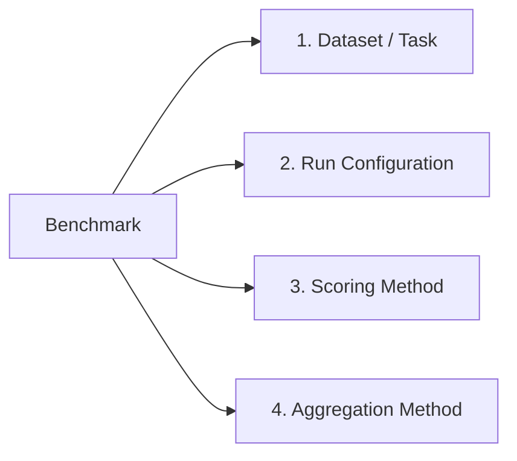
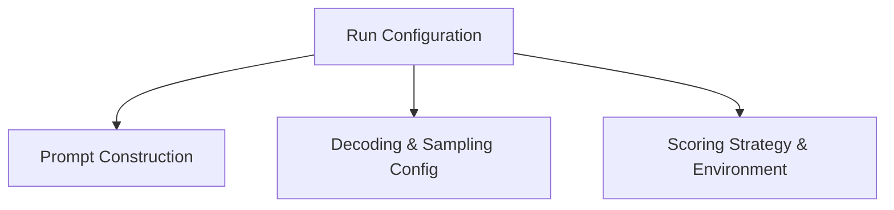
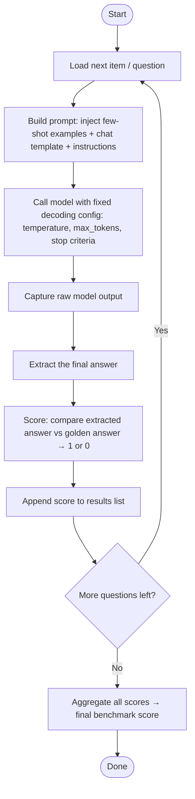
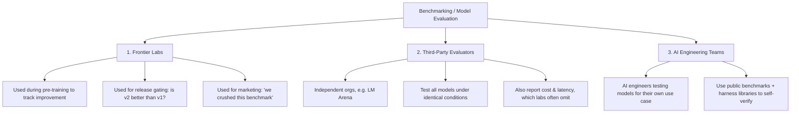
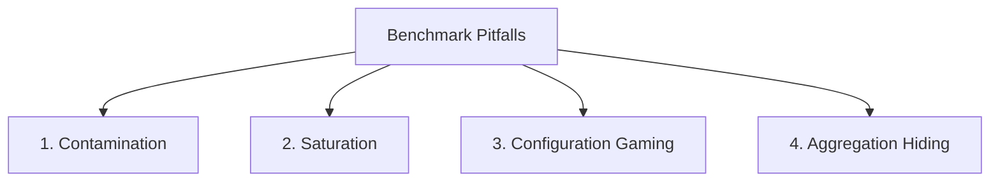

# LLM Evaluations — Understanding Benchmarks (Standardized Model Exams)

> **Summary:** Benchmarks are standardized tests used to measure a specific capability of an LLM. Every benchmark is built from four core components — Dataset/Task, Run Configuration, Scoring Method, and Aggregation Method — and is typically executed via an **eval harness** (e.g., `lm-evaluation-harness`) that automates the loop of prompting, generating, extracting, scoring, and aggregating. While benchmarks are useful for model development, release gating, and marketing, they must be trusted with caution due to contamination, saturation, configuration gaming, and aggregation-hiding issues.

---

## Table of Contents
1. [Recap: Model Evals Landscape](#1-recap-model-evals-landscape)
2. [What Is a Benchmark?](#2-what-is-a-benchmark)
3. [The 4 Core Components of a Benchmark](#3-the-4-core-components-of-a-benchmark)
4. [Case Study: GSM8K](#4-case-study-gsm8k)
5. [Component 1: Dataset & Task](#5-component-1-dataset--task)
6. [Component 2: Run Configuration](#6-component-2-run-configuration)
7. [Component 3: Scoring Method](#7-component-3-scoring-method)
8. [Component 4: Aggregation Method](#8-component-4-aggregation-method)
9. [Benchmarks Originate as Research Papers](#9-benchmarks-originate-as-research-papers)
10. [How Model Evaluation Actually Works (The Loop)](#10-how-model-evaluation-actually-works-the-loop)
11. [Why You Need an Eval Harness](#11-why-you-need-an-eval-harness)
12. [Live Demo: `lm-evaluation-harness`](#12-live-demo-lm-evaluation-harness)
13. [Who Runs Benchmarking? (3 Stakeholders)](#13-who-runs-benchmarking-3-stakeholders)
14. [Why You Can't Blindly Trust Benchmarks](#14-why-you-cant-blindly-trust-benchmarks)
15. [Comparison Tables](#15-comparison-tables)
16. [Interview Q&A](#16-interview-qa)
17. [Quick Revision Checklist](#17-quick-revision-checklist)

---

## 1. Recap: Model Evals Landscape

Flow of the course so far:
1. Why model evals are important
2. Formal definition of model evals — two types:
   - **Standardized Benchmarks**
   - **Custom Evals**
3. Before diving into benchmarks → learned the **8 core LLM capabilities** that exist
4. This session → deep dive into **Benchmarks**

---

## 2. What Is a Benchmark?

> **Definition:** A benchmark is a **standardized test** used to measure a particular model capability.

Every benchmark, regardless of domain, is built around **4 components**.

---

## 3. The 4 Core Components of a Benchmark



| # | Component | What It Defines |
|---|-----------|------------------|
| 1 | Dataset / Task | The questions + golden answers, and what capability is being tested |
| 2 | Run Configuration | Prompt style, decoding/sampling settings, tools allowed |
| 3 | Scoring Method | How the model's raw output is extracted & compared to the correct answer |
| 4 | Aggregation Method | How individual question scores are combined into a final benchmark score |

---

## 4. Case Study: GSM8K

- **Full form:** Grade School Mathematics (8K = ~8,000 rows in the dataset)
- Released ~2020–2021; now considered an **old / saturated** benchmark
- Tests **basic mathematical reasoning** (grade 6–8 level word problems)
- Publicly available on **Hugging Face** and **Kaggle**

**Sample row:**
```
Q: Natalia sold clips to 48 friends in April, and then she sold half as many
   clips in May. How many clips did she sell altogether?
A: 48 + 24 = 72
```

---

## 5. Component 1: Dataset & Task

- **Dataset = Question + Answer pairs** → acts as a "golden dataset"
- **Task** = what the model is asked to do with each row
  - GSM8K task: *Given a grade-school math problem, generate the correct numeric answer.*
- Every benchmark (MMLU, SWE-bench, etc.) follows this same Q+A dataset structure, just for different capabilities.

---

## 6. Component 2: Run Configuration

Ensures **fair, apples-to-apples comparison** — all models tested under identical conditions. Has 3 sub-parts:



### 6.1 Prompt Construction
| Setting | Options | Notes |
|---|---|---|
| Shot type | Zero-shot vs Few-shot | Zero-shot = no solved examples given; Few-shot = N solved examples shown before the actual question |
| GSM8K default | **8-shot** | 8 solved examples are shown before the target question |
| Reasoning mode | Chain-of-Thought (CoT) vs Direct | CoT tells the model to solve step-by-step → improves accuracy; GSM8K **allows CoT** |

### 6.2 Decoding & Sampling Configuration
- **Temperature** → kept near **0** (low creativity/variance, deterministic-ish outputs)
- **Max tokens** → fixed value
  - Too low → CoT reasoning gets cut off mid-way, answer never generated
  - Too high → unfairly benefits models capable of very long reasoning chains
  - Must be **identical across all models** being compared

### 6.3 Tool Usage / Environment
- Some benchmarks **disallow tools** (e.g., GSM8K — no web search, no code interpreter)
- Some benchmarks **require tools** (e.g., SWE-bench needs GitHub issue-fetching tools)
- Whether tools are allowed is defined upfront by the benchmark spec

---

## 7. Component 3: Scoring Method

Two steps:

### 7.1 Extraction
Raw LLM output can vary in form:
- `"The answer is 72"`
- `"72"`
- `72` (just the number)

→ Use **structured output enforcement** or **regex** to reliably extract just the final answer.

### 7.2 Comparison
| Answer Type | Comparison Method |
|---|---|
| Closed-ended (e.g., a number like 72) | Exact match / programmatic comparison (1 or 0) |
| Open-ended (e.g., a paragraph) | **LLM-as-a-judge** or human evaluation |

---

## 8. Component 4: Aggregation Method

- Simplest form: **Mean** → e.g., 920/1000 correct → 92% score
- More complex form: **Weighted Mean**
  - Example: MMLU has 57 subjects, each reporting its own %, e.g. Biology 87%, Physics 91%, Economics 72%
  - Simple average across subjects can be misleading if question-count per subject is imbalanced → **weighted mean** used instead

### Scoring Strategy Variants (used during the scoring stage, not aggregation)
| Strategy | Meaning | Strictness |
|---|---|---|
| **Pass@1** | Ask once, check if correct | Strict |
| **Pass@k** | Ask k times, correct if *at least one* of k attempts is right | Lenient |
| **Majority@k** | Ask k times, take the *most frequent* (mode) answer as final | Statistical robustness |

> When someone quotes "82% on Benchmark X", always ask: *Pass@1, Pass@k, or Majority@k?*

---

## 9. Benchmarks Originate as Research Papers

- Most popular benchmarks (GSM8K, MMLU, SWE-bench, etc.) were **originally published as research papers**
- The paper documents all 4 components: dataset, run config, scoring mechanism, aggregation mechanism
- Researchers in each domain publish benchmarks for their field → these become the standard yardstick for all future models

---

## 10. How Model Evaluation Actually Works (The Loop)

Model evaluation on a benchmark is essentially a **loop over every row in the dataset**.



**Steps in plain terms:**
1. Load a question
2. Build the prompt (inject few-shot examples, apply chat template, add instructions)
3. Call the model with the pinned decoding config
4. Capture raw output
5. Extract the answer
6. Score it (true/false)
7. Store the score
8. Repeat for all questions
9. Aggregate → final score

---

## 11. Why You Need an Eval Harness

Although the loop *looks* simple, real implementation needs extra "plumbing" engineering:

- Answer extraction logic (handling varied output formats)
- Exact scoring mechanism per the paper's spec
- **Batching strategy** for thousands of LLM calls
- **Retry logic** for failed API calls
- **Rate-limit handling**

> **Eval Harness** = a piece of code/library that handles all this plumbing so you don't have to write it yourself.

**Analogy:** Benchmark = the exam paper. Eval Harness = the exam administration/invigilation system that runs everything on your behalf.

### Popular Eval Harness Libraries
| Library | Notes |
|---|---|
| **lm-evaluation-harness** (EleutherAI) | Industry standard, most widely used, minimal code needed |
| **Inspect** | Also popular |
| **DeepEval** | More geared toward *application-level* evals (testing your own fine-tuned models); requires more custom code to plug in a model like OpenAI's |

---

## 12. Live Demo: `lm-evaluation-harness`

**Steps:**
1. `pip install lm-eval`
2. Provide your OpenAI API key (or use a Hugging Face model)
3. Run a single command specifying:
   - `model` → e.g., target model like `gpt-5.6`
   - `num_concurrent` → concurrency level for parallel questions
   - `max_retries` → retry count for failed calls
   - `tasks` → benchmark name, e.g., `gsm8k`
   - `cot` → chain-of-thought flag (enabled)
   - `num_fewshot` → 8 (8-shot prompting)
   - `apply_chat_template` → yes
   - `limit` → restrict to N questions (used here: 20, instead of full 8K, to save cost — full run costs ~₹2300; 20-question run costs ~₹3–4)
   - `output_path` → where results are saved
   - `log_samples` → log every individual result

**Result of demo run:** ~90% accuracy (18/20 correct) on a 20-question sample of GSM8K.

**Output artifacts:**
- A JSON object per question containing: doc ID, question, generated answer, correctness
- Full logs stored at the specified output path

> Without an eval harness, you'd have to hand-write all the loop + plumbing code yourself — tedious and error-prone (results could vary run-to-run without standardization).

---

## 13. Who Runs Benchmarking? (3 Stakeholders)



### 13.1 Frontier Labs (OpenAI, Anthropic, Google DeepMind, etc.)
- Run benchmarks during pre-training checkpoints to track training direction
- Used for **release gating** — decide if a new model version is actually better
- Used for **marketing** — highlight strong benchmark scores publicly

⚠️ **Caution:** Don't blindly trust numbers self-reported by frontier labs. Ask: *Who ran this evaluation?* If the lab ran it themselves under their own controlled settings, treat it skeptically (like a car's advertised mileage vs real-world mileage). Labs may also **cherry-pick** favorable benchmarks and downplay weak ones.

### 13.2 Third-Party Evaluators
- Independent organizations (e.g., **LM Arena**) whose core business is model evaluation
- Test all models under **identical conditions** → more reliable comparisons
- Publish extra useful info like **cost and latency**, which labs often withhold
- Considered the **most trustworthy source** of benchmark numbers

### 13.3 AI Engineering Teams (you)
- Don't fully rely on labs or third parties
- Run your own evaluation using public benchmarks + harness libraries under your own real-world conditions (cost, latency, accuracy for your use case)

---

## 14. Why You Can't Blindly Trust Benchmarks



### 14.1 Benchmark Contamination
- Most public benchmarks have their dataset (Q + golden A) **freely available on the internet**
- When labs scrape the web for pre-training data, this benchmark data can leak into the training set
- Result: the model may be **recalling memorized answers**, not actually reasoning
- **Mitigations:** use private benchmarks, or dynamic benchmarks (datasets that refresh periodically instead of staying static for years)

### 14.2 Benchmark Saturation
- Early on, a new benchmark is hard — all models score low and vary a lot (e.g., 25–36%)
- Over time, models improve and scores **cluster near the ceiling** (e.g., 92–97%), making the benchmark unable to differentiate model quality anymore
- Example: GSM8K, MMLU, and SWE-bench are all considered **saturated** today
- Saturated benchmarks are eventually **retired and replaced** with harder, newer ones

### 14.3 Configuration Gaming
- Frontier labs can tweak run configuration to unfairly favor their own model (e.g., giving their model a Python interpreter tool on GSM8K while a rival gets no tools)
- Small config changes can cause **5–10% swings** in reported scores
- If a lab won't disclose their exact run config (temperature, max tokens, tools, reasoning level, latency, cost) — don't trust the headline number

### 14.4 Aggregation Hiding (Cherry-picking within averages)
- Example: MMLU averages across 57 subjects
- A model might score great in Physics but terrible in Economics — but the lab only publishes the **overall average**, hiding the weak subject
- If you deploy that model for an Economics-specific use case based on the strong average score, you'll be surprised by poor real-world performance

> **Golden rule:** Take every benchmark number *with a pinch of salt*. Build your own validation methodology rather than trusting a single published number.

---

## 15. Comparison Tables

### Zero-shot vs Few-shot
| Aspect | Zero-shot | Few-shot |
|---|---|---|
| Examples given before question | None | N solved examples |
| Performance | Generally lower | Generally higher |
| GSM8K default | — | 8-shot |

### Pass@1 vs Pass@k vs Majority@k
| Strategy | Attempts | Success Criteria | Strictness |
|---|---|---|---|
| Pass@1 | 1 | Must be correct on the single try | Strict |
| Pass@k | k | At least 1 of k correct | Lenient |
| Majority@k | k | Most frequent (mode) answer taken as final | Balanced/robust |

### lm-evaluation-harness vs DeepEval
| Aspect | lm-evaluation-harness | DeepEval |
|---|---|---|
| Primary use case | Standardized benchmark evaluation | Application-level evaluation (custom fine-tuned models) |
| Code required | Minimal (single command) | More boilerplate needed |
| Industry adoption | Used by large labs, considered standard | More niche/application-focused |

---

## 16. Interview Q&A

**Q1. What is a benchmark in the context of LLM evaluation?**
A: A standardized test used to measure a specific capability of a model, built from a dataset/task, run configuration, scoring method, and aggregation method.

**Q2. What are the 4 core components of every benchmark?**
A: Dataset/Task, Run Configuration, Scoring Method, Aggregation Method.

**Q3. What does GSM8K test, and why is it considered outdated today?**
A: It tests grade-school-level mathematical reasoning (~8K questions). It's considered saturated — most modern frontier models now score 90%+ on it, so it no longer differentiates model quality.

**Q4. Explain the difference between Pass@1, Pass@k, and Majority@k.**
A: Pass@1 checks correctness on a single attempt (strict). Pass@k checks if at least one of k attempts is correct (lenient). Majority@k takes the most frequent answer across k attempts as the final answer (mode-based, more statistically robust).

**Q5. Why is temperature typically set close to 0 during benchmark evaluation?**
A: To minimize randomness/creativity in outputs and ensure more consistent, reproducible, and comparable results across models.

**Q6. What is an eval harness, and why is it needed?**
A: A library/piece of code that automates the full evaluation loop (prompt building, calling the model, extracting answers, scoring, aggregating) along with plumbing concerns like batching, retries, and rate-limit handling — so engineers don't need to hand-write this infrastructure for every benchmark run.

**Q7. What is benchmark contamination?**
A: When a benchmark's public dataset (questions + answers) ends up inside a model's pre-training data because it was scraped from the internet, causing the model to potentially "recall" memorized answers rather than genuinely reason through them.

**Q8. What is benchmark saturation and why does it matter?**
A: It's when nearly all top models cluster near the maximum score on a benchmark, making it useless for differentiating model quality; saturated benchmarks are usually retired and replaced by harder ones.

**Q9. Why should you be cautious about benchmark numbers published directly by frontier labs?**
A: Labs may run evaluations under highly favorable, undisclosed configurations (configuration gaming) and may cherry-pick which benchmarks to highlight, so self-reported numbers act more like a "ceiling" than a realistic estimate.

**Q10. Give an example of how aggregation can hide weaknesses in a benchmark score.**
A: MMLU averages scores across 57 subjects; a model might excel in most subjects but perform poorly in one (e.g., Economics) — the published overall average can mask this, misleading someone deploying the model for that specific domain.

**Q11. Who are the three main stakeholders that perform LLM benchmarking, and why does each do it?**
A: (1) Frontier labs — for pre-training tracking, release gating, and marketing; (2) Third-party evaluators (e.g., LM Arena) — for independent, standardized rankings, plus cost/latency data; (3) AI engineering teams — to validate models for their own specific real-world use case.

---

## 17. Quick Revision Checklist

- [ ] Can define what a benchmark is in one line
- [ ] Can list and explain all 4 core benchmark components (Dataset/Task, Run Config, Scoring, Aggregation)
- [ ] Understand GSM8K as a concrete example (dataset size, task, few-shot/CoT setup)
- [ ] Know the 3 sub-parts of Run Configuration (prompt construction, decoding/sampling, tools/environment)
- [ ] Can differentiate Pass@1 vs Pass@k vs Majority@k
- [ ] Understand extraction vs comparison in scoring, and when LLM-as-a-judge is needed
- [ ] Know simple mean vs weighted mean aggregation, with the MMLU example
- [ ] Understand why benchmarks originate as research papers
- [ ] Can walk through the full evaluation loop step-by-step (load → build prompt → call model → extract → score → store → aggregate)
- [ ] Know what an eval harness is and why it's needed (plumbing: batching, retries, rate limits)
- [ ] Familiar with `lm-evaluation-harness` as the industry-standard tool, and DeepEval as the application-eval alternative
- [ ] Can name the 3 stakeholder categories that run benchmarking and their motivations
- [ ] Can explain all 4 major benchmark pitfalls: contamination, saturation, configuration gaming, aggregation hiding
- [ ] Understand the "take with a pinch of salt" principle — always question who ran the eval and under what config

---

*Source: CampusX LLM Evaluations Playlist — Benchmarks Deep Dive session.*
