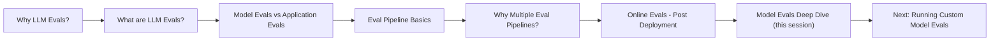
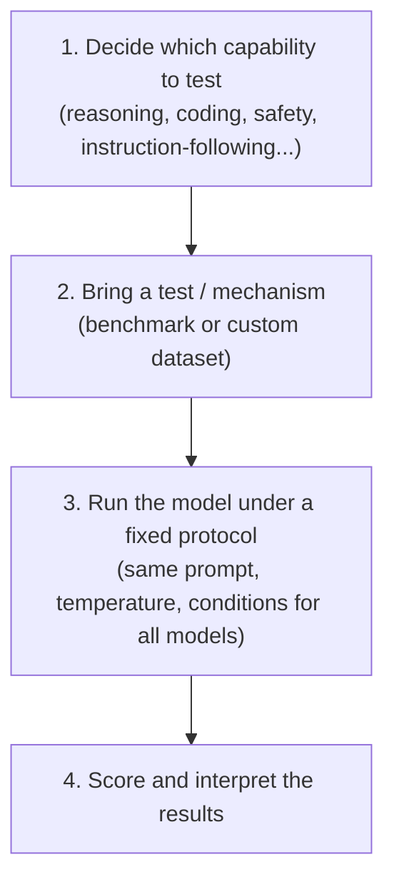
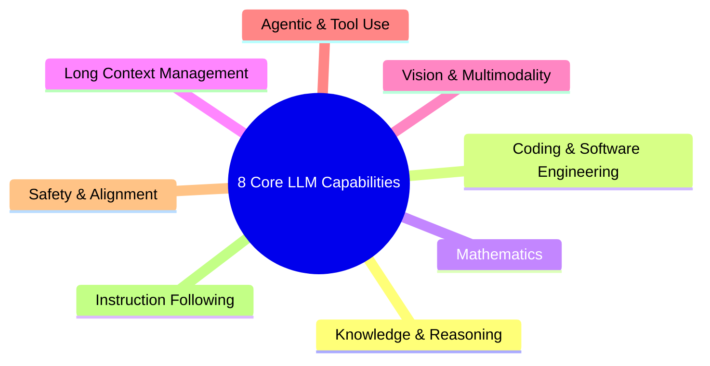

# Model Evals & LLM Benchmarking

> **Summary:** This session shifts focus from *Application Evals* (evaluating RAG pipelines, agents, etc.) to *Model Evals* — the systematic process of testing an LLM's raw capabilities. It covers why AI engineers (not just frontier labs) need model evals, the 4-step structure of any model eval, benchmarks vs. custom eval datasets, a real-world Zomato cost/latency case study, and a deep dive into the 8 core LLM capabilities that virtually all industry benchmarks target.

## Table of Contents
- [1. Recap: Where This Fits in the Course](#1-recap-where-this-fits-in-the-course)
- [2. Why AI Engineers Need Model Evals](#2-why-ai-engineers-need-model-evals)
- [3. What Is a Model Eval? (Formal Definition)](#3-what-is-a-model-eval-formal-definition)
- [4. The 4-Step Structure of Every Model Eval](#4-the-4-step-structure-of-every-model-eval)
- [5. Benchmarks vs. Custom Evaluation Datasets](#5-benchmarks-vs-custom-evaluation-datasets)
- [6. Case Study: Zomato Email Router (Model A vs Model B)](#6-case-study-zomato-email-router-model-a-vs-model-b)
- [7. The 8 Core LLM Capabilities](#7-the-8-core-llm-capabilities)
- [8. Real-World Relevance Map](#8-real-world-relevance-map)
- [9. Interview Q&A](#9-interview-qa)
- [10. Quick Revision Checklist](#10-quick-revision-checklist)

---

## 1. Recap: Where This Fits in the Course

Course flow so far:

- **Model Evals** → evaluate LLMs directly (their raw capabilities).
- **Application Evals** → evaluate LLM-*based applications* (retriever, generator, full RAG pipeline, agents). This remains the course's main focus overall, but understanding model evals is a prerequisite.

---

## 2. Why AI Engineers Need Model Evals

Obvious reason: *measure capabilities so you can improve them* ("if you can't measure, you can't improve"). But the more interesting question is **why does a working AI engineer (not a frontier lab) need this?**

Four practical reasons:

| # | Reason | Explanation |
|---|--------|-------------|
| 1 | **Compare models for your application** | Justify concretely (not "just pick one") why you chose OpenAI vs Claude vs another provider for a specific app. |
| 2 | **Track whether newer models actually improve** | E.g., should you migrate a deployed app from Claude Opus 4.8 to Claude Fable? Model evals give the numbers to justify (or reject) the switch. |
| 3 | **Judge safety before/after deployment** | Hallucination rate, jailbreak resistance, general safety of the model you're shipping. |
| 4 | **Decide: proprietary API vs self-hosted open source** | E.g., Claude API vs self-hosting DeepSeek on your own infra — cost, performance, and capability trade-offs are only comparable via model evals. |

> **Key line:** *"Without model evals, you are basically blind."* If you need to compare two models, model evals are the only real option.

---

## 3. What Is a Model Eval? (Formal Definition)

> A model eval is a **systematic process of measuring an underlying model's capabilities, behavior, reliability, and operational characteristics under controlled conditions.**

Simplified: a repeatable process to test an LLM's capabilities and behavior.

Important nuance: unlike a human IQ score (one number summarizing a lot), **a single number cannot summarize an LLM.** Each capability (reasoning, coding, safety, etc.) needs its own separate eval.

---

## 4. The 4-Step Structure of Every Model Eval

Every model eval — regardless of type — follows the same 4 steps:

1. **Decide the capability to test** — LLMs are general-purpose, so no single eval tests everything.
2. **Bring a test** — either a standardized benchmark or a custom dataset.
3. **Run under a fixed protocol** — prompt, temperature, and conditions are kept constant so results are reproducible and comparable across models.
4. **Score and interpret** — publish/interpret the resulting numbers.

---

## 5. Benchmarks vs. Custom Evaluation Datasets

Step 2 (the "test") can be one of two types:

| Aspect | Benchmarks | Custom Evaluation Datasets |
|---|---|---|
| Definition | Standardized, shared tests everyone runs (e.g., MMLU, SWE-bench) | Data assembled from your **actual task**, measuring what *you* specifically care about |
| Purpose | Compare models on common ground, generic capability signal | Measure real performance on your specific application/use case |
| Ownership | Public, industry-wide | Built in-house from your own labeled data |
| Limitation | Doesn't reflect your specific business context | Not standardized; can't be used to compare models "in general" |

**Why not just rely on benchmarks?** Because a model that wins on every public benchmark may still not be the best (cost/latency/accuracy-adjusted) choice for *your specific task* — demonstrated in the Zomato case study below.

---

## 6. Case Study: Zomato Email Router (Model A vs Model B)

**Task:** Classify incoming customer emails into categories (Billing / Technical / Refund).

**Model choices:**

| | Model A (large) | Model B (small) |
|---|---|---|
| Position on public benchmarks | Top of leaderboard | Mid-table |
| Cost | $15 / 1M tokens | $0.50 / 1M tokens |
| Analogy | Claude Opus-tier | Small open model (e.g. low-param Qwen/MiniMax) |

If you only looked at public benchmarks, **Model A wins every single category** (math, coding, language generation) — so the "obvious" choice is Model A.

**But:** running Model A at Zomato's scale would be extremely expensive.

**Custom eval approach:** Build a golden dataset of 200–500 labeled past emails, run both models on it:

| Metric | Model A | Model B |
|---|---|---|
| Classification accuracy | 94% | 91% |
| Urgency accuracy | 88% | 87% |
| Cost per 1,000 emails | ~$6 | ~$0.21 |
| Latency | 4.1 sec | 0.9 sec |

**Conclusion:** Accuracy gap is small, but cost/latency gap is huge → **Model B is the better value proposition** for this specific task, despite losing on every public benchmark.

> **Takeaway:** Benchmarks alone would never surface this conclusion — only a custom eval on your own data could.

---

## 7. The 8 Core LLM Capabilities

These are the 8 categories most frontier labs and industry benchmarks organize around:

### 7.1 Knowledge & Reasoning
- **Factual recall** across subjects (biology, physics, chemistry, history...). Benchmark example: **MMLU** (57 subjects).
- **Multi-step logical reasoning** — connecting multiple facts in correct sequence to reach a conclusion (e.g., summarizing all of human evolution and explaining its effect on modern society).
- Signals overall model "intelligence" — the reason frontier labs care about this most.

### 7.2 Coding & Software Engineering
- Highest **economic** importance (e.g., Cursor's $60B valuation cited as an example).
- Tested aspects:
  - Functional-level code generation (English → working function)
  - Test case generation + self-correction from errors
  - Bug fixing in existing codebases
  - Multi-file, long-horizon engineering tasks (e.g., codebase-wide refactors)
  - Running multiple CLI commands (installing packages, configuring servers/environments)
  - API / function calling

### 7.3 Mathematics
- A form of reasoning, tested across a difficulty ladder:
  - Grade-school math
  - Competition-level problems (Olympiad-style, needs creative thinking)
  - Undergraduate-level problems
  - Research-level mathematical reasoning (open-ended, no known solution yet)
- Relevant to scientific computing, financial modeling, engineering simulations, data analysis.

### 7.4 Long Context Management
- Measures whether a model can **effectively use** information from very long inputs (hundreds of thousands of tokens) — not just whether the context window is large on paper.
- Tested aspects:
  - Extracting a small fact from a long context
  - Fetching details about a specific person/entity from a large document
  - Summarizing long context
  - Maintaining full context of a large codebase (for coding agents)
- Real issue: quoted context windows (128K/200K/1M tokens) often degrade in practice as conversations grow — quality diminishes over time.

### 7.5 Vision & Multimodality
- Can the model understand images/video, not just text?
- Relevant because we live in a multimodal world (e.g., "what's in this fridge, what can I cook?").

### 7.6 Agentic & Tool Use
- Can the model use tools effectively — web browsing, structured tool calling, API interaction, desktop/computer use?
- Foundation of the broader "agentic AI" field — models need to *act*, not just generate text.

### 7.7 Safety & Alignment
- Can the model be trusted to behave responsibly?
- Tested aspects:
  - Avoiding harmful content generation
  - Resistance to adversarial attacks / jailbreaks
  - Truthfulness vs. sycophancy (blind flattery of user ideas)
  - Cybersecurity-related skills: cryptography, reverse engineering, digital forensics
- Critical for frontier labs due to regulatory pressure and reputational risk (a single incident can be very damaging).

### 7.8 Instruction Following
- Does the model precisely follow user instructions (format, word limits, tone)?
- Does it ask clarifying questions when instructions are ambiguous?
- Often underrated, but directly affects user satisfaction and retention — poor instruction-following drives users to switch products.

---

## 8. Real-World Relevance Map

| Capability | Example Real-World Use Case |
|---|---|
| Knowledge & Reasoning | Research paper analysis chatbots, professional assistants (legal, teaching) |
| Coding & SWE | AI coding agents, automated bug fixing, codebase refactoring tools |
| Mathematics | Scientific computing, financial modeling, engineering simulation |
| Long Context | Any LLM app that scales with usage/conversation length; large document/codebase analysis |
| Vision & Multimodal | Visual assistants, image/video-based Q&A |
| Agentic & Tool Use | Autonomous agents, browsing assistants, API-driven workflows |
| Safety & Alignment | Any production-facing deployment, regulated industries |
| Instruction Following | Any consumer-facing product where UX/format compliance matters |

---

## 9. Interview Q&A

**Q1: What is a model eval, and how does it differ from an application eval?**
A: A model eval systematically measures an LLM's own capabilities, behavior, and reliability under controlled conditions. An application eval measures the performance of a full LLM-based application (e.g., a RAG pipeline's retriever + generator), not the underlying model in isolation.

**Q2: Why can't a single benchmark score fully describe an LLM, unlike human IQ?**
A: LLMs are general-purpose with many independent capabilities (reasoning, coding, math, safety, etc.). Strong performance in one area doesn't imply strong performance in another, so each capability needs its own dedicated eval/benchmark.

**Q3: What are the 4 steps common to every model eval?**
A: (1) Decide which capability to test, (2) bring a test/benchmark or custom dataset, (3) run the model under a fixed, repeatable protocol, (4) score and interpret results.

**Q4: When would you use a custom evaluation dataset instead of a public benchmark?**
A: When you need to know how a model performs on your specific application/task rather than generic capability. Public benchmarks show generic strength, but real deployment decisions (cost, latency, task-specific accuracy) may favor a "weaker" model, as shown in the Zomato case study.

**Q5: Name the 8 core LLM capabilities most benchmarks are organized around.**
A: Knowledge & Reasoning, Coding & Software Engineering, Mathematics, Long Context Management, Vision & Multimodality, Agentic & Tool Use, Safety & Alignment, Instruction Following.

**Q6: Why might a smaller, benchmark-inferior model be preferred for a production task?**
A: If the accuracy gap on the actual task is small but the cost and latency gap is large, the smaller model can offer far better ROI — as demonstrated by Model B outperforming Model A on cost/latency in the Zomato email classification case despite losing on every public benchmark.

**Q7: What does "long context management" actually test, beyond stated context window size?**
A: Whether the model can *effectively use* information across a long input — extracting facts, summarizing, maintaining entity details — rather than just accepting a large token count. Real-world retention often degrades as context grows, regardless of the advertised window size.

**Q8: What is sycophancy in the context of safety & alignment evals, and why does it matter?**
A: Sycophancy is a model's tendency to flatter or agree with the user's ideas rather than give a truthful, critical assessment. It's tested as part of safety/alignment because a trustworthy model should be truthful even when it means disagreeing with the user.

---

## 10. Quick Revision Checklist

- [ ] Can explain the difference between Model Evals and Application Evals
- [ ] Can list all 4 reasons AI engineers (not just frontier labs) need model evals
- [ ] Can state the formal definition of a model eval
- [ ] Can walk through the 4-step structure of any model eval from memory
- [ ] Can differentiate benchmarks vs. custom evaluation datasets with an example
- [ ] Can explain the Zomato case study and why the "obvious" model wasn't the best choice
- [ ] Can list and briefly describe all 8 core LLM capabilities
- [ ] Can name at least one benchmark example (MMLU → Knowledge & Reasoning)
- [ ] Understands why long context window ≠ effective long context usage
- [ ] Understands what "sycophancy" means and why it's a safety concern

---

*Source: CampusX LLM Evaluations Playlist — Session on Model Evals & LLM Benchmarking (Part 1 of 2; next session covers running custom model evals).*
